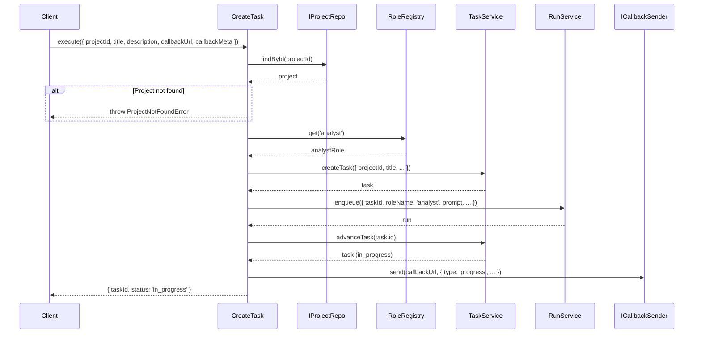
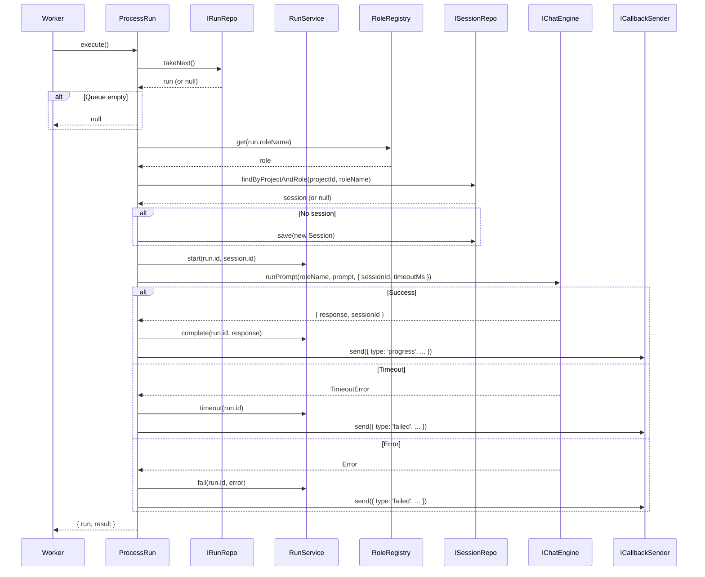
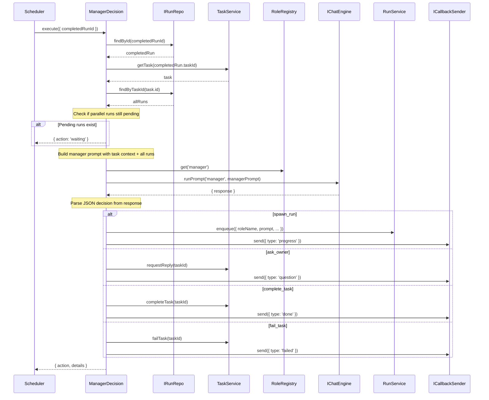
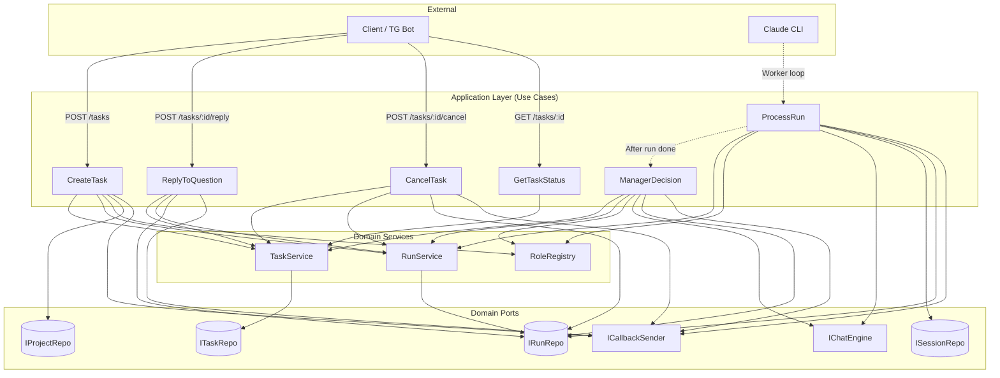

# Sprint 5 — Application Layer (Use Cases): Design Specification

## Обзор

Application-слой содержит 6 use cases, каждый в отдельном файле в `src/application/`. Use cases оркестрируют domain-сервисы и порты, реализуя бизнес-сценарии. Зависимость только от domain (порты + entities + services), DI через конструкторы.

### Карта use cases

| Use Case | Триггер | Описание |
|----------|---------|----------|
| CreateTask | HTTP POST /tasks | Создать задачу, первый step (analyst), первый run |
| ProcessRun | Worker loop | Взять run из очереди, выполнить через Claude CLI, сохранить результат |
| ManagerDecision | После завершения run | Manager-агент решает следующий шаг |
| ReplyToQuestion | HTTP POST /tasks/:id/reply | Восстановить контекст, продолжить работу |
| CancelTask | HTTP POST /tasks/:id/cancel | Отменить задачу и все pending/queued runs |
| GetTaskStatus | HTTP GET /tasks/:id | Вернуть текущий статус задачи |

---

## Ключевые архитектурные решения

### D1: Первый шаг — всегда analyst

Первый шаг каждой задачи — analyst. Manager-агент определяет следующие шаги динамически. Это упрощает CreateTask и соответствует архитектуре: "Нейроцех сама решает какие роли задействовать".

**Обоснование:** analyst анализирует задачу, формирует спецификацию. Без анализа невозможно принять решение о следующих шагах. Manager подключается после завершения первого run.

### D2: ProcessRun берет следующий run из очереди (takeNext)

ProcessRun не получает конкретный runId — он вызывает `IRunRepo.takeNext()`, который делает `SELECT ... FOR UPDATE SKIP LOCKED`. Это позволяет запускать несколько worker'ов параллельно без конфликтов.

**Обоснование:** архитектура "manager + worker" предполагает, что worker — stateless процесс, который берет работу из очереди. Конкретный runId знает только менеджер при постановке в очередь.

### D3: Manager получает решение через MCP-инструменты (структурированный вывод)

Manager-агент вызывает MCP tools: `spawn_run(role, prompt)`, `ask_owner(question)`, `complete_task(summary)`, `fail_task(reason)`. Вывод Claude CLI парсится: ищем tool_use блоки в response. Если агент не вызвал ни один tool — это ошибка (run failed).

**Формат response от IChatEngine:** текстовый response от Claude CLI. ManagerDecision парсит его, извлекая вызовы MCP-инструментов. Формат парсинга — ответственность infrastructure (ClaudeCLIAdapter может возвращать структурированные tool calls).

**Упрощение для Sprint 5:** пока MCP-сервер не реализован, manager возвращает JSON-решение в response. ManagerDecision парсит JSON из response текста. Формат:

```json
{
  "action": "spawn_run" | "ask_owner" | "complete_task" | "fail_task",
  "role": "developer",
  "prompt": "...",
  "question": "...",
  "summary": "...",
  "reason": "..."
}
```

**Обоснование:** JSON-парсинг — простая и надежная реализация для MVP. Переход на MCP tools — отдельный спринт.

### D4: ReplyToQuestion — создает новый run для той же роли

При получении ответа на вопрос:
1. Находим run, который задал вопрос (последний done run с question в response)
2. Создаем новый run для той же роли с промптом: оригинальный контекст + вопрос + ответ
3. Контекст восстанавливается через `sessionId` (CLI session) — Claude CLI сам хранит историю

**Обоснование:** агент не висит в памяти (ADR #33). Все персистировано. Новый run с обогащенным промптом — самый простой способ "продолжить" работу.

### D5: Отсутствующий порт ITaskStepRepo

В текущем domain-слое нет порта `ITaskStepRepo`. Для Sprint 5 нужно его добавить (prerequisite). Use cases CreateTask и ManagerDecision работают с TaskStep.

**Необходимый порт:**
```javascript
// src/domain/ports/ITaskStepRepo.js
class ITaskStepRepo {
  async findById(id) → TaskStep | null
  async findByTaskId(taskId) → TaskStep[]
  async save(taskStep) → void
}
```

---

## Use Case 1: CreateTask

### Файл
`src/application/CreateTask.js`

### Класс
```javascript
export class CreateTask {
  constructor({ taskService, runService, roleRegistry, projectRepo, callbackSender })
}
```

### Зависимости (DI)
| Зависимость | Тип | Назначение |
|-------------|-----|------------|
| taskService | TaskService | Создание задачи |
| runService | RunService | Постановка run в очередь |
| roleRegistry | RoleRegistry | Проверка существования роли analyst |
| projectRepo | IProjectRepo | Проверка существования проекта |
| callbackSender | ICallbackSender | Отправка progress callback |

### Сигнатура
```javascript
async execute({ projectId, title, description, callbackUrl, callbackMeta }) → { taskId, status }
```

### Алгоритм

```
1. Валидация входных данных:
   - projectId, title — обязательны
   - title — не пустая строка
2. Проверить существование проекта:
   - projectRepo.findById(projectId)
   - Если null → throw ProjectNotFoundError
3. Проверить существование роли 'analyst':
   - roleRegistry.get('analyst')
   - Если нет → throw RoleNotFoundError (не должно случиться)
4. Создать задачу:
   - taskService.createTask({ projectId, title, description, callbackUrl, callbackMeta })
5. Получить конфиг роли analyst:
   - role = roleRegistry.get('analyst')
6. Сформировать промпт для analyst:
   - prompt = `Задача: ${title}\n\n${description ?? ''}\n\nПроанализируй задачу и создай спецификацию.`
7. Создать run в очереди:
   - runService.enqueue({ taskId: task.id, stepId: null, roleName: 'analyst', prompt, callbackUrl, callbackMeta })
8. Перевести задачу в in_progress:
   - taskService.advanceTask(task.id)
9. Отправить progress callback (если callbackUrl указан):
   - callbackSender.send(callbackUrl, { type: 'progress', taskId: task.id, stage: 'queued', message: 'Задача принята, начинаю анализ' }, callbackMeta)
10. Вернуть { taskId: task.id, status: 'in_progress' }
```

### Обработка ошибок
| Ошибка | Условие | Действие |
|--------|---------|----------|
| ValidationError | Нет projectId или title | throw (HTTP 400) |
| ProjectNotFoundError | Проект не найден | throw (HTTP 404) |
| RoleNotFoundError | Роль analyst не загружена | throw (HTTP 500) |

### Возвращаемое значение
```javascript
{ taskId: string, status: 'in_progress' }
```

---

## Use Case 2: ProcessRun

### Файл
`src/application/ProcessRun.js`

### Класс
```javascript
export class ProcessRun {
  constructor({ runService, taskService, chatEngine, sessionRepo, roleRegistry, callbackSender })
}
```

### Зависимости (DI)
| Зависимость | Тип | Назначение |
|-------------|-----|------------|
| runService | RunService | Управление lifecycle run |
| taskService | TaskService | Обновление статуса задачи при question/fail |
| chatEngine | IChatEngine | Выполнение промпта через Claude CLI |
| sessionRepo | ISessionRepo | Создание/поиск сессий |
| roleRegistry | RoleRegistry | Получение конфига роли (timeout, model) |
| callbackSender | ICallbackSender | Отправка callback с результатом |

### Сигнатура
```javascript
async execute() → { run, result } | null
```

Возвращает `null` если очередь пуста.

### Алгоритм

```
1. Взять следующий run из очереди:
   - run = await runRepo.takeNext()
   - Если null → return null (очередь пуста)
2. Получить конфиг роли:
   - role = roleRegistry.get(run.roleName)
3. Найти или создать сессию:
   - session = await sessionRepo.findByProjectAndRole(task.projectId, run.roleName)
   - Если нет → session = Session.create({ projectId: task.projectId, roleName: run.roleName })
   - await sessionRepo.save(session)
4. Начать run:
   - runService.start(run.id, session.id)
5. Выполнить промпт:
   try {
     - result = await chatEngine.runPrompt(run.roleName, run.prompt, {
         sessionId: session.cliSessionId,
         timeoutMs: role.timeoutMs
       })
     - Обновить cliSessionId сессии если новый:
       session.cliSessionId = result.sessionId
       await sessionRepo.save(session)
6. Завершить run:
     - runService.complete(run.id, result.response)
   } catch (error) {
7. Ошибка:
     - Если timeout → runService.timeout(run.id)
     - Иначе → runService.fail(run.id, error.message)
   }
8. Отправить callback:
   - Если run.callbackUrl:
     - Если done → callbackSender.send(callbackUrl, { type: 'progress', taskId, stage: run.roleName, message: 'Шаг завершен' }, callbackMeta)
     - Если failed/timeout → callbackSender.send(callbackUrl, { type: 'failed', taskId, error: run.error }, callbackMeta)
9. Вернуть { run, result }
```

### Обработка ошибок
| Ошибка | Условие | Действие |
|--------|---------|----------|
| RoleNotFoundError | Роль не найдена в реестре | run.fail(), callback |
| TimeoutError | Claude CLI timeout | run.markTimeout(), callback |
| Любая ошибка chatEngine | Claude CLI crash | run.fail(), callback |

### Важно: ProcessRun не принимает решений

ProcessRun — чистый executor. Он не решает, что делать после завершения run. Это ответственность ManagerDecision. ProcessRun только:
1. Берет run из очереди
2. Выполняет
3. Сохраняет результат
4. Шлет callback

### Возвращаемое значение
```javascript
{ run: Run, result: RunPromptResult } | null
```

### Примечание: доступ к runRepo

ProcessRun нуждается в прямом доступе к `IRunRepo.takeNext()`. Есть два варианта:
- (A) Инжектировать `runRepo` напрямую и вызывать `takeNext()`
- (B) Добавить метод `takeNext()` в RunService

**Решение:** вариант (A) — инжектировать `runRepo`. `takeNext()` — инфраструктурная операция очереди, она не содержит domain-логики. RunService оперирует конкретными run (по id). Добавлять queue-операцию в domain service — нарушение SRP.

Обновленный конструктор:
```javascript
constructor({ runRepo, runService, taskService, chatEngine, sessionRepo, roleRegistry, callbackSender })
```

---

## Use Case 3: ManagerDecision

### Файл
`src/application/ManagerDecision.js`

### Класс
```javascript
export class ManagerDecision {
  constructor({ runService, taskService, chatEngine, roleRegistry, callbackSender, runRepo })
}
```

### Зависимости (DI)
| Зависимость | Тип | Назначение |
|-------------|-----|------------|
| runService | RunService | Создание новых runs |
| taskService | TaskService | Обновление статуса задачи |
| chatEngine | IChatEngine | Запуск manager-агента |
| roleRegistry | RoleRegistry | Получение конфига manager |
| callbackSender | ICallbackSender | Отправка callback |
| runRepo | IRunRepo | Получение истории runs по задаче |

### Сигнатура
```javascript
async execute({ completedRunId }) → { action, details }
```

### Алгоритм

```
1. Загрузить завершенный run:
   - completedRun = await runRepo.findById(completedRunId)
   - Если null → throw RunNotFoundError
   - Если run.status не в ['done', 'failed', 'timeout'] → throw InvalidStateError
2. Загрузить задачу:
   - task = await taskRepo.findById(completedRun.taskId)
   - Если null → throw TaskNotFoundError
   - Если task.status не 'in_progress' → return (задача уже завершена/отменена)
3. Загрузить историю runs задачи:
   - runs = await runRepo.findByTaskId(task.id)
4. Проверить: все ли параллельные runs завершены
   - pendingRuns = runs.filter(r => r.status === 'queued' || r.status === 'running')
   - Если pendingRuns.length > 0 → return { action: 'waiting', details: { pendingCount: pendingRuns.length } }
     (не все параллельные runs завершены, ждем)
5. Сформировать промпт для manager-агента:
   - managerPrompt = buildManagerPrompt(task, runs)
   - Включает: описание задачи, результаты всех runs, текущий статус
6. Запустить manager-агента:
   - role = roleRegistry.get('manager')
   - result = await chatEngine.runPrompt('manager', managerPrompt, { timeoutMs: role.timeoutMs })
7. Распарсить решение:
   - decision = parseManagerDecision(result.response)
   - Если не удалось распарсить → failTask + callback
8. Выполнить решение:
   switch (decision.action) {
     case 'spawn_run':
       - Проверить роль: roleRegistry.get(decision.role)
       - runService.enqueue({ taskId: task.id, stepId: null, roleName: decision.role, prompt: decision.prompt, callbackUrl: task.callbackUrl, callbackMeta: task.callbackMeta })
       - callbackSender.send(task.callbackUrl, { type: 'progress', taskId: task.id, stage: decision.role, message: `Переход к этапу: ${decision.role}` }, task.callbackMeta)

     case 'ask_owner':
       - taskService.requestReply(task.id)
       - callbackSender.send(task.callbackUrl, { type: 'question', taskId: task.id, questionId: crypto.randomUUID(), question: decision.question, context: decision.context ?? '' }, task.callbackMeta)

     case 'complete_task':
       - taskService.completeTask(task.id)
       - callbackSender.send(task.callbackUrl, { type: 'done', taskId: task.id, summary: decision.summary }, task.callbackMeta)

     case 'fail_task':
       - taskService.failTask(task.id)
       - callbackSender.send(task.callbackUrl, { type: 'failed', taskId: task.id, error: decision.reason }, task.callbackMeta)
   }
9. Вернуть { action: decision.action, details: decision }
```

### Вспомогательные функции

#### buildManagerPrompt(task, runs)
```javascript
function buildManagerPrompt(task, runs) {
  const completedRuns = runs
    .filter(r => ['done', 'failed', 'timeout'].includes(r.status))
    .sort((a, b) => a.createdAt - b.createdAt);

  const runsReport = completedRuns
    .map(r => `[${r.roleName}] status=${r.status}\n${r.response ?? r.error ?? 'no output'}`)
    .join('\n---\n');

  return `Задача: ${task.title}
Описание: ${task.description ?? 'нет'}
Текущий статус: ${task.status}
Количество ревизий: ${task.revisionCount}

Завершённые шаги:
${runsReport}

Прими решение о следующем шаге. Ответь строго в формате JSON:
{
  "action": "spawn_run" | "ask_owner" | "complete_task" | "fail_task",
  "role": "имя_роли",        // только для spawn_run
  "prompt": "промпт",        // только для spawn_run
  "question": "вопрос",      // только для ask_owner
  "context": "контекст",     // только для ask_owner (опционально)
  "summary": "итог",         // только для complete_task
  "reason": "причина"        // только для fail_task
}`;
}
```

#### parseManagerDecision(response)
```javascript
function parseManagerDecision(response) {
  // Ищем JSON в response (может быть обернут в markdown code block)
  const jsonMatch = response.match(/\{[\s\S]*\}/);
  if (!jsonMatch) return null;

  try {
    const decision = JSON.parse(jsonMatch[0]);
    const validActions = ['spawn_run', 'ask_owner', 'complete_task', 'fail_task'];
    if (!validActions.includes(decision.action)) return null;
    return decision;
  } catch {
    return null;
  }
}
```

### Обработка ошибок
| Ошибка | Условие | Действие |
|--------|---------|----------|
| RunNotFoundError | Run не найден | throw |
| TaskNotFoundError | Задача не найдена | throw |
| Parse error | Manager вернул невалидный JSON | failTask + callback |
| RevisionLimitError | Лимит ревизий превышен | failTask + callback |
| ChatEngine error | Manager-агент упал | failTask + callback |

### Проверка лимита ревизий

Если `decision.action === 'spawn_run'` и роль — developer (повторный код после review):
```javascript
if (decision.role === 'developer' && runs.some(r => r.roleName === 'developer' && r.status === 'done')) {
  await taskService.incrementRevision(task.id); // throws RevisionLimitError if > 5
}
```

### Возвращаемое значение
```javascript
{ action: string, details: object }
```

---

## Use Case 4: ReplyToQuestion

### Файл
`src/application/ReplyToQuestion.js`

### Класс
```javascript
export class ReplyToQuestion {
  constructor({ taskService, runService, runRepo, callbackSender })
}
```

### Зависимости (DI)
| Зависимость | Тип | Назначение |
|-------------|-----|------------|
| taskService | TaskService | Восстановление статуса задачи |
| runService | RunService | Создание нового run с ответом |
| runRepo | IRunRepo | Получение последнего run (для контекста) |
| callbackSender | ICallbackSender | Отправка progress callback |

### Сигнатура
```javascript
async execute({ taskId, questionId, answer }) → { taskId, status }
```

### Алгоритм

```
1. Загрузить задачу:
   - task = await taskRepo.findById(taskId) (через taskService)
   - Если null → throw TaskNotFoundError
2. Проверить статус задачи:
   - Если task.status !== 'waiting_reply' → throw InvalidStateError('Task is not waiting for reply')
3. Загрузить историю runs задачи:
   - runs = await runRepo.findByTaskId(taskId)
4. Найти последний завершенный run (тот, что задал вопрос):
   - lastRun = runs.filter(r => r.status === 'done').sort((a, b) => b.createdAt - a.createdAt)[0]
   - Если null → throw InvalidStateError('No completed run found')
5. Сформировать промпт с ответом:
   - prompt = `Предыдущий контекст: ты работал над задачей "${task.title}" в роли ${lastRun.roleName}.
     Ты задал вопрос: (см. контекст предыдущего run)
     Ответ от владельца: ${answer}
     Продолжи работу с учётом ответа.`
6. Восстановить задачу в in_progress:
   - taskService.resumeAfterReply(taskId)
7. Создать новый run:
   - runService.enqueue({
       taskId,
       stepId: lastRun.stepId,
       roleName: lastRun.roleName,
       prompt,
       callbackUrl: task.callbackUrl,
       callbackMeta: task.callbackMeta
     })
8. Отправить progress callback:
   - callbackSender.send(task.callbackUrl, { type: 'progress', taskId, stage: 'reply_received', message: 'Ответ получен, продолжаю работу' }, task.callbackMeta)
9. Вернуть { taskId, status: 'in_progress' }
```

### Восстановление контекста агента

Контекст восстанавливается через CLI session ID. Последний run хранит `sessionId`, который ссылается на Session с `cliSessionId`. При создании нового run worker (ProcessRun) найдет существующую сессию по `(projectId, roleName)` и передаст `cliSessionId` в `chatEngine.runPrompt()`. Claude CLI восстановит историю диалога.

Если CLI session потеряна — агент начнет с нуля, но промпт содержит полный контекст (задача + вопрос + ответ), что достаточно для продолжения.

### Обработка ошибок
| Ошибка | Условие | Действие |
|--------|---------|----------|
| TaskNotFoundError | Задача не найдена | throw (HTTP 404) |
| InvalidStateError | Задача не в waiting_reply | throw (HTTP 409) |
| InvalidStateError | Нет завершенных runs | throw (HTTP 500) |

### Возвращаемое значение
```javascript
{ taskId: string, status: 'in_progress' }
```

### Примечание: доступ к taskRepo

ReplyToQuestion нуждается в `taskRepo.findById()` для проверки статуса. TaskService предоставляет методы изменения, но не геттер. Два варианта:
- (A) Инжектировать `taskRepo` напрямую для чтения
- (B) Добавить `getTask(taskId)` в TaskService

**Решение:** вариант (B) — добавить публичный метод `getTask(taskId)` в TaskService. Это чище: TaskService уже содержит приватный `#getTask`, достаточно сделать его публичным. Это применимо ко всем use cases, которым нужно читать задачу.

---

## Use Case 5: CancelTask

### Файл
`src/application/CancelTask.js`

### Класс
```javascript
export class CancelTask {
  constructor({ taskService, runRepo, runService, callbackSender })
}
```

### Зависимости (DI)
| Зависимость | Тип | Назначение |
|-------------|-----|------------|
| taskService | TaskService | Отмена задачи |
| runRepo | IRunRepo | Получение runs задачи |
| runService | RunService | Отмена runs |
| callbackSender | ICallbackSender | Отправка callback |

### Сигнатура
```javascript
async execute({ taskId }) → { taskId, status, cancelledRuns }
```

### Алгоритм

```
1. Загрузить задачу:
   - task = await taskService.getTask(taskId)
   - Если null → throw TaskNotFoundError
2. Проверить, можно ли отменить:
   - Если task.status in ['done', 'failed', 'cancelled'] → throw InvalidStateError('Task already terminal')
3. Загрузить все runs задачи:
   - runs = await runRepo.findByTaskId(taskId)
4. Отменить все queued runs:
   - queuedRuns = runs.filter(r => r.status === 'queued')
   - for (const run of queuedRuns):
       run.transitionTo('cancelled')
       await runRepo.save(run)
5. Пометить running runs (они завершатся по таймауту или будут interrupted при следующем тике):
   - runningRuns = runs.filter(r => r.status === 'running')
   - Примечание: running runs нельзя отменить мгновенно (Claude CLI процесс),
     но задача уже cancelled, и ManagerDecision не будет обрабатывать их результат.
6. Отменить задачу:
   - taskService.cancelTask(taskId)
7. Отправить callback:
   - callbackSender.send(task.callbackUrl, { type: 'failed', taskId, error: 'Task cancelled by user' }, task.callbackMeta)
8. Вернуть { taskId, status: 'cancelled', cancelledRuns: queuedRuns.length }
```

### Обработка ошибок
| Ошибка | Условие | Действие |
|--------|---------|----------|
| TaskNotFoundError | Задача не найдена | throw (HTTP 404) |
| InvalidStateError | Задача в терминальном статусе | throw (HTTP 409) |
| InvalidTransitionError | Невалидный переход | throw (HTTP 409) |

### Возвращаемое значение
```javascript
{ taskId: string, status: 'cancelled', cancelledRuns: number }
```

---

## Use Case 6: GetTaskStatus

### Файл
`src/application/GetTaskStatus.js`

### Класс
```javascript
export class GetTaskStatus {
  constructor({ taskService, runRepo })
}
```

### Зависимости (DI)
| Зависимость | Тип | Назначение |
|-------------|-----|------------|
| taskService | TaskService | Чтение задачи |
| runRepo | IRunRepo | Получение runs для деталей |

### Сигнатура
```javascript
async execute({ taskId }) → { task, runs }
```

### Алгоритм

```
1. Загрузить задачу:
   - task = await taskService.getTask(taskId)
   - Если null → throw TaskNotFoundError
2. Загрузить runs:
   - runs = await runRepo.findByTaskId(taskId)
3. Сформировать ответ:
   - return {
       task: {
         id: task.id,
         projectId: task.projectId,
         title: task.title,
         status: task.status,
         revisionCount: task.revisionCount,
         createdAt: task.createdAt,
         updatedAt: task.updatedAt
       },
       runs: runs.map(r => ({
         id: r.id,
         roleName: r.roleName,
         status: r.status,
         startedAt: r.startedAt,
         finishedAt: r.finishedAt,
         durationMs: r.durationMs
       }))
     }
```

### Обработка ошибок
| Ошибка | Условие | Действие |
|--------|---------|----------|
| TaskNotFoundError | Задача не найдена | throw (HTTP 404) |

### Возвращаемое значение
```javascript
{
  task: { id, projectId, title, status, revisionCount, createdAt, updatedAt },
  runs: [{ id, roleName, status, startedAt, finishedAt, durationMs }]
}
```

---

## Диаграммы

### Sequence Diagram: CreateTask



### Sequence Diagram: ProcessRun



### Sequence Diagram: ManagerDecision



### Data Flow Diagram



---

## Prerequisites (что нужно до начала реализации)

### 1. Добавить ITaskStepRepo (опционально)

Архитектура предусматривает TaskStep, но в текущем Sprint 5 manager динамически решает следующий шаг — TaskStep не используется как обязательный элемент пайплайна. Steps создаются manager'ом по необходимости.

**Решение:** в Sprint 5 TaskStep не используется. Runs привязываются к task напрямую (`run.taskId`). `stepId` остается nullable. Manager сам управляет последовательностью ролей. Это упрощает реализацию и соответствует ADR #1: "manager принимает интеллектуальные решения".

### 2. Публичный метод getTask в TaskService

Добавить в `src/domain/services/TaskService.js`:

```javascript
async getTask(taskId) {
  const task = await this.#taskRepo.findById(taskId);
  if (!task) throw new TaskNotFoundError(taskId);
  return task;
}
```

### 3. Новая ошибка: InvalidStateError

Добавить в `src/domain/errors/`:

```javascript
// InvalidStateError.js
import { DomainError } from './DomainError.js';

export class InvalidStateError extends DomainError {
  constructor(message) {
    super(message, 'INVALID_STATE');
  }
}
```

### 4. Новая ошибка: ProjectNotFoundError

```javascript
// ProjectNotFoundError.js
import { DomainError } from './DomainError.js';

export class ProjectNotFoundError extends DomainError {
  constructor(projectId) {
    super(`Project not found: ${projectId}`, 'PROJECT_NOT_FOUND');
    this.projectId = projectId;
  }
}
```

### 5. Новая ошибка: ValidationError

```javascript
// ValidationError.js
import { DomainError } from './DomainError.js';

export class ValidationError extends DomainError {
  constructor(message) {
    super(message, 'VALIDATION_ERROR');
  }
}
```

---

## Полная карта зависимостей (Composition Root)

```javascript
// src/index.js — wiring

// Ports (infrastructure)
const taskRepo = new PgTaskRepo(knex);
const runRepo = new PgRunRepo(knex);
const sessionRepo = new PgSessionRepo(knex);
const projectRepo = new PgProjectRepo(knex);
const chatEngine = new ClaudeCLIAdapter(config);
const callbackSender = new CallbackClient();

// Domain Services
const taskService = new TaskService({ taskRepo });
const runService = new RunService({ runRepo });
const roleRegistry = new RoleRegistry();

// Use Cases
const createTask = new CreateTask({ taskService, runService, roleRegistry, projectRepo, callbackSender });
const processRun = new ProcessRun({ runRepo, runService, taskService, chatEngine, sessionRepo, roleRegistry, callbackSender });
const managerDecision = new ManagerDecision({ runService, taskService, chatEngine, roleRegistry, callbackSender, runRepo });
const replyToQuestion = new ReplyToQuestion({ taskService, runService, runRepo, callbackSender });
const cancelTask = new CancelTask({ taskService, runRepo, runService, callbackSender });
const getTaskStatus = new GetTaskStatus({ taskService, runRepo });
```

---

## План тестирования

### Общие правила
- Все порты мокаются (in-memory реализации или vi.fn())
- Domain services — реальные (с мок-репо)
- Каждый тест — изолированный, без побочных эффектов
- Файл теста рядом с use case: `CreateTask.test.js`

### CreateTask.test.js

| # | Тест | Что проверяем |
|---|------|---------------|
| 1 | Создание задачи — happy path | task создана, run в очереди, callback отправлен, возвращает taskId |
| 2 | Проект не найден | throw ProjectNotFoundError |
| 3 | Пустой title | throw ValidationError |
| 4 | Без callbackUrl | Задача создана, callback не отправлен (не падает) |
| 5 | Без description | Задача создана, description = null |

### ProcessRun.test.js

| # | Тест | Что проверяем |
|---|------|---------------|
| 1 | Полный lifecycle: queued → running → done | run.status = done, response сохранен, callback отправлен |
| 2 | Пустая очередь | return null |
| 3 | ChatEngine timeout | run.status = timeout, callback с type: failed |
| 4 | ChatEngine ошибка | run.status = failed, error сохранен |
| 5 | Новая сессия создается | sessionRepo.save вызван с новой Session |
| 6 | Существующая сессия переиспользуется | sessionRepo.findByProjectAndRole возвращает сессию |
| 7 | cliSessionId обновляется | После runPrompt cliSessionId сессии обновлен |

### ManagerDecision.test.js

| # | Тест | Что проверяем |
|---|------|---------------|
| 1 | spawn_run — developer | Новый run в очереди с ролью developer |
| 2 | spawn_run — 3 reviewer'а | 3 runs в очереди (параллельный review) |
| 3 | ask_owner | task.status = waiting_reply, callback type: question |
| 4 | complete_task | task.status = done, callback type: done |
| 5 | fail_task | task.status = failed, callback type: failed |
| 6 | Параллельные runs не все завершены | return { action: 'waiting' }, ничего не делает |
| 7 | Невалидный JSON от manager | task failed |
| 8 | Manager не вернул JSON | task failed |
| 9 | Лимит ревизий превышен | RevisionLimitError → task failed |
| 10 | Задача уже cancelled | return без действий |
| 11 | ChatEngine ошибка при запуске manager | task failed |

### ReplyToQuestion.test.js

| # | Тест | Что проверяем |
|---|------|---------------|
| 1 | Happy path | task: waiting_reply → in_progress, новый run создан, callback отправлен |
| 2 | Задача не найдена | throw TaskNotFoundError |
| 3 | Задача не в waiting_reply | throw InvalidStateError |
| 4 | Нет завершенных runs | throw InvalidStateError |
| 5 | Промпт содержит ответ | Проверить prompt нового run содержит answer |
| 6 | roleName совпадает с last run | Новый run имеет ту же роль |

### CancelTask.test.js

| # | Тест | Что проверяем |
|---|------|---------------|
| 1 | Отмена задачи с queued runs | task cancelled, все queued runs cancelled |
| 2 | Отмена задачи без runs | task cancelled, cancelledRuns = 0 |
| 3 | Задача не найдена | throw TaskNotFoundError |
| 4 | Задача уже done | throw InvalidStateError |
| 5 | Задача уже cancelled | throw InvalidStateError |
| 6 | Running runs не отменяются | running runs остаются running |
| 7 | Callback отправлен | callbackSender.send вызван |

### GetTaskStatus.test.js

| # | Тест | Что проверяем |
|---|------|---------------|
| 1 | Happy path | Возвращает task + runs |
| 2 | Задача не найдена | throw TaskNotFoundError |
| 3 | Задача без runs | runs = [] |
| 4 | Runs отсортированы | Проверить порядок |
| 5 | Чувствительные поля скрыты | response и prompt не в выводе runs |

---

## Структура файлов (итого)

```
src/application/
├── CreateTask.js
├── CreateTask.test.js
├── ProcessRun.js
├── ProcessRun.test.js
├── ManagerDecision.js
├── ManagerDecision.test.js
├── ReplyToQuestion.js
├── ReplyToQuestion.test.js
├── CancelTask.js
├── CancelTask.test.js
├── GetTaskStatus.js
└── GetTaskStatus.test.js

src/domain/errors/
├── InvalidStateError.js        ← NEW
├── ProjectNotFoundError.js     ← NEW
└── ValidationError.js          ← NEW

src/domain/services/
└── TaskService.js              ← UPDATE: add public getTask()
```

---

## Порядок реализации

1. **Prerequisites** — добавить ошибки (InvalidStateError, ProjectNotFoundError, ValidationError), публичный `getTask()` в TaskService
2. **GetTaskStatus** — самый простой, только чтение
3. **CancelTask** — простая логика, хороший тест для DI-паттерна
4. **CreateTask** — основной сценарий входа
5. **ProcessRun** — ядро execution
6. **ReplyToQuestion** — восстановление контекста
7. **ManagerDecision** — самый сложный, зависит от понимания всех остальных

---

## Открытые вопросы (для обсуждения на code review)

1. **Transaction boundaries** — CreateTask выполняет несколько записей (task + run). Нужна ли транзакция? На уровне use case транзакции — это infrastructure concern. Предлагаю пока без транзакций, добавить Unit of Work паттерн в следующем спринте если потребуется.

2. **Retry policy для callback** — если callbackSender.send() упал, что делать? Предлагаю: логировать ошибку, не блокировать основной flow. Retry — ответственность infrastructure (CallbackClient).

3. **Concurrency в ManagerDecision** — два worker'а могут завершить runs одновременно и оба вызвать ManagerDecision. Проверка "все ли параллельные runs завершены" должна быть атомарной. Предлагаю: pessimistic lock на task при ManagerDecision (SELECT FOR UPDATE).
