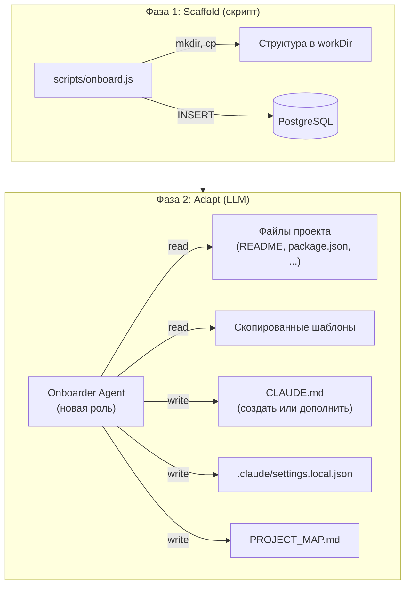
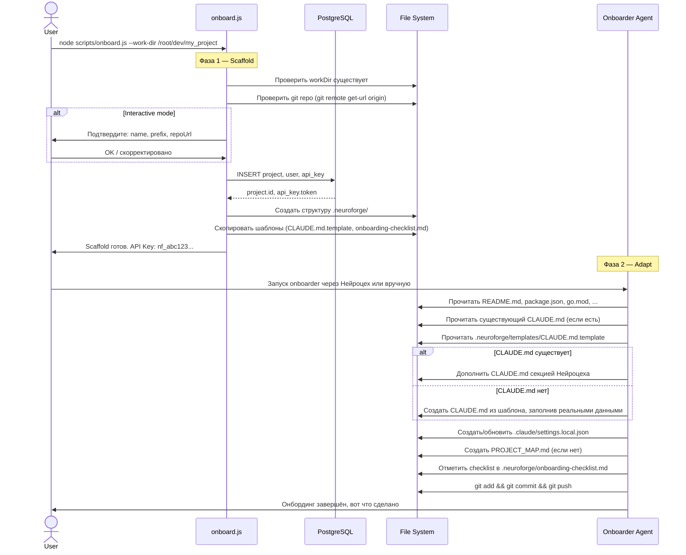

# NF-22: Процесс онбординга новых проектов — Спецификация

## Обзор

Двухфазный онбординг: **scaffold-скрипт** создаёт структуру и копирует базовые файлы, затем **LLM-агент** (onboarder) анализирует проект и адаптирует всё под конкретный стек и архитектуру.

## ADR

### Почему LLM вместо детерминистического скрипта

**Решение:** Скрипт делает только механическую работу (mkdir, cp, DB insert). Всю интеллектуальную работу (анализ стека, генерация CLAUDE.md, настройка permissions) делает LLM-агент.

**Альтернатива отвергнута:** Детерминистический StackDetector + шаблонный генератор CLAUDE.md. Проблема: эвристики на основе файлов хрупкие, шаблон не может учесть нюансы конкретного проекта (monorepo, нестандартная структура, специфичный workflow).

**Обоснование:**
- LLM может прочитать README, package.json, существующий CLAUDE.md и понять контекст глубже любого regex
- Если CLAUDE.md уже есть — LLM дополнит его секцией Нейроцеха, не ломая существующее
- Если проект нестандартный — LLM адаптируется, скрипт — нет
- Меньше кода в кодовой базе, меньше поддержки

### Почему не per-project roles

**Решение:** Роли остаются глобальными (`roles/*.md`). Project-specific контекст передаётся через CLAUDE.md в workDir проекта.

**Обоснование:** CLAUDE.md автоматически читается Claude CLI при запуске в workDir. Этого достаточно для project-specific контекста.

## Архитектура

### Диаграмма компонентов



### Sequence Diagram



## Детальный дизайн

### Фаза 1: Scaffold-скрипт (`scripts/onboard.js`)

Минимальный скрипт. Никакой "умной" логики — только IO.

**Что делает:**
1. Валидирует входные параметры (name, prefix, workDir существует, git repo)
2. Регистрирует проект в БД (project + user + api_key)
3. Создаёт структуру `.neuroforge/` в workDir проекта
4. Копирует шаблоны из `docs/templates/onboarding/`
5. Выводит API-ключ и инструкцию для запуска Фазы 2

**CLI:**
```bash
# Interactive (default)
node scripts/onboard.js --work-dir /root/dev/my_project

# Non-interactive
node scripts/onboard.js \
  --work-dir /root/dev/my_project \
  --name my-project \
  --prefix MP \
  --no-interactive

# Dry run
node scripts/onboard.js --work-dir /root/dev/my_project --dry-run
```

**Флаги:**

| Флаг | Описание | Default |
|------|----------|---------|
| `--work-dir` | Путь к проекту (обязательный) | — |
| `--name` | Slug проекта | Из имени директории |
| `--prefix` | Префикс задач | Из имени (первые буквы, uppercase) |
| `--repo-url` | Git remote URL | Из `git remote get-url origin` |
| `--no-interactive` | Без вопросов | false |
| `--dry-run` | Показать план без выполнения | false |

**Структура, создаваемая в workDir проекта:**
```
.neuroforge/
├── onboarding-checklist.md    # чеклист для LLM-агента
└── project.json               # метаданные (projectId, prefix, slug)
```

### Шаблоны (`docs/templates/onboarding/`)

Source of truth для онбординга. Скрипт копирует их в `.neuroforge/`, LLM читает и использует.

#### `docs/templates/onboarding/CLAUDE.md.template`

Шаблон CLAUDE.md с плейсхолдерами и инструкциями для LLM:

```markdown
# {{PROJECT_NAME}}

<!-- LLM: замени {{плейсхолдеры}} реальными данными из проекта -->

## Overview
{{Описание проекта — из README.md или своими словами после анализа кода}}

## Tech Stack
{{Определи из package.json / composer.json / go.mod / pyproject.toml / Cargo.toml / pubspec.yaml / build.gradle.kts}}
- **Runtime:** {{runtime}}
- **Framework:** {{framework}}
- **DB:** {{если есть}}
- **Language:** {{language}}

## Project Structure
{{Сгенерируй дерево основных директорий, как в примере ниже}}
```
src/
├── ...
```

## Запуск
{{Команды для запуска, тестов, сборки — из package.json scripts / Makefile / README}}
```bash
# Dev
{{dev command}}

# Test
{{test command}}

# Build
{{build command}}
```

## Task Manager (Нейроцех)

Base URL: `http://localhost:3000`
Project: `{{SLUG}}`
Prefix: `{{PREFIX}}`

```bash
# Создать задачу
curl -X POST http://localhost:3000/tasks \
  -H "Authorization: Bearer $NF_TOKEN" \
  -H "Content-Type: application/json" \
  -d '{"projectId": "{{PROJECT_ID}}", "title": "...", "description": "..."}'
```
```

#### `docs/templates/onboarding/onboarding-checklist.md`

Чеклист, который LLM-агент проходит и отмечает:

```markdown
# Onboarding Checklist

## Анализ проекта
- [ ] Прочитать README.md
- [ ] Определить стек (язык, фреймворк, БД, тесты)
- [ ] Понять структуру директорий
- [ ] Найти команды запуска (dev, test, build)

## CLAUDE.md
- [ ] Проверить: существует ли CLAUDE.md?
  - Если да: дополнить секцией "Task Manager (Нейроцех)"
  - Если нет: создать из шаблона, заполнив реальными данными
- [ ] Убедиться что описание проекта актуально
- [ ] Убедиться что структура директорий отражает реальность
- [ ] Убедиться что команды запуска рабочие

## .claude/settings.local.json
- [ ] Создать/обновить с permissions для стека проекта:
  - Всегда: git, ls, grep
  - Node.js: npm, npx, node
  - PHP: php, composer, ./vendor/bin/phpunit
  - Python: python3, pip, pytest
  - Go: go
  - Swift: swift, xcodebuild
  - Kotlin/Android: ./gradlew, adb
  - Dart/Flutter: flutter, dart
  - Docker: docker-compose

## PROJECT_MAP.md
- [ ] Если нет — создать карту основных модулей проекта
- [ ] Если есть — проверить актуальность

## Финализация
- [ ] git add && git commit -m "chore: neuroforge onboarding" && git push
```

#### `docs/templates/onboarding/settings.local.template.json`

Базовый шаблон permissions (LLM дополняет по стеку):

```json
{
  "permissions": {
    "allow": [
      "Bash(git *)",
      "Bash(ls:*)",
      "Read",
      "Write",
      "Edit",
      "Glob",
      "Grep"
    ]
  }
}
```

### Фаза 2: Onboarder Agent (роль `roles/onboarder.md`)

Новая роль для Нейроцеха. Может запускаться как:
- Автоматически через Нейроцех-пайплайн (задача типа "onboarding")
- Вручную: `claude -p "Выполни онбординг проекта" --system-prompt roles/onboarder.md` из workDir

**Роль:**

```markdown
---
name: onboarder
model: sonnet
timeout_ms: 600000
allowed_tools:
  - Read
  - Write
  - Edit
  - Glob
  - Grep
  - Bash
---

# Onboarder — Настройка проекта для Нейроцеха

Ты настраиваешь проект для работы с Нейроцехом. Scaffold-скрипт уже создал
`.neuroforge/` с метаданными и чеклистом. Твоя задача — проанализировать проект
и создать/обновить конфигурационные файлы.

## Процесс

1. Прочитай `.neuroforge/project.json` — там projectId, slug, prefix
2. Прочитай `.neuroforge/onboarding-checklist.md` — это твой план
3. Проанализируй проект (README, конфиги, структуру)
4. Выполни каждый пункт чеклиста, отмечая выполненные
5. Закоммить и запушь результат

## Правила

- Если CLAUDE.md уже существует — НЕ перезаписывай. Дополни секцией Нейроцеха
- Если .claude/settings.local.json существует — мержи permissions, не затирай
- Не выдумывай то, чего не видишь в проекте. Если не можешь определить — оставь TODO
- Будь лаконичным в CLAUDE.md — это рабочий документ, не документация
- PROJECT_MAP.md — максимум 200 строк, только основные модули
```

### Project Registrar (`scripts/lib/projectRegistrar.js`)

Переиспользует существующие entity и repo:

```js
class ProjectRegistrar {
  constructor({ pool })

  async register({ name, prefix, repoUrl, workDir }) → {
    project,    // Project entity
    user,       // User entity
    apiKey: {   // { id, name, token (raw!) }
      id, name, token
    }
  }
}
```

**Логика:**
1. `Project.create({name, prefix, repoUrl, workDir})` → `projectRepo.save()`
2. `User.create({name: \`${slug}-agent\`, role: 'member'})` → `userRepo.save()`
3. `ApiKey.create(...)` → `apiKeyRepo.save()`, вернуть raw token

### Файловая структура изменений

```
docs/templates/onboarding/              # NEW — шаблоны для онбординга
├── CLAUDE.md.template                  # шаблон CLAUDE.md с плейсхолдерами
├── onboarding-checklist.md             # чеклист для LLM-агента
└── settings.local.template.json        # базовые permissions

roles/
└── onboarder.md                        # NEW — роль онбордера

scripts/
├── onboard.js                          # NEW — CLI scaffold-скрипт
└── lib/
    └── projectRegistrar.js             # NEW — регистрация в БД
```

## Изменения по слоям

### Domain Layer
Нет изменений. Используем существующие Project, User, ApiKey entity.

### Application Layer
Нет изменений. Скрипт работает напрямую с domain + infrastructure.

### Infrastructure Layer
Нет изменений. Используем существующие PgProjectRepo, PgUserRepo, PgApiKeyRepo.

### Scripts (новый слой)
| Что | Файл | Действие |
|-----|------|----------|
| CLI scaffold | `scripts/onboard.js` | CREATE |
| DB registrar | `scripts/lib/projectRegistrar.js` | CREATE |

### Roles
| Что | Файл | Действие |
|-----|------|----------|
| Onboarder role | `roles/onboarder.md` | CREATE |

### Templates
| Что | Файл | Действие |
|-----|------|----------|
| CLAUDE.md template | `docs/templates/onboarding/CLAUDE.md.template` | CREATE |
| Checklist | `docs/templates/onboarding/onboarding-checklist.md` | CREATE |
| Settings template | `docs/templates/onboarding/settings.local.template.json` | CREATE |

### Критичные файлы оркестрации
Изменения НЕ требуются.

## Как это работает: пример

```bash
# 1. Scaffold
$ node scripts/onboard.js --work-dir /root/dev/flower_shop

  Проект:   flower-shop
  Префикс:  FS
  Repo:     https://github.com/user/flower_shop
  workDir:  /root/dev/flower_shop

  Подтвердить? [Y/n] y

  ✅ Проект зарегистрирован в БД
  ✅ .neuroforge/ создана
  🔑 API Key: nf_abc123... (сохраните, больше не покажем)

  Следующий шаг — запустите онбордер:
  cd /root/dev/flower_shop && claude -p "Выполни онбординг" --system-prompt /root/dev/neuroforge/roles/onboarder.md

# 2. LLM-агент анализирует проект и создаёт:
#    - CLAUDE.md (или дополняет существующий)
#    - .claude/settings.local.json
#    - PROJECT_MAP.md
#    - Коммитит и пушит
```

## Тесты

### Unit Tests

1. **projectRegistrar.test.js**
   - Успешная регистрация (project + user + apiKey)
   - Duplicate name → ошибка
   - Duplicate prefix → ошибка

2. **onboard.test.js** (скрипт)
   - Парсинг аргументов (--work-dir, --name, --prefix)
   - Auto-detect name из директории
   - Auto-detect repoUrl из git remote
   - Dry run: ничего не меняется в БД и FS
   - Создание структуры .neuroforge/
   - Копирование шаблонов

### Integration Tests

3. **onboard.integration.test.js** (с реальной БД)
   - Full scaffold flow: validate → register → create structure
   - Идемпотентность: повторный запуск → понятная ошибка
   - Несуществующий workDir → ошибка

### Тестирование LLM-агента
Onboarder тестируется вручную на реальных проектах. Автотесты для LLM-фазы не нужны — результат проверяется reviewer'ом или пользователем.

## Открытые вопросы

1. **`npm run onboard` alias?** — Да, добавить в package.json.
2. **Запуск онбордера через API?** — Out of scope. Пока ручной запуск через CLI.
3. **Деонбординг/удаление проекта?** — Out of scope.
