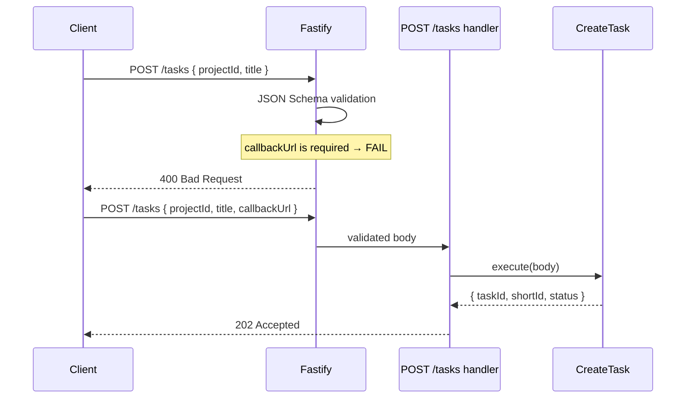
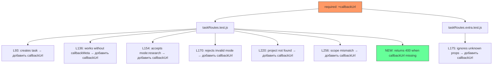

# Spec: callbackUrl обязателен при создании задачи

## Изменение

### Слой: Infrastructure (HTTP validation)

**Файл:** `src/infrastructure/http/routes/taskRoutes.js`

**Изменение:** строка 9, добавить `'callbackUrl'` в массив `required`:
```js
// БЫЛО:
required: ['projectId', 'title'],

// СТАЛО:
required: ['projectId', 'title', 'callbackUrl'],
```

Больше никаких изменений в production-коде. `callbackMeta` остаётся необязательным.

---

## Диаграмма: Sequence — валидация запроса



## Диаграмма: Impact — затронутые тесты



## Обновление тестов

### `taskRoutes.test.js`

Константа для повторного использования (добавить после строки 12):
```js
const CALLBACK_URL = 'https://example.com/callback';
```

#### Тесты, где нужно добавить `callbackUrl` в payload:

| Строка | Тест | Payload fix |
|--------|------|-------------|
| 93 | `creates a task and returns 202` | `+ callbackUrl: CALLBACK_URL` |
| 136 | `works without callbackMeta in request body` | `+ callbackUrl: CALLBACK_URL` |
| 154 | `accepts mode: research` | `+ callbackUrl: CALLBACK_URL` |
| 170 | `rejects invalid mode value` | `+ callbackUrl: CALLBACK_URL` |
| 220 | `returns 404 when project not found` | `+ callbackUrl: CALLBACK_URL` |
| 256 | `returns 403 when scope does not match` | `+ callbackUrl: CALLBACK_URL` |

#### Новый тест (добавить после теста `returns 400 when title is missing`):

```js
it('returns 400 when callbackUrl is missing', async () => {
  const { app: a } = setup();
  app = a;
  await app.ready();

  const res = await app.inject({
    method: 'POST',
    url: '/tasks',
    headers: authHeader(),
    payload: { projectId: PROJECT_ID, title: 'Task without callback' },
  });

  expect(res.statusCode).toBe(400);
});
```

### `taskRoutes.extra.test.js`

| Строка | Тест | Payload fix |
|--------|------|-------------|
| 184 | `ignores additional unknown properties` | `+ callbackUrl: 'https://example.com/callback'` |

## Чеклист для developer'а
- [ ] Изменить `required` в `createTaskSchema` (1 строка)
- [ ] Обновить 6 тестов в `taskRoutes.test.js` — добавить `callbackUrl` в payload
- [ ] Добавить 1 новый тест: `returns 400 when callbackUrl is missing`
- [ ] Обновить 1 тест в `taskRoutes.extra.test.js`
- [ ] Запустить `npx vitest run src/infrastructure/http/routes/taskRoutes` — все тесты зелёные
- [ ] НЕ мержить в main
