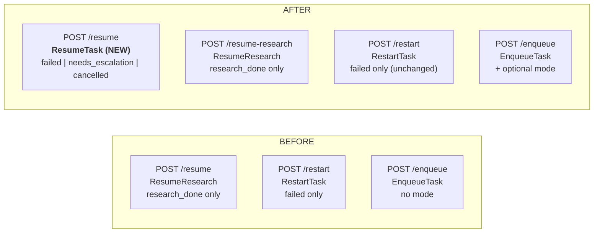
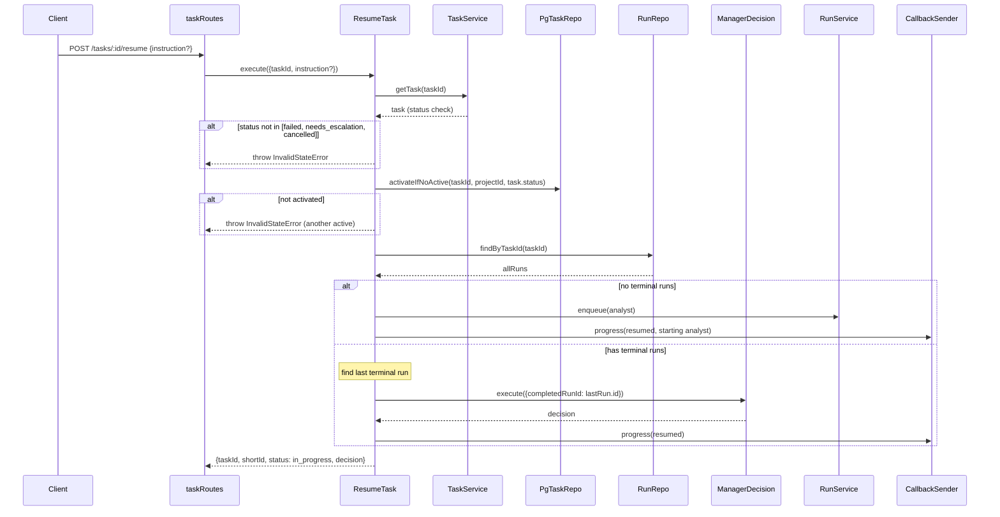

# NF-25: Spec — Refactoring Resume API

## Обзор

Три изменения:
1. **Новый** `POST /tasks/:id/resume` — универсальный resume из failed/needs_escalation/cancelled
2. **Переименование** `POST /tasks/:id/resume` → `POST /tasks/:id/resume-research`
3. **Расширение** `POST /tasks/:id/enqueue` — опциональный параметр mode

## Диаграмма: API endpoints (до и после)



## Диаграмма: ResumeTask sequence



## 1. POST /tasks/:id/resume — ResumeTask (новый use case)

### Файл: `src/application/ResumeTask.js` (новый)

```
class ResumeTask {
  constructor({ taskService, runService, runRepo, taskRepo, projectRepo,
                roleRegistry, managerDecision, callbackSender, logger })

  async execute({ taskId, instruction }) → { taskId, shortId, status, decision }
}
```

### Логика execute:

1. `taskService.getTask(taskId)` — получить задачу
2. Проверить `task.status` in `['failed', 'needs_escalation', 'cancelled']`, иначе `InvalidStateError`
3. `taskRepo.activateIfNoActive(taskId, projectId, task.status)` — атомарная активация. Если false → `InvalidStateError` (другая задача активна)
4. Получить историю ранов: `runRepo.findByTaskId(taskId)`
5. Отфильтровать terminal runs (done, failed, timeout, interrupted), отсортировать по createdAt
6. **Если нет terminal runs** → enqueue analyst (аналогично RestartTask):
   ```
   runService.enqueue({ taskId, roleName: 'analyst', prompt: '...' })
   ```
   Если передан `instruction` — добавить его в промпт analyst'а.
7. **Если есть terminal runs** → `managerDecision.execute({ completedRunId: lastRun.id })`
   - ManagerDecision сам определит следующий шаг по детерминистической логике
   - Если передан `instruction` — записать в лог (instruction не влияет на ManagerDecision, это контекст для человека)
8. Callback: `type: 'progress', stage: 'resumed'`
9. Return: `{ taskId, shortId, status: 'in_progress', decision }`

### Зависимости (DI):
- taskService, runService, runRepo, taskRepo, projectRepo, roleRegistry, managerDecision, callbackSender, logger

### HTTP Schema:
```js
const resumeTaskSchema = {
  params: { type: 'object', required: ['id'], properties: { id: { type: 'string' } } },
  body: {
    type: 'object',
    properties: {
      instruction: { type: 'string', minLength: 1, maxLength: 10000 },
    },
    additionalProperties: false,
  },
  response: {
    200: {
      type: 'object',
      properties: {
        taskId: { type: 'string' },
        shortId: { type: 'string' },
        status: { type: 'string' },
        decision: { type: 'object' },
      },
    },
  },
};
```

Обрати внимание: `body` не required (может быть пустым или отсутствовать), `instruction` опциональна.

## 2. POST /tasks/:id/resume-research — переименование

### Изменения в `src/infrastructure/http/routes/taskRoutes.js`:
- Текущий маршрут `POST /tasks/:id/resume` → `POST /tasks/:id/resume-research`
- Текущая схема `resumeSchema` → переименовать в `resumeResearchSchema`
- Use case остаётся `useCases.resumeResearch`
- Добавить новый маршрут `POST /tasks/:id/resume` с новой схемой `resumeTaskSchema`, вызывающий `useCases.resumeTask`

### Порядок маршрутов:
```
POST /tasks/:id/resume          → useCases.resumeTask (новый)
POST /tasks/:id/resume-research → useCases.resumeResearch (текущий)
```

## 3. POST /tasks/:id/enqueue — добавить mode

### Изменения в `src/application/EnqueueTask.js`:

```js
async execute({ taskId, mode }) {
  const task = await this.#taskService.enqueueFromBacklog(taskId);

  // Обновить mode если передан
  if (mode) {
    await this.#taskService.updateMode(task.id, mode);
  }

  // ... остальное без изменений
}
```

### Изменения в схеме `enqueueSchema` (taskRoutes.js):

Добавить body:
```js
const enqueueSchema = {
  params: { ... },  // без изменений
  body: {
    type: 'object',
    properties: {
      mode: { type: 'string', enum: ['research', 'full', 'fix', 'auto'] },
    },
    additionalProperties: false,
  },
  response: { ... },  // без изменений
};
```

### Изменения в маршруте /enqueue:
```js
fastify.post('/tasks/:id/enqueue', { schema: enqueueSchema }, async (request, reply) => {
  // ...
  const result = await useCases.enqueueTask.execute({
    taskId: status.task.id,
    mode: request.body?.mode,  // передать mode
  });
  return reply.send(result);
});
```

## 4. Domain: разрешить cancelled → in_progress

### Изменения в `src/domain/entities/Task.js`:

```js
// Строка 25: добавить IN_PROGRESS
[STATUSES.CANCELLED]: [STATUSES.IN_PROGRESS],
```

**Обоснование**: Без этого перехода ResumeTask не сможет возобновить cancelled задачу. `activateIfNoActive` выполняет UPDATE с `AND status = $3`, и затем entity transition validation проверяет допустимость перехода.

Однако `activateIfNoActive` делает UPDATE напрямую в БД, минуя entity transition validation. Поэтому для корректности domain model нужно добавить переход, даже если технически UPDATE сработает.

## 5. Критичный файл: src/index.js

**Необходимые изменения в index.js:**

1. Импорт: `import { ResumeTask } from './application/ResumeTask.js';`
2. Инстанцирование:
```js
const resumeTask = new ResumeTask({
  taskService, runService, runRepo, taskRepo, projectRepo,
  roleRegistry, managerDecision, callbackSender, logger: console,
});
```
3. Добавить в объект useCases: `resumeTask`

## Изменения по слоям

| Слой | Файл | Изменение |
|------|------|-----------|
| Domain | `src/domain/entities/Task.js` | Добавить `cancelled → [in_progress]` в TRANSITIONS |
| Application | `src/application/ResumeTask.js` | **Новый файл** — use case |
| Application | `src/application/EnqueueTask.js` | Добавить параметр `mode` в `execute()` |
| Infrastructure | `src/infrastructure/http/routes/taskRoutes.js` | Новая схема `resumeTaskSchema`, переименовать `resumeSchema` → `resumeResearchSchema`, новый маршрут `/resume`, переименовать старый в `/resume-research`, добавить body в `enqueueSchema` |
| Infrastructure | `src/index.js` | DI для ResumeTask, добавить в useCases |

## Тесты

### Новые тесты: `src/application/ResumeTask.test.js`
1. **Успешный resume из failed** — с terminal runs → вызывает managerDecision
2. **Успешный resume из needs_escalation** — аналогично
3. **Успешный resume из cancelled** — аналогично
4. **Resume без истории ранов** — enqueue analyst
5. **Resume с instruction** — instruction добавляется в промпт analyst'а (если нет ранов)
6. **Ошибка: неверный статус** — in_progress → InvalidStateError
7. **Ошибка: другая задача активна** — activateIfNoActive returns false → InvalidStateError

### Обновить: `src/application/EnqueueTask.test.js`
1. **Enqueue с mode** — вызывает updateMode
2. **Enqueue без mode** — не вызывает updateMode (обратная совместимость)

### Обновить: `src/domain/entities/Task.test.js`
1. **Transition cancelled → in_progress** — должен быть валидным

### Обновить: `src/infrastructure/http/routes/taskRoutes.test.js`
1. **POST /resume** — вызывает resumeTask use case
2. **POST /resume-research** — вызывает resumeResearch use case
3. **POST /enqueue с mode** — передаёт mode в use case
