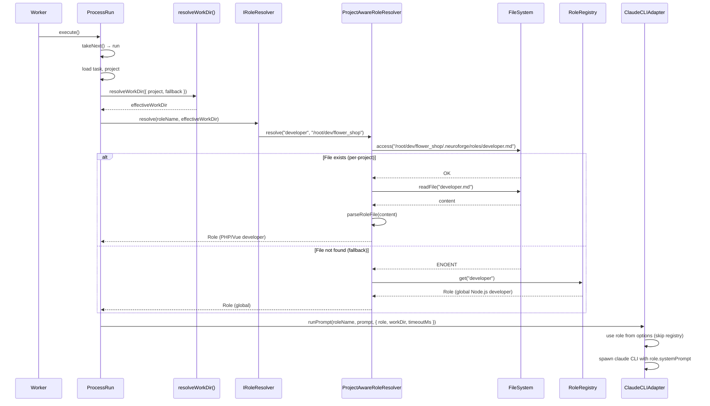

# NF-26: Per-project roles — Спецификация

## Цель

При выполнении run'а для проекта — резолвить роль из `<project.workDir>/.neuroforge/roles/<roleName>.md` с фолбэком на глобальную роль из `roles/`.

## Архитектура

### Новый порт: IRoleResolver

```
Domain Port (абстракция)
  │
  └─ IRoleResolver.resolve(roleName, projectWorkDir?) → Promise<Role>
       │
       └─ Infrastructure (реализация)
            └─ ProjectAwareRoleResolver
                 ├─ проверяет <projectWorkDir>/.neuroforge/roles/<roleName>.md
                 ├─ если есть → parseRoleFile() → Role (project-specific)
                 └─ если нет → roleRegistry.get(roleName) (global fallback)
```

### Диаграмма C4 — Component level

```mermaid
graph TB
    subgraph Domain
        IRR[IRoleResolver<br/><i>port</i>]
        RR[RoleRegistry<br/><i>global roles Map</i>]
        RoleVO[Role<br/><i>value object</i>]
    end

    subgraph Infrastructure
        PARR[ProjectAwareRoleResolver<br/><i>implements IRoleResolver</i>]
        FRL[fileRoleLoader<br/><i>parseRoleFile()</i>]
        CLA[ClaudeCLIAdapter]
    end

    subgraph Application
        PR[ProcessRun]
    end

    subgraph FileSystem
        GR[roles/*.md<br/><i>global roles</i>]
        PPR["&lt;workDir&gt;/.neuroforge/roles/*.md<br/><i>project roles</i>"]
    end

    PR -->|uses| IRR
    CLA -->|uses| IRR
    PARR -.->|implements| IRR
    PARR -->|fallback| RR
    PARR -->|parses| FRL
    FRL -->|creates| RoleVO
    RR -->|stores| RoleVO
    FRL -->|reads| GR
    PARR -->|reads| PPR
```

### Sequence Diagram — role resolution при выполнении run



## Изменения по слоям

### 1. Domain — новый порт IRoleResolver

**Новый файл**: `src/domain/ports/IRoleResolver.js`

```js
/**
 * Port for resolving roles with optional project-level overrides.
 * @interface IRoleResolver
 */
export class IRoleResolver {
  /**
   * @param {string} roleName
   * @param {string|null} [projectWorkDir] — if provided, check project-specific role first
   * @returns {Promise<import('../valueObjects/Role.js').Role>}
   */
  async resolve(roleName, projectWorkDir = null) {
    throw new Error('Not implemented');
  }
}
```

### 2. Infrastructure — ProjectAwareRoleResolver

**Новый файл**: `src/infrastructure/roles/projectAwareRoleResolver.js`

```js
import { access } from 'node:fs/promises';
import { readFile } from 'node:fs/promises';
import { join } from 'node:path';
import { IRoleResolver } from '../../domain/ports/IRoleResolver.js';
import { parseRoleFile } from './fileRoleLoader.js';

export class ProjectAwareRoleResolver extends IRoleResolver {
  #roleRegistry;
  #logger;

  constructor({ roleRegistry, logger }) {
    super();
    this.#roleRegistry = roleRegistry;
    this.#logger = logger || console;
  }

  async resolve(roleName, projectWorkDir = null) {
    if (projectWorkDir) {
      const projectRolePath = join(projectWorkDir, '.neuroforge', 'roles', `${roleName}.md`);
      try {
        await access(projectRolePath);
        const content = await readFile(projectRolePath, 'utf-8');
        const role = parseRoleFile(content, `${roleName}.md`);
        this.#logger.info('[RoleResolver] Using project role: %s from %s', roleName, projectRolePath);
        return role;
      } catch (err) {
        if (err.code !== 'ENOENT') {
          this.#logger.warn('[RoleResolver] Error reading project role %s: %s', projectRolePath, err.message);
        }
        // fallback to global
      }
    }
    return this.#roleRegistry.get(roleName);
  }
}
```

**Логика**:
- Если `projectWorkDir` передан — проверить `<workDir>/.neuroforge/roles/<roleName>.md`
- Если файл есть и парсится — вернуть project-specific Role
- Если файла нет (ENOENT) — молча фолбэк на глобальный
- Если файл есть, но невалидный — ошибка всплывает (fail fast), run упадёт
- Если `projectWorkDir` не передан — сразу глобальный

### 3. Application — ProcessRun

**Файл**: `src/application/ProcessRun.js`

Изменения:
1. Заменить `#roleRegistry` на `#roleResolver` (IRoleResolver)
2. **Переместить** резолюцию роли ПОСЛЕ `resolveWorkDir()` (строка 85 → перед chatEngine.runPrompt)
3. Использовать `await this.#roleResolver.resolve(run.roleName, effectiveWorkDir)`

```diff
- #roleRegistry;
+ #roleResolver;

  constructor({ ..., roleRegistry, ... }) {
-   this.#roleRegistry = roleRegistry;
+   this.#roleResolver = roleRegistry; // accepts IRoleResolver (backward-compatible param name)
  }

  async execute() {
    ...
-   const role = this.#roleRegistry.get(run.roleName);  // строка 48 — УДАЛИТЬ
    ...
    const effectiveWorkDir = await resolveWorkDir({ project, fallback: this.#workDir });
    ...
+   // Resolve role with project-level override
+   const role = await this.#roleResolver.resolve(run.roleName, effectiveWorkDir);
    ...
    result = await this.#chatEngine.runPrompt(run.roleName, run.prompt, {
      ...
      timeoutMs: role.timeoutMs,
      ...
    });
  }
```

**Важно**: параметр конструктора оставить `roleRegistry` для обратной совместимости в DI. Внутри использовать как IRoleResolver.

### 4. Infrastructure — ClaudeCLIAdapter

**Файл**: `src/infrastructure/claude/claudeCLIAdapter.js`

Изменения:
1. Заменить `roleRegistry` на `roleResolver` (IRoleResolver) в конструкторе
2. В `#execCLI`: использовать `await this.roleResolver.resolve(roleName, effectiveWorkDir)`

```diff
- constructor({ roleRegistry, workDir, logger, killDelayMs, mcpConfigPath } = {}) {
+ constructor({ roleRegistry, workDir, logger, killDelayMs, mcpConfigPath } = {}) {
    super();
-   this.roleRegistry = roleRegistry;
+   this.roleResolver = roleRegistry; // accepts IRoleResolver (backward-compatible param name)
    ...
  }

  async #execCLI(roleName, prompt, options = {}) {
    const { sessionId, signal, timeoutMs, runId, taskId, workDir } = options;
    const effectiveWorkDir = workDir || this.workDir;
    ...
-   const role = this.roleRegistry.get(roleName);
+   const role = await this.roleResolver.resolve(roleName, effectiveWorkDir);
    ...
  }
```

**Примечание**: оба поля (`ProcessRun.#roleResolver` и `ClaudeCLIAdapter.roleResolver`) получат один и тот же экземпляр `ProjectAwareRoleResolver`. Но роль резолвится **дважды** за один run (ProcessRun для timeoutMs, ClaudeCLIAdapter для model/systemPrompt/allowedTools). Это OK: файл читается 2 раза (~1ms каждый), зато код чистый и каждый компонент автономен.

### 5. Composition Root — src/index.js (**критичный файл**)

**Файл**: `src/index.js`

Добавить после создания `roleRegistry` (строка 93):

```diff
+ import { ProjectAwareRoleResolver } from './infrastructure/roles/projectAwareRoleResolver.js';
  ...
  const roleRegistry = new RoleRegistry();
  for (const role of roles) {
    roleRegistry.register(role);
  }
+ const roleResolver = new ProjectAwareRoleResolver({ roleRegistry, logger: console });
  ...
  const chatEngine = new ClaudeCLIAdapter({
-   roleRegistry,
+   roleRegistry: roleResolver,
    workDir: config.workDir,
    mcpConfigPath,
  });
```

И во всех use cases где инжектится `roleRegistry` в ProcessRun:
```diff
  const processRun = new ProcessRun({
    ...,
-   roleRegistry,
+   roleRegistry: roleResolver,
    ...
  });
```

**Остальные use cases** (CreateTask, ManagerDecision, RestartTask, etc.) продолжают получать оригинальный `roleRegistry` — им нужна только валидация `has()`/`get()`, project-aware резолюция не требуется.

## Тесты

### Новый тест: `src/infrastructure/roles/projectAwareRoleResolver.test.js`

| Кейс | Описание |
|------|----------|
| project role exists | `resolve('developer', '/tmp/project')` → возвращает project-specific Role |
| project role missing, global exists | `resolve('developer', '/tmp/project')` → возвращает глобальную Role |
| no projectWorkDir | `resolve('developer', null)` → возвращает глобальную Role |
| project role invalid YAML | `resolve('developer', '/tmp/project')` → throws Error |
| project role dir missing | `resolve('developer', '/tmp/no-such-dir')` → фолбэк на глобальную |

Тест использует `tmp` директорию с реальными файлами (не моки FS) для простоты и надёжности.

### Обновление: `src/application/ProcessRun.test.js`

- Заменить мок `roleRegistry` на мок `roleResolver` с методом `resolve()` вместо `get()`
- Добавить кейс: roleResolver вызывается с effectiveWorkDir

### Обновление: `src/infrastructure/claude/claudeCLIAdapter.test.js`

- Заменить мок `roleRegistry` на мок `roleResolver` с методом `resolve()`

## Файлы для создания/изменения

| Действие | Файл |
|----------|------|
| **CREATE** | `src/domain/ports/IRoleResolver.js` |
| **CREATE** | `src/infrastructure/roles/projectAwareRoleResolver.js` |
| **CREATE** | `src/infrastructure/roles/projectAwareRoleResolver.test.js` |
| **MODIFY** | `src/application/ProcessRun.js` — roleRegistry → roleResolver, переместить резолюцию после workDir |
| **MODIFY** | `src/infrastructure/claude/claudeCLIAdapter.js` — roleRegistry → roleResolver (async) |
| **MODIFY** | `src/index.js` — создать ProjectAwareRoleResolver, инжектить в ProcessRun и ClaudeCLIAdapter |
| **UPDATE** | `src/application/ProcessRun.test.js` — адаптировать моки |
| **UPDATE** | `src/infrastructure/claude/claudeCLIAdapter.test.js` — адаптировать моки |

## Что НЕ меняется

- `Role` value object — без изменений
- `RoleRegistry` — без изменений (используется как fallback внутри ProjectAwareRoleResolver)
- `fileRoleLoader.js` — без изменений (parseRoleFile реюзается)
- `IChatEngine` port — без изменений
- Use cases: CreateTask, ManagerDecision, RestartTask, ResumeResearch, StartNextPendingTask — без изменений (продолжают использовать RoleRegistry для валидации)
