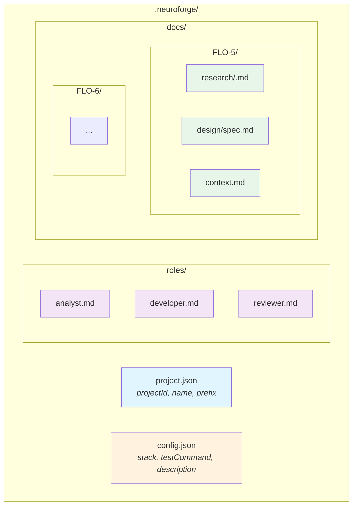
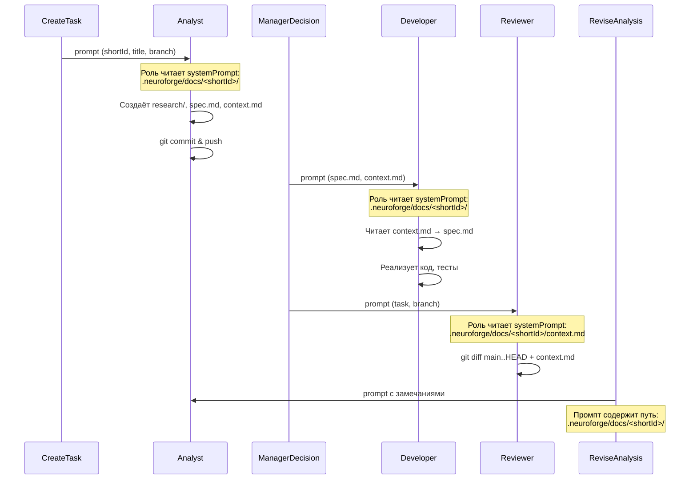
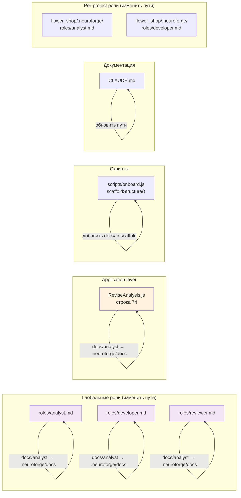

# NF-27: Спецификация — Стандартизация `.neuroforge/` как системной папки

## Обзор

Стандартизировать `.neuroforge/` как единую системную папку для всего, что связано с Нейроцехом в проекте. Перенести путь артефактов аналитика из `docs/analyst/<shortId>/` в `.neuroforge/docs/<shortId>/`. Создать `config.json` конвенцию.

**Важно:** Глобальные роли (`roles/` в корне neuroforge) НЕ переносятся — они остаются source of truth для всех проектов. Обоснование в `research/decisions.md` (ADR-2).

## Целевая структура `.neuroforge/`

```
<project>/
└── .neuroforge/
    ├── project.json     # метаданные проекта (уже есть, создаётся onboard.js)
    ├── config.json      # стек, команды, описание (NEW)
    ├── roles/           # per-project role overrides (уже работает после NF-26)
    │   ├── analyst.md
    │   ├── developer.md
    │   └── reviewer.md
    └── docs/            # артефакты задач (NEW — вместо docs/analyst/)
        └── <taskId>/
            ├── research/
            │   └── <slug>.md
            ├── design/
            │   └── spec.md
            └── context.md
```

## Диаграммы

### Диаграмма 1: Структура `.neuroforge/` (C4 Container)



### Диаграмма 2: Поток данных — где читают артефакты (Sequence)



### Диаграмма 3: Компоненты, затрагиваемые изменениями



## Изменения по слоям

### Domain layer
**Нет изменений.** Пути артефактов не являются частью domain — они зашиты в промптах ролей и application use cases.

### Application layer

#### `src/application/ReviseAnalysis.js` (строка 74)
Заменить путь артефактов:
```
- Обнови артефакты в docs/analyst/${shortId ?? '<shortId>'}/
+ Обнови артефакты в .neuroforge/docs/${shortId ?? '<shortId>'}/
```

Это единственное место в application layer с hardcoded путём.

### Infrastructure layer
**Нет изменений в коде.** `projectAwareRoleResolver.js` уже ищет роли в `.neuroforge/roles/` — это не меняется.

### Системные промпты ролей

#### `roles/analyst.md`
Заменить все `docs/analyst/<shortId>/` → `.neuroforge/docs/<shortId>/`:
- Строка 49: определение рабочей папки
- Строки 52-57: дерево артефактов
- Строка 60: примеры путей
- Строка 62: запрет раскидывать файлы
- Строка 65: git add команда
- Строка 72: путь к context.md

#### `roles/developer.md`
Заменить все `docs/analyst/<shortId>/` → `.neuroforge/docs/<shortId>/`:
- Строки 20-23: артефакты аналитика
- Строки 27-31: предварительная проверка
- Строка 34: процесс работы (шаг 1)
- Строка 36: процесс работы (шаг 3)

#### `roles/reviewer.md`
Заменить `docs/analyst/<shortId>/` → `.neuroforge/docs/<shortId>/`:
- Строка 21: чтение context.md

### Per-project роли (flower_shop)

#### `/root/dev/flower_shop/.neuroforge/roles/analyst.md`
Аналогичная замена `docs/analyst/` → `.neuroforge/docs/` (если путь упоминается в кастомной роли).

#### `/root/dev/flower_shop/.neuroforge/roles/developer.md`
Аналогичная замена.

### Скрипт онбординга

#### `scripts/onboard.js` → функция `scaffoldStructure()` (строка 172)
Добавить создание директории `docs/`:
```javascript
function scaffoldStructure(workDir, projectMeta) {
  const neuroforgeDir = resolve(workDir, '.neuroforge');
  mkdirSync(neuroforgeDir, { recursive: true });
+ mkdirSync(resolve(neuroforgeDir, 'docs'), { recursive: true });

  // ... existing project.json и checklist ...
}
```

### Документация

#### `CLAUDE.md`
Заменить все `docs/analyst/<shortId>/` → `.neuroforge/docs/<shortId>/`:
- Строка 64: таблица ролей
- Строки 91-93: структура артефактов

#### Обновить секцию Project Structure в `CLAUDE.md`
Убрать `docs/analyst/` из дерева, добавить `.neuroforge/docs/`.

## Создание `.neuroforge/` в проектах

### neuroforge (`/root/dev/neuroforge/`)

Создать:
```
.neuroforge/
├── config.json
└── docs/           # пока пустая, будущие задачи будут писать сюда
```

**config.json:**
```json
{
  "name": "neuroforge",
  "stack": ["node.js", "fastify", "postgresql", "knex"],
  "testCommand": "npx vitest run",
  "description": "API-сервер для оркестрации AI-агентов"
}
```

**Не создавать `project.json`** — neuroforge не зарегистрирован через onboard.js, у него нет projectId в БД. project.json создаётся onboard-скриптом.

**Не переносить `roles/`** — они глобальные (ADR-2).

**Не создавать `.neuroforge/roles/`** — neuroforge как проект использует глобальные роли напрямую.

### mybot (`/root/bot/mybot/`)

Создать:
```
.neuroforge/
├── config.json
└── docs/
```

**config.json:**
```json
{
  "name": "mybot",
  "stack": ["node.js", "telegraf", "postgresql"],
  "testCommand": "npx vitest run",
  "description": "Telegram-бот"
}
```

### flower_shop (`/root/dev/flower_shop/`)

Дополнить существующую `.neuroforge/`:
```
.neuroforge/
├── project.json         # уже есть
├── onboarding-checklist.md  # уже есть
├── roles/               # уже есть (analyst, developer, reviewer)
├── config.json          # NEW
└── docs/                # NEW
```

**config.json:**
```json
{
  "name": "flower_shop",
  "stack": ["php", "symfony", "vue.js", "postgresql", "api-platform"],
  "testCommand": "php bin/phpunit",
  "description": "Интернет-магазин цветов"
}
```

## Схема config.json

```json
{
  "name": "string (required) — slug проекта",
  "stack": ["string[] (required) — технологии"],
  "testCommand": "string (optional) — команда запуска тестов",
  "buildCommand": "string (optional) — команда сборки",
  "description": "string (optional) — краткое описание проекта"
}
```

config.json читается только агентами (convention), НЕ читается кодом Нейроцеха (ADR-3).

## Критичные файлы оркестрации

**`src/index.js` — НЕ ТРЕБУЕТ ИЗМЕНЕНИЙ.** `ROLES_DIR` продолжает указывать на `roles/` (глобальные роли). `.neuroforge/roles/` — per-project overrides, обрабатываются `projectAwareRoleResolver.js`.

**`src/infrastructure/claude/claudeCLIAdapter.js` — НЕ ТРЕБУЕТ ИЗМЕНЕНИЙ.** Пути артефактов зашиты в системных промптах ролей, не в адаптере.

## Тесты

### Существующие тесты (не должны сломаться)
- `fileRoleLoader.test.js` — тестирует загрузку из `roles/` → **не ломается** (roles/ не переносится)
- `projectAwareRoleResolver.test.js` — тестирует `.neuroforge/roles/` → **не ломается**
- Все остальные тесты — пути артефактов не тестируются в unit-тестах

### Новые тесты
Не требуются — изменения касаются только промптов (строковые константы в ролях) и одной строки в ReviseAnalysis.js. Функциональность не меняется.

### Ручная проверка
1. `npx vitest run` — все тесты проходят
2. Проверить что `.neuroforge/config.json` создан во всех трёх проектах
3. Проверить что `.neuroforge/docs/` существует во всех трёх проектах
4. Проверить что промпты ролей ссылаются на `.neuroforge/docs/`

## Порядок реализации

1. **Обновить роли** (analyst.md, developer.md, reviewer.md) — замена путей
2. **Обновить ReviseAnalysis.js** — одна строка
3. **Обновить CLAUDE.md** — замена путей в документации
4. **Обновить onboard.js** — добавить `docs/` в scaffold
5. **Создать `.neuroforge/`** в neuroforge, mybot, flower_shop
6. **Обновить per-project роли** flower_shop (если содержат пути)
7. **Запустить тесты** — `npx vitest run`
