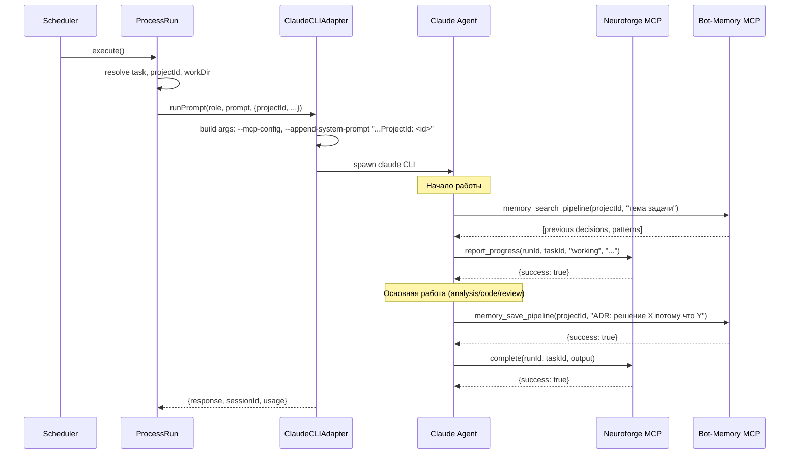
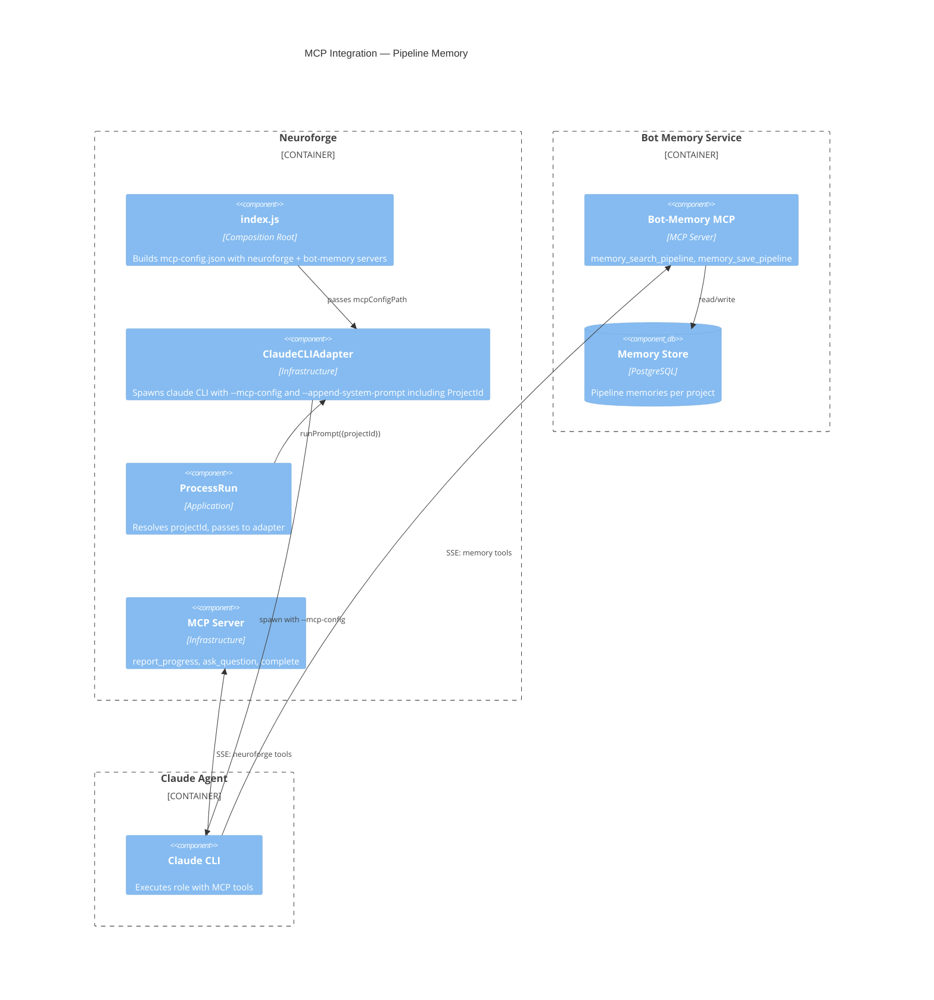

# Spec: Pipeline Memory Integration

## Цель

Подключить MCP-инструменты командной памяти (`memory_search_pipeline`, `memory_save_pipeline`) к пайплайну агентов. Агенты читают и пополняют командную память проекта.

## Изменения по слоям

### Infrastructure

#### 1. `src/index.js` — добавить bot-memory в mcp-config

**Критичный файл оркестрации.** Изменения необходимы для подключения нового MCP-сервера к единому конфигу агентов.

После строки 131 (после записи mcp-config.json), **изменить** генерацию конфига:

```
Читать env: BOT_MEMORY_URL (default: null)
Если BOT_MEMORY_URL задан → добавить в mcpServers:
  "bot-memory": {
    "type": "sse",
    "url": "<BOT_MEMORY_URL>/sse"
  }
```

Структура итогового mcp-config.json (когда BOT_MEMORY_URL задан):
```json
{
  "mcpServers": {
    "neuroforge": { "type": "sse", "url": "http://localhost:3100/sse", "headers": {...} },
    "bot-memory": { "type": "sse", "url": "http://127.0.0.1:3099/sse" }
  }
}
```

Если `BOT_MEMORY_URL` не задан — конфиг остаётся как есть (только neuroforge).

#### 2. `src/infrastructure/claude/claudeCLIAdapter.js` — передавать projectId

**Критичный файл оркестрации.** Изменение необходимо для передачи projectId в контекст агента через `--append-system-prompt`.

В методе `#execCLI()`:
- Принять `projectId` из `options`
- Расширить append-system-prompt:

```
Было:   --append-system-prompt "Project workspace: <workDir>"
Стало:  --append-system-prompt "Project workspace: <workDir>\nProjectId: <projectId>"
```

`projectId` добавляется только если передан (не null). Это позволит агентам знать projectId для MCP-вызовов memory_search_pipeline/memory_save_pipeline.

Сигнатура `options`: добавить optional `projectId: string|null`.

#### 3. `src/application/ProcessRun.js` — передавать projectId в chatEngine

В `execute()`, при вызове `chatEngine.runPrompt()` (строка 108), добавить `projectId` в options:

```javascript
result = await this.#chatEngine.runPrompt(run.roleName, run.prompt, {
  sessionId: session.cliSessionId || null,
  timeoutMs: role.timeoutMs,
  runId: run.id,
  taskId: run.taskId,
  signal: abortController.signal,
  workDir: effectiveWorkDir,
  projectId,              // <-- NEW
});
```

`projectId` уже доступен в scope (строка 50).

### Roles (system prompts)

#### 4. `.neuroforge/roles/analyst.md`

**allowed_tools** — добавить:
```yaml
allowed_tools:
  - Read
  - Write
  - Glob
  - Grep
  - Bash
  - WebSearch
  - WebFetch
  - mcp__bot-memory__memory_search_pipeline
  - mcp__bot-memory__memory_save_pipeline
```

**System prompt** — добавить секцию перед "## Процесс работы":

```markdown
## Командная память проекта

У тебя есть доступ к трём пространствам памяти через MCP-инструменты:
- **pipeline** (read+write) — командная память проекта. Сюда пишут и читают все агенты пайплайна.
- **personal** (read-only) — контекст владельца проекта. Только чтение.
- **project** (read-only) — знания о кодовой базе. Только чтение.

### Когда читать
В начале работы вызови `memory_search_pipeline` с запросом, релевантным задаче. Используй ProjectId из system prompt. Это поможет узнать о предыдущих архитектурных решениях, отклонённых подходах, паттернах проекта.

### Когда писать
Сохраняй в pipeline-память через `memory_save_pipeline`:
- Ключевые архитектурные решения (ADR) с обоснованием
- Отклонённые подходы с причинами отклонения
- Обнаруженные паттерны проекта, которые не описаны в документации
- НЕ сохраняй: промежуточные выводы, очевидные факты, содержимое файлов

Если MCP-инструменты памяти недоступны — продолжай работу без них.
```

#### 5. `.neuroforge/roles/developer.md`

**allowed_tools** — добавить:
```yaml
allowed_tools:
  - Read
  - Glob
  - Grep
  - Bash
  - Write
  - Edit
  - mcp__bot-memory__memory_search_pipeline
  - mcp__bot-memory__memory_save_pipeline
```

**System prompt** — добавить секцию перед "## Артефакты аналитика":

```markdown
## Командная память проекта

У тебя есть доступ к командной памяти проекта через MCP-инструменты:
- `memory_search_pipeline(projectId, query)` — поиск в командной памяти (архитектурные решения, паттерны, отклонённые подходы)
- `memory_save_pipeline(projectId, content)` — сохранение в командную память

### Когда читать
В начале работы — поищи в памяти решения, связанные с текущей задачей. Используй ProjectId из system prompt.

### Когда писать
Сохраняй только значимое:
- Нетривиальные решения по реализации с обоснованием
- Обнаруженные ограничения/подводные камни
- НЕ сохраняй: что уже есть в коде, очевидные вещи

Если MCP-инструменты памяти недоступны — продолжай работу без них.
```

#### 6. `.neuroforge/roles/reviewer.md`

**allowed_tools** — добавить:
```yaml
allowed_tools:
  - Read
  - Glob
  - Grep
  - Bash
  - mcp__bot-memory__memory_search_pipeline
```

Reviewer получает только `memory_search_pipeline` (read-only). Ему не нужно сохранять в память — он генерирует findings, а не знания.

**System prompt** — добавить секцию перед "## Подготовка":

```markdown
## Командная память проекта

Доступен MCP-инструмент `memory_search_pipeline` — поиск в командной памяти проекта.
Используй его для проверки, соответствуют ли изменения архитектурным решениям и паттернам проекта.
Используй ProjectId из system prompt. Если инструмент недоступен — продолжай без него.
```

## Диаграммы

### Sequence: Agent с pipeline memory



### C4 Component: MCP Integration



## Конфигурация

Новая env-переменная:

| Переменная | Default | Описание |
|-----------|---------|----------|
| `BOT_MEMORY_URL` | (не задана) | URL bot-memory MCP-сервера. Если не задана — память не подключается |

Пример: `BOT_MEMORY_URL=http://127.0.0.1:3099`

## Тест-план

### Unit-тесты

1. **ClaudeCLIAdapter**: projectId в append-system-prompt
   - Когда projectId передан → `--append-system-prompt` содержит `ProjectId: <id>`
   - Когда projectId null → строка как раньше (только workspace)

2. **index.js (mcp-config generation)**: проверить содержимое конфига
   - Когда `BOT_MEMORY_URL` задан → конфиг содержит оба сервера
   - Когда `BOT_MEMORY_URL` не задан → конфиг содержит только neuroforge

### Integration

3. **ProcessRun → ClaudeCLIAdapter**: projectId пробрасывается из task через options

## Acceptance Criteria

- [ ] При `BOT_MEMORY_URL=http://127.0.0.1:3099` агенты получают MCP-инструменты `memory_search_pipeline` и `memory_save_pipeline`
- [ ] Агенты знают projectId через system prompt и могут передавать его в MCP-вызовы
- [ ] Analyst и developer имеют read+write доступ к pipeline-памяти
- [ ] Reviewer имеет только read-доступ (только `memory_search_pipeline`)
- [ ] Без `BOT_MEMORY_URL` система работает как раньше (graceful degradation)
- [ ] System prompts ролей содержат инструкции по работе с памятью
- [ ] Тесты покрывают условное подключение и передачу projectId
