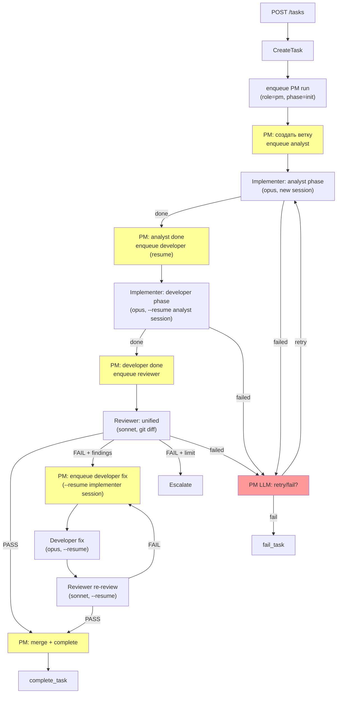
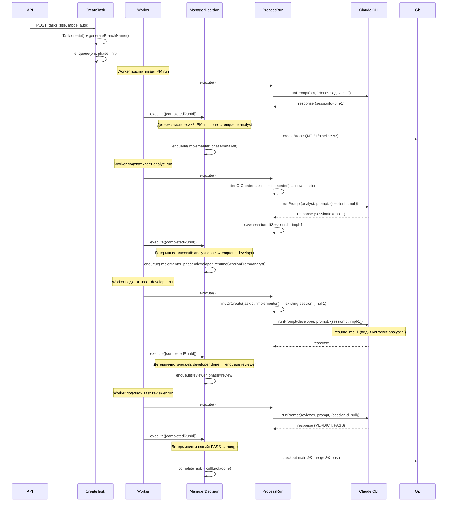

# Spec: Pipeline v2 — session-based агенты с PM-оркестратором

## Проблема

Текущий пайплайн (7-8 агентов × stateless) стоит $7-8 за задачу. 60-75% токенов — повторное чтение файлов. Manager LLM вызывается для каждого детерминистического перехода. 3 reviewer'а дублируют контекст.

## Решение

3 сессии вместо 7-8 процессов:
1. **PM** (sonnet, `--resume`) — детерминистический оркестратор + LLM для edge cases
2. **Implementer** (opus, analyst+developer в одной сессии через `--resume`)
3. **Reviewer** (sonnet, unified чеклист, начинает с `git diff`)

Tester/CTO убираются из пайплайна (файлы ролей сохраняются). Merge делает PM через Bash.

---

## Диаграмма: Pipeline v2 — полный flow



## Sequence Diagram: задача от создания до merge



---

## Изменения по слоям

### 1. Domain Layer

#### 1.1. `src/domain/entities/Session.js` — ИЗМЕНИТЬ

Добавить `taskId`:

```javascript
constructor({ id, projectId, taskId, cliSessionId, roleName, status, createdAt, updatedAt }) {
  this.id = id;
  this.projectId = projectId;
  this.taskId = taskId ?? null;  // ← НОВОЕ
  this.cliSessionId = cliSessionId ?? null;
  this.roleName = roleName;
  this.status = status;
  this.createdAt = createdAt;
  this.updatedAt = updatedAt;
}

static create({ projectId, taskId, roleName, cliSessionId }) {
  return new Session({
    id: crypto.randomUUID(),
    projectId,
    taskId: taskId ?? null,  // ← НОВОЕ
    cliSessionId,
    roleName,
    status: STATUSES.ACTIVE,
    createdAt: new Date(),
    updatedAt: new Date(),
  });
}

// fromRow/toRow — добавить task_id mapping
```

#### 1.2. `src/domain/valueObjects/ReviewFindings.js` — БЕЗ ИЗМЕНЕНИЙ

Unified reviewer использует тот же формат VERDICT/FINDINGS/SUMMARY. `parseAll()` работает для одного reviewer run так же как для трёх.

Единственное уточнение: `REVIEWER_ROLES` в ManagerDecision нужно обновить — добавить `'reviewer'` (unified).

### 2. Application Layer

#### 2.1. `src/application/ManagerDecision.js` — **ПЕРЕПИСАТЬ**

Это центральный компонент рефакторинга. Текущая логика:
1. handleResearchMode → handleDevFixComplete → handleReviewFindings → **LLM manager**
2. LLM manager решает spawn_run/complete/fail

Целевая логика:
1. handleResearchMode (без изменений)
2. **Детерминистический pipeline router** (90% случаев)
3. **PM LLM** только для ошибок и edge cases

```javascript
const PIPELINE_V2_ROLES = {
  PM: 'pm',
  IMPLEMENTER: 'implementer',  // analyst + developer phases
  REVIEWER: 'reviewer',        // unified reviewer
};

// Фазы implementer'а (передаются через run.stepId или через prompt metadata)
const IMPLEMENTER_PHASES = {
  ANALYST: 'analyst',
  DEVELOPER: 'developer',
  FIX: 'fix',
};

export class ManagerDecision {
  // ... existing deps + gitOps

  async execute({ completedRunId }) {
    const completedRun = await this.#runRepo.findById(completedRunId);
    // ... existing validation ...

    const task = await this.#taskService.getTask(completedRun.taskId);
    if (['done', 'failed', 'cancelled', 'research_done'].includes(task.status)) {
      return { action: 'skipped' };
    }

    const allRuns = await this.#runRepo.findByTaskId(task.id);
    const pendingRuns = allRuns.filter(r => r.status === 'queued' || r.status === 'running');
    if (pendingRuns.length > 0) return { action: 'waiting' };

    // 1. Research mode (без изменений)
    const researchResult = await this.#handleResearchMode(task, allRuns);
    if (researchResult) return researchResult;

    // 2. Deterministic pipeline routing
    const deterministicResult = await this.#routePipeline(task, completedRun, allRuns);
    if (deterministicResult) return deterministicResult;

    // 3. Fallback: PM LLM для нестандартных ситуаций
    return await this.#callPmLlm(task, completedRun, allRuns);
  }
}
```

**`#routePipeline()` — детерминистический маршрутизатор:**

```javascript
async #routePipeline(task, completedRun, allRuns) {
  const role = completedRun.roleName;
  const phase = completedRun.stepId; // analyst/developer/fix/review
  const status = completedRun.status;

  // PM init done → create branch + enqueue analyst
  if (role === 'pm' && phase === 'init' && status === 'done') {
    return await this.#afterPmInit(task, completedRun);
  }

  // Analyst done → enqueue developer (resume session)
  if (role === 'implementer' && phase === 'analyst' && status === 'done') {
    return await this.#afterAnalystDone(task, completedRun, allRuns);
  }

  // Developer done → enqueue reviewer
  if (role === 'implementer' && (phase === 'developer' || phase === 'fix') && status === 'done') {
    return await this.#afterDeveloperDone(task, completedRun, allRuns);
  }

  // Reviewer done → parse findings, route
  if (role === 'reviewer' && status === 'done') {
    return await this.#afterReviewerDone(task, completedRun, allRuns);
  }

  // Failed/timeout runs → PM LLM decides
  if (['failed', 'timeout', 'interrupted'].includes(status)) {
    return null; // fallback to PM LLM
  }

  return null; // unknown → PM LLM
}
```

**Ключевые методы:**

```javascript
async #afterPmInit(task, completedRun) {
  // 1. Создать git ветку (если ещё нет)
  if (!task.branchName) {
    // branchName уже создан в CreateTask, но PM мог получить первый
  }

  // 2. Enqueue analyst
  const prompt = `Задача: ${task.shortId ?? ''} ${task.title}\n\n${task.description ?? ''}\n\nПроанализируй задачу и создай спецификацию.`;
  await this.#runService.enqueue({
    taskId: task.id,
    stepId: 'analyst',
    roleName: 'implementer',
    prompt,
    callbackUrl: task.callbackUrl,
    callbackMeta: task.callbackMeta,
  });
  // callback: progress, stage=analyst
  return { action: 'spawn_run', details: { role: 'implementer', phase: 'analyst' } };
}

async #afterAnalystDone(task, completedRun, allRuns) {
  // Developer resume analyst session
  const devPrompt = `Переключись на реализацию. Спецификация уже создана (design/spec.md, context.md).
Реализуй код по спецификации:
1. Прочитай design/spec.md
2. Реализуй все изменения по слоям (domain → application → infrastructure)
3. Напиши unit-тесты для каждого нового модуля
4. Запусти тесты: npx vitest run
5. Закоммить все изменения

Не перечитывай файлы, которые ты уже видел в фазе анализа.`;

  await this.#runService.enqueue({
    taskId: task.id,
    stepId: 'developer',
    roleName: 'implementer',
    prompt: devPrompt,
    callbackUrl: task.callbackUrl,
    callbackMeta: task.callbackMeta,
  });
  // callback: progress, stage=developer
  return { action: 'spawn_run', details: { role: 'implementer', phase: 'developer' } };
}

async #afterDeveloperDone(task, completedRun, allRuns) {
  const reviewPrompt = `Проведи ревью задачи "${task.title}".
Начни с: git diff main..HEAD
Если diff пустой — сразу PASS.
Проверь по объединённому чеклисту: архитектура (DDD/SOLID), бизнес-логика (AC), безопасность (OWASP).`;

  await this.#runService.enqueue({
    taskId: task.id,
    stepId: 'review',
    roleName: 'reviewer',
    prompt: reviewPrompt,
    callbackUrl: task.callbackUrl,
    callbackMeta: task.callbackMeta,
  });
  // callback: progress, stage=reviewer
  return { action: 'spawn_run', details: { role: 'reviewer', phase: 'review' } };
}

async #afterReviewerDone(task, completedRun, allRuns) {
  const findings = ReviewFindings.parse(completedRun.response || '', 'reviewer');

  // PASS → merge
  if (!findings.hasBlockingFindings) {
    // Tech debt callback для minor findings
    if (findings.minorFindings.length > 0 && task.callbackUrl) {
      await this.#callbackSender.send(task.callbackUrl,
        { type: 'tech_debt', taskId: task.id, shortId: task.shortId, findings: findings.minorFindings },
        task.callbackMeta);
    }
    return await this.#mergeAndComplete(task);
  }

  // FAIL + revision limit → escalate
  if (task.revisionCount >= MAX_REVIEW_REVISIONS) {
    await this.#taskService.escalateTask(task.id);
    // callback: needs_escalation
    return { action: 'needs_escalation' };
  }

  // FAIL → developer fix (resume implementer session)
  await this.#taskService.incrementRevision(task.id);
  const fixPrompt = buildFixPrompt(task, [...findings.blockingFindings, ...findings.minorFindings.filter(f => f.severity !== 'LOW')]);
  await this.#runService.enqueue({
    taskId: task.id,
    stepId: 'fix',
    roleName: 'implementer',
    prompt: fixPrompt,
    callbackUrl: task.callbackUrl,
    callbackMeta: task.callbackMeta,
  });
  // callback: progress, stage=revision
  return { action: 'revision_cycle', details: { findings: findings.blockingFindings } };
}

async #mergeAndComplete(task) {
  try {
    await this.#gitOps.mergeBranch(task.branchName);
    await this.#taskService.completeTask(task.id);
    // callback: done
    await this.#tryStartNext(task.projectId);
    return { action: 'complete_task' };
  } catch (err) {
    if (err.message.includes('conflict') || err.message.includes('CONFLICT')) {
      await this.#taskService.escalateTask(task.id);
      // callback: needs_escalation, reason: merge conflict
      return { action: 'needs_escalation', details: { reason: 'merge conflict' } };
    }
    throw err;
  }
}
```

**`#callPmLlm()` — fallback для нестандартных ситуаций:**

```javascript
async #callPmLlm(task, completedRun, allRuns) {
  // Формируем дельта-промпт (НЕ всю историю)
  const deltaPrompt = buildPmDeltaPrompt(task, completedRun);

  // Используем PM session для --resume
  const pmSession = await this.#sessionRepo.findOrCreateForTask(task.id, 'pm');
  const role = this.#roleRegistry.get('pm');
  const result = await this.#chatEngine.runPrompt('pm', deltaPrompt, {
    timeoutMs: role.timeoutMs,
    sessionId: pmSession?.cliSessionId || null,
  });

  // Save PM session
  if (result.sessionId && result.sessionId !== pmSession.cliSessionId) {
    pmSession.cliSessionId = result.sessionId;
    await this.#sessionRepo.save(pmSession);
  }

  const decision = parseManagerDecision(result.response);
  // ... existing decision execution logic ...
}
```

#### 2.2. `src/application/ProcessRun.js` — ИЗМЕНИТЬ

Session lookup изменить: task-scoped вместо project-scoped.

```javascript
// Было (строки 53-64):
const session = await this.#sessionRepo.findOrCreate(projectId, run.roleName);
if (run.roleName === 'developer' && !session.cliSessionId) {
  const analystSession = await this.#sessionRepo.findByProjectAndRole(projectId, 'analyst');
  ...
}

// Стало:
const session = run.taskId
  ? await this.#sessionRepo.findOrCreateForTask(run.taskId, run.roleName)
  : await this.#sessionRepo.findOrCreate(projectId, run.roleName);
// Session sharing: implementer уже одна роль —
// analyst и developer фазы используют одну session row
// Никакого хака с наследованием не нужно
```

#### 2.3. `src/application/CreateTask.js` — ИЗМЕНИТЬ

Первый run — НЕ analyst, а implementer(analyst) напрямую. PM init фаза убирается (PM вызывается только как LLM fallback).

**Обоснование:** PM init = детерминистический (создать ветку + enqueue analyst). Нет смысла тратить LLM-вызов. CreateTask делает это сам.

```javascript
// Было:
const prompt = `Задача: ${task.shortId ?? ''} ${title}\n\n${description ?? ''}\n\nПроанализируй задачу и создай спецификацию.`;
await this.#runService.enqueue({
  taskId: task.id, stepId: null, roleName: 'analyst', prompt, ...
});

// Стало:
const prompt = `Задача: ${task.shortId ?? ''} ${title}\n\n${description ?? ''}\n\nПроанализируй задачу и создай спецификацию.`;
await this.#runService.enqueue({
  taskId: task.id,
  stepId: 'analyst',        // ← фаза
  roleName: 'implementer',  // ← единая роль
  prompt,
  callbackUrl, callbackMeta,
});
```

#### 2.4. `src/application/StartNextPendingTask.js` — ИЗМЕНИТЬ

Аналогично CreateTask: enqueue `implementer` с stepId `analyst`.

#### 2.5. `src/application/ReplyToQuestion.js` — ИЗМЕНИТЬ

Reply → enqueue PM (с ответом владельца). PM через --resume имеет контекст и решит, как продолжить.

```javascript
// Было: enqueue(lastRun.roleName, prompt)
// Стало: enqueue('pm', `Ответ владельца на вопрос: ${answer}. Реши, как продолжить.`)
```

**Альтернатива:** если вопрос задал implementer, resume implementer с ответом (не PM). Проще и эффективнее по токенам.

**Решение:** resume ту же роль (как сейчас). Если ask_owner пришёл от PM LLM — resume PM. Если от implementer — resume implementer. Определяется по `lastRun.roleName`.

#### 2.6. `src/application/RestartTask.js` — МИНИМАЛЬНЫЕ ИЗМЕНЕНИЯ

Restart → enqueue implementer(analyst) с нуля (если нет completed runs) или enqueue по роли последнего run.

#### 2.7. `src/application/ResumeResearch.js` — ИЗМЕНИТЬ

Resume research → enqueue `implementer` (stepId=developer) вместо `developer`.

### 3. Infrastructure Layer

#### 3.1. `src/infrastructure/persistence/PgSessionRepo.js` — ИЗМЕНИТЬ

Добавить `findOrCreateForTask(taskId, roleName)`:

```javascript
async findOrCreateForTask(taskId, roleName) {
  // Atomic: find active session for task+role, or create new
  const pool = getPool();
  await pool.query('BEGIN');
  try {
    const existing = await pool.query(
      `SELECT * FROM sessions WHERE task_id = $1 AND role_name = $2 AND status = 'active' LIMIT 1 FOR UPDATE`,
      [taskId, roleName],
    );
    // ... same pattern as findOrCreate but with task_id ...
    await pool.query('COMMIT');
    return Session.fromRow(row);
  } catch (err) {
    await pool.query('ROLLBACK');
    throw err;
  }
}
```

Существующий `findOrCreate(projectId, roleName)` — **сохраняется** для backward compat (standalone runs без taskId).

#### 3.2. `src/infrastructure/persistence/migrations/` — НОВАЯ МИГРАЦИЯ

```javascript
export async function up(knex) {
  await knex.schema.alterTable('sessions', (table) => {
    table.uuid('task_id').nullable().references('id').inTable('tasks').onDelete('CASCADE');
  });
  // Unique: one active session per task+role
  await knex.raw(`
    CREATE UNIQUE INDEX idx_sessions_task_role_active
    ON sessions(task_id, role_name)
    WHERE task_id IS NOT NULL AND status = 'active'
  `);
}

export async function down(knex) {
  await knex.raw('DROP INDEX IF EXISTS idx_sessions_task_role_active');
  await knex.schema.alterTable('sessions', (table) => {
    table.dropColumn('task_id');
  });
}
```

#### 3.3. `src/infrastructure/git/gitCLIAdapter.js` — ИЗМЕНИТЬ

Добавить `mergeBranch(branchName)`:

```javascript
async mergeBranch(branchName, workDir) {
  const dir = workDir || this.#defaultWorkDir;
  await this.#exec('git', ['checkout', 'main'], dir);
  await this.#exec('git', ['pull', '--ff-only'], dir);
  await this.#exec('git', ['merge', branchName, '--no-ff'], dir);
  await this.#exec('git', ['push'], dir);
  await this.#exec('git', ['branch', '-d', branchName], dir);
}
```

Добавить `mergeBranch` в `IGitOps` порт.

#### 3.4. Роли — НОВЫЕ/ИЗМЕНЁННЫЕ файлы

**`roles/pm.md` — НОВЫЙ:**

```yaml
---
name: pm
model: sonnet
timeout_ms: 300000
allowed_tools: []
---
```

PM prompt — минимальный, т.к. вызывается только для edge cases. Основная логика — детерминистическая в ManagerDecision.

**`roles/implementer.md` — НОВЫЙ** (заменяет analyst + developer):

```yaml
---
name: implementer
model: opus
timeout_ms: 3600000
allowed_tools:
  - Read
  - Write
  - Glob
  - Grep
  - Bash
  - Edit
  - WebSearch
  - WebFetch
---
```

System prompt — объединение analyst.md и developer.md с фазовым переключением.

**`roles/reviewer.md` — НОВЫЙ** (unified):

```yaml
---
name: reviewer
model: sonnet
timeout_ms: 900000
allowed_tools:
  - Read
  - Glob
  - Grep
  - Bash
---
```

System prompt — объединение reviewer-architecture.md + reviewer-business.md + reviewer-security.md.

**`roles/analyst.md` — ИЗМЕНИТЬ:**
- Убрать создание git ветки (делает CreateTask/PM)
- Добавить: "Ты — фаза 'analyst' роли implementer"

**`roles/developer.md` — ИЗМЕНИТЬ:**
- Добавить: "Напиши unit-тесты, запусти, убедись что проходят"
- Добавить: "Ты — фаза 'developer' роли implementer"

#### 3.5. `src/index.js` — **КРИТИЧНЫЙ ФАЙЛ ОРКЕСТРАЦИИ**

**Обоснование:** Нужно передать `gitOps` в ManagerDecision для merge.

```javascript
// Обновить создание ManagerDecision:
const managerDecision = new ManagerDecision({
  runService, taskService, chatEngine, roleRegistry,
  callbackSender, runRepo, sessionRepo, logger: console,
  startNextPendingTask,
  gitOps,      // ← НОВОЕ (для merge)
  workDir: config.workDir, // ← НОВОЕ (для merge)
});
```

---

## Критичные файлы оркестрации

| Файл | Затрагивается? | Что именно | Обоснование |
|---|---|---|---|
| `src/index.js` | ✅ **ДА** | Передать gitOps и workDir в ManagerDecision | Merge через gitOps вместо CTO-агента |
| `src/infrastructure/claude/claudeCLIAdapter.js` | ❌ Нет | --resume, usage, AbortSignal уже работают | — |
| `src/infrastructure/scheduler/worker.js` | ❌ Нет | processRun → managerDecision chain не меняется | — |
| `src/infrastructure/scheduler/managerScheduler.js` | ❌ Нет | tick/slot/timeout/recovery не меняются | — |
| `restart.sh` | ❌ Нет | — | — |

---

## ADR: Детерминистический PM vs. PM как LLM-first

### Контекст
PM может быть: (A) LLM-first (PM LLM вызывается ВСЕГДА, принимает решение), или (B) Deterministic-first (код решает 90% случаев, PM LLM только для ошибок/edge cases).

### Решение
Вариант **B — Deterministic-first**.

### Обоснование
- Стандартный пайплайн (analyst → developer → reviewer → merge) предсказуем на 90%
- LLM-вызов PM = $0.05-0.10 × 4-6 раз = $0.3-0.6 впустую
- Детерминистическая логика быстрее (0ms vs 5-15s LLM call)
- PM LLM сохраняется для нестандартных случаев (failed runs, ask_owner, edge cases)
- `#routePipeline()` проще отлаживать и тестировать чем LLM responses

### Последствия
- PM LLM вызывается ~10% задач (только при ошибках)
- PM session может вообще не создаваться для happy path
- Экономия: ~$0.3-0.5 на задачу

---

## ADR: Implementer (единая роль) vs. отдельные analyst/developer

### Контекст
Analyst и developer могут быть: (A) одной ролью `implementer` с фазами, или (B) отдельными ролями с session sharing.

### Решение
Вариант **A — единая роль `implementer`** с `stepId` для обозначения фазы.

### Обоснование
- Session row: одна запись `(taskId, 'implementer')` вместо хака наследования
- `--resume` между фазами нативный — та же сессия
- System prompt переключается через фокусирующий промпт от ManagerDecision
- При revision (fix после review) — снова та же session
- Роли `analyst.md` и `developer.md` остаются как reference, но ClaudeCLIAdapter получает `implementer` с system prompt из `implementer.md`

### Последствия
- `Run.roleName` = `'implementer'` для обоих фаз. `Run.stepId` = `'analyst'`/`'developer'`/`'fix'`
- Callback stage = stepId (не roleName): `stage: 'analyst'`, `stage: 'developer'`
- ReviewFindings — без изменений (парсит response по формату, не по roleName)

---

## ADR: Implementer system prompt — единый vs. фазовый

### Контекст
Implementer может иметь: (A) один system prompt для обеих фаз, или (B) разные system prompts (analyst.md при stepId=analyst, developer.md при stepId=developer).

### Решение
Вариант **A — единый system prompt** (`implementer.md`), с фокусировкой через user prompt от ManagerDecision.

### Обоснование
- `--resume` к session с другим `--system-prompt` может сбить Claude
- Единый prompt с обоими контекстами (analyst rules + developer rules)
- ManagerDecision передаёт фокусирующий промпт: "Фаза: analyst. Исследуй и создай спецификацию."
- При переключении на developer: "Фаза: developer. Реализуй по спецификации."
- KISS: один файл, один system prompt, фокус через user prompt

### Последствия
- `implementer.md` = объединение analyst.md + developer.md (без дублирования общих частей)
- `roles/analyst.md` и `roles/developer.md` остаются как reference, не загружаются в пайплайн
- При `--resume` system prompt не меняется (Claude видит тот же контекст)

---

## Порядок реализации (этапы)

### Этап 1: Session migration + task-scoped sessions
1. Миграция: добавить `task_id` в sessions
2. `Session.js`: добавить taskId
3. `PgSessionRepo.js`: `findOrCreateForTask(taskId, roleName)`
4. `ProcessRun.js`: использовать `findOrCreateForTask` для task-linked runs

### Этап 2: Новые роли
1. `roles/implementer.md` — объединённый system prompt
2. `roles/reviewer.md` — unified чеклист
3. `roles/pm.md` — минимальный для LLM fallback

### Этап 3: ManagerDecision rewrite
1. `#routePipeline()` — детерминистический маршрутизатор
2. `#afterAnalystDone()`, `#afterDeveloperDone()`, `#afterReviewerDone()`
3. `#mergeAndComplete()` — merge через gitOps
4. `#callPmLlm()` — fallback
5. `REVIEWER_ROLES` → включить `'reviewer'`

### Этап 4: Entry points
1. `CreateTask.js` — enqueue implementer(analyst)
2. `StartNextPendingTask.js` — enqueue implementer(analyst)
3. `ReplyToQuestion.js` — resume ту же роль
4. `RestartTask.js` — adaptать
5. `ResumeResearch.js` — enqueue implementer(developer)

### Этап 5: GitOps + merge
1. `gitCLIAdapter.js` — `mergeBranch()`
2. `IGitOps.js` — добавить `mergeBranch` в порт
3. `src/index.js` — передать gitOps в ManagerDecision

### Этап 6: Тесты + cleanup
1. Обновить все тесты
2. Удалить хак session inheritance в ProcessRun
3. E2E тест полного цикла

---

## Тесты

### Unit: `src/application/ManagerDecision.test.js` (ПЕРЕПИСАТЬ)

```
# Детерминистический routing
✓ analyst done → enqueue implementer(developer)
✓ developer done → enqueue reviewer
✓ reviewer PASS → merge + complete
✓ reviewer FAIL + findings → enqueue implementer(fix) + increment revision
✓ reviewer FAIL + revision limit → escalate
✓ failed run → PM LLM called
✓ research mode → research_done (без изменений)

# Merge
✓ merge success → complete task + callback(done)
✓ merge conflict → escalate + callback(needs_escalation)

# PM LLM fallback
✓ PM LLM called for failed analyst
✓ PM session saved for --resume
✓ PM unparseable response → fail task

# Callbacks
✓ progress callback on each step (stage = stepId)
✓ tech_debt callback for minor findings
✓ done callback after merge
```

### Unit: `src/application/ProcessRun.test.js` (ДОПОЛНИТЬ)

```
✓ task-scoped session: findOrCreateForTask called with taskId
✓ implementer session reused for developer phase (same session)
✓ standalone run (no taskId): findOrCreate с projectId (backward compat)
```

### Unit: `src/application/CreateTask.test.js` (ОБНОВИТЬ)

```
✓ enqueue implementer (not analyst) with stepId=analyst
```

### Unit: `src/domain/entities/Session.test.js` (ОБНОВИТЬ)

```
✓ Session.create with taskId
✓ fromRow/toRow with task_id
```

### Integration: E2E

```
✓ Full pipeline: create → analyst → developer (resume) → reviewer → merge → done
✓ Revision cycle: reviewer FAIL → developer fix (resume) → re-review (resume) → PASS
✓ Research mode: create(mode=research) → analyst → research_done
✓ Cancel: cancel during developer → abort + cancelled runs
✓ Cost: total < $5 for typical task
```

---

## Acceptance Criteria

1. ✅ Implementer = analyst + developer в одной session (--resume)
2. ✅ Unified reviewer вместо 3-х (один sonnet, начинает с git diff)
3. ✅ Merge через gitOps, не через CTO-агент
4. ✅ Детерминистический routing для 90% переходов (без LLM)
5. ✅ PM LLM только для ошибок и edge cases
6. ✅ Session per task+role (не project+role)
7. ✅ tester/cto/reviewer-* файлы ролей НЕ удаляются
8. ✅ API POST /tasks не меняется
9. ✅ Все callbacks работают (progress, done, failed, needs_escalation, question, tech_debt, research_done)
10. ✅ Research mode работает (analyst → research_done)
11. ✅ Cancel/Restart/Reply работают
12. ✅ Revision cycle: reviewer FAIL → developer fix (resume) → re-review (resume)
13. ✅ Merge conflict → escalation
14. ✅ Стоимость задачи ≤ $4-5 (vs текущие $7-8)
15. ✅ Все существующие тесты проходят (с обновлениями)
