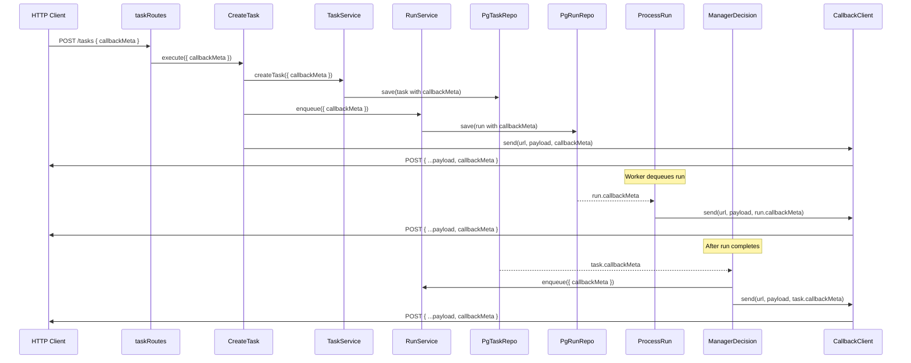
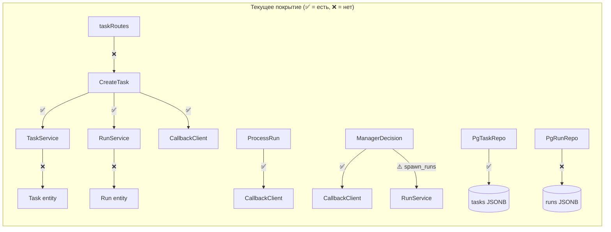

# Spec: test callbackMeta

## Цель

Закрыть пробелы тестового покрытия для `callbackMeta` — opaque JSONB-объекта, который клиент передаёт при создании задачи и получает обратно в каждом callback-уведомлении.

## Диаграмма потока callbackMeta



## Диаграмма покрытия тестами (до/после)



## Изменения

### Нет изменений в domain / application / infrastructure

Код callbackMeta уже полностью реализован. Задача исключительно про тесты.

### Новые и изменяемые тесты

#### 1. `src/infrastructure/persistence/PgRunRepo.test.js` — ИЗМЕНИТЬ

**Что добавить:** В тесте `save + findById` создать Run с `callbackMeta: { chatId: 42 }` и проверить, что после save + findById значение сохраняется.

```javascript
// В существующем тесте 'save + findById' (строка 48)
// ИЗМЕНИТЬ: добавить callbackMeta в создание Run
const run = Run.create({
  taskId,
  roleName: 'analyst',
  prompt: 'Analyze this',
  callbackUrl: 'https://example.com/cb',
  callbackMeta: { chatId: 42 },
});

// ДОБАВИТЬ: ассерт после findById
expect(found.callbackMeta).toEqual({ chatId: 42 });
```

**Новый тест:** Отдельный тест на roundtrip callbackMeta = null.

```javascript
it('preserves null callbackMeta', async () => {
  const run = Run.create({ taskId, roleName: 'analyst', prompt: 'p' });
  await repo.save(run);
  const found = await repo.findById(run.id);
  expect(found.callbackMeta).toBeNull();
});
```

#### 2. `src/domain/entities/Run.test.js` — ИЗМЕНИТЬ

**Что добавить:** В `describe('serialization')` добавить ассерт на callbackMeta roundtrip.

```javascript
// В тесте 'roundtrips through toRow/fromRow' (строка 73)
// ДОБАВИТЬ: в defaults заменить callbackMeta: {} на callbackMeta: { chatId: 99 }
// ДОБАВИТЬ: ассерт
expect(restored.callbackMeta).toEqual({ chatId: 99 });
```

#### 3. `src/infrastructure/http/routes/taskRoutes.test.js` — ИЗМЕНИТЬ

**Что добавить:** Тест что callbackMeta из request body передаётся в CreateTask.execute().

```javascript
it('passes callbackMeta to createTask use case', async () => {
  const { app: server, useCases } = setup();
  app = server;

  const response = await app.inject({
    method: 'POST',
    url: '/tasks',
    headers: authHeader,
    payload: {
      projectId: PROJECT_ID,
      title: 'Test Task',
      callbackUrl: 'https://example.com/cb',
      callbackMeta: { telegramChatId: 555, threadId: 42 },
    },
  });

  expect(response.statusCode).toBe(202);
  expect(useCases.createTask.execute).toHaveBeenCalledWith(
    expect.objectContaining({
      callbackMeta: { telegramChatId: 555, threadId: 42 },
    }),
  );
});
```

**Ещё один тест:** callbackMeta отсутствует — не должен падать.

```javascript
it('works without callbackMeta in request body', async () => {
  const { app: server, useCases } = setup();
  app = server;

  const response = await app.inject({
    method: 'POST',
    url: '/tasks',
    headers: authHeader,
    payload: { projectId: PROJECT_ID, title: 'No meta task' },
  });

  expect(response.statusCode).toBe(202);
  expect(useCases.createTask.execute).toHaveBeenCalledWith(
    expect.objectContaining({ title: 'No meta task' }),
  );
  // callbackMeta should be undefined (not required in schema)
});
```

#### 4. `src/domain/services/RunService.test.js` — ИЗМЕНИТЬ

**Что добавить:** Тест что `enqueue()` прокидывает callbackMeta в Run.create().

```javascript
it('passes callbackMeta to created run', async () => {
  const result = await runService.enqueue({
    taskId: 't-1',
    roleName: 'analyst',
    prompt: 'do stuff',
    callbackUrl: 'https://cb.example.com',
    callbackMeta: { chatId: 777 },
  });

  const savedRun = runRepo.save.mock.calls[0][0];
  expect(savedRun.callbackMeta).toEqual({ chatId: 777 });
});
```

#### 5. `src/domain/services/TaskService.test.js` — ИЗМЕНИТЬ

**Что добавить:** Тест что `createTask()` прокидывает callbackMeta в Task.create().

```javascript
it('passes callbackMeta to created task', async () => {
  const task = await taskService.createTask({
    projectId: 'proj-1',
    title: 'Test',
    callbackMeta: { chatId: 888 },
  });

  const savedTask = taskRepo.save.mock.calls[0]?.[0]
    ?? taskRepo.saveWithSeqNumber.mock.calls[0]?.[0];
  expect(savedTask.callbackMeta).toEqual({ chatId: 888 });
});
```

#### 6. `src/application/ManagerDecision.test.js` — ИЗМЕНИТЬ

**Что добавить:** В тесте `spawn_runs` явно проверить, что каждый enqueued run получает callbackMeta.

Найти тест для spawn_runs action и добавить:

```javascript
// ДОБАВИТЬ: ассерт что callbackMeta прокидывается в каждый enqueued run
for (const call of runService.enqueue.mock.calls) {
  expect(call[0].callbackMeta).toEqual({ chatId: 1 });
}
```

## Критичные файлы оркестрации

Изменения НЕ затрагивают критичные файлы:
- ❌ `src/infrastructure/claude/claudeCLIAdapter.js` — не трогаем
- ❌ `src/infrastructure/scheduler/` — не трогаем
- ❌ `src/index.js` — не трогаем
- ❌ `restart.sh` — не трогаем

## Команда запуска тестов

```bash
npx vitest run
```

## Acceptance Criteria

1. ✅ `PgRunRepo.test.js` — callbackMeta сохраняется и читается из БД (integration)
2. ✅ `Run.test.js` — callbackMeta roundtrip через toRow/fromRow
3. ✅ `taskRoutes.test.js` — callbackMeta из HTTP body передаётся в use case
4. ✅ `taskRoutes.test.js` — запрос без callbackMeta не ломается
5. ✅ `RunService.test.js` — callbackMeta прокидывается в Run.create()
6. ✅ `TaskService.test.js` — callbackMeta прокидывается в Task.create()
7. ✅ `ManagerDecision.test.js` — spawn_runs прокидывает callbackMeta в каждый run
8. ✅ Все существующие тесты проходят (`npx vitest run`)
