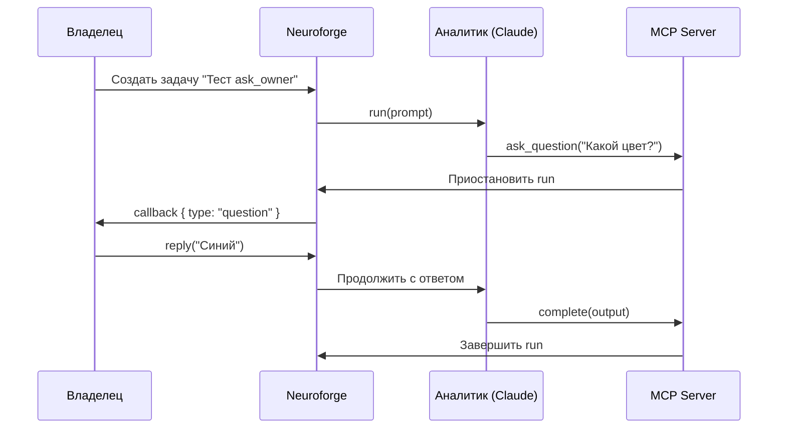
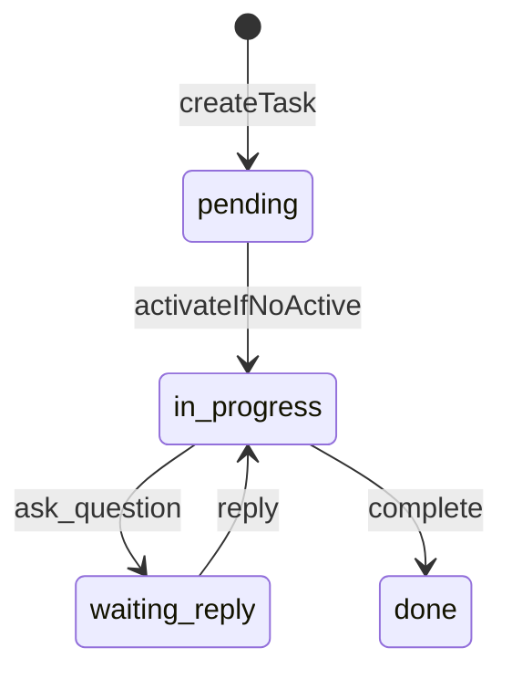

# Spec: Тест ask_owner flow

## Цель

Проверить что механизм `ask_owner` (задать вопрос владельцу через MCP) работает end-to-end в пайплайне аналитика.

## Диаграмма flow

## Диаграмма состояний задачи

## Изменения

**Нет изменений в коде.** Это тестовая задача для валидации существующего механизма.

## Результат теста

| Шаг | Статус |
|---|---|
| Аналитик запущен | ✅ |
| Вопрос задан через MCP | ✅ |
| Выполнение приостановлено | ✅ |
| Ответ получен: «Синий» | ✅ |
| Работа продолжена | ✅ |

## Acceptance Criteria

1. ✅ Аналитик вызывает `ask_question` с переданным вопросом
2. ✅ Владелец получает вопрос и отвечает
3. ✅ Аналитик получает ответ и продолжает работу
4. ✅ Ответ учтён в дальнейших действиях (цвет кнопки = синий)
