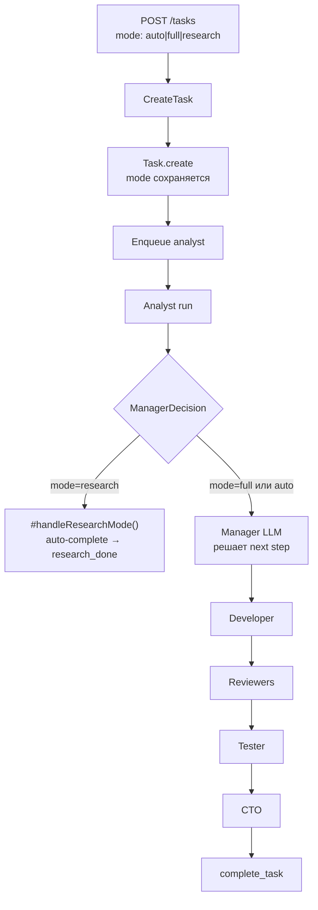
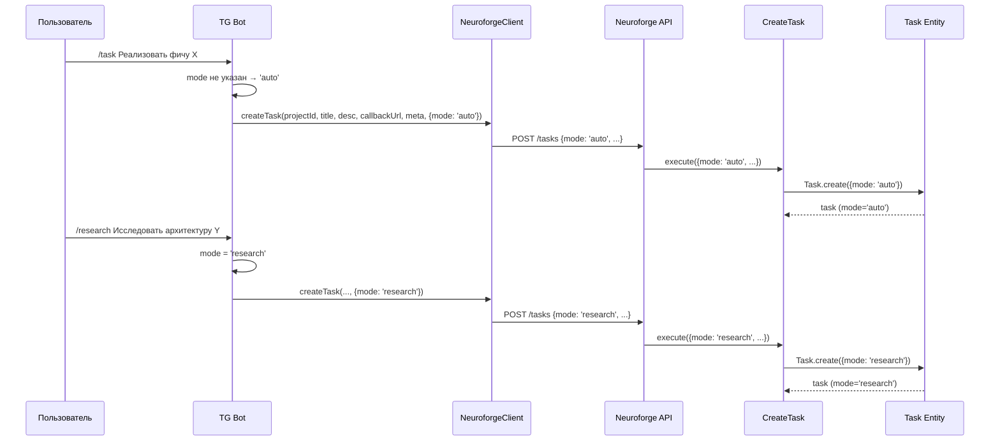

# Spec: Явный параметр mode при создании задачи

## Проблема

Режим задачи (`research` / `full`) нельзя указать из клиента (TG-бот). Default `full` не позволяет создавать research-задачи через бота. Нет режима `auto` для делегирования решения системе.

## Решение

Добавить `auto` в перечисление режимов. Сделать `auto` значением по умолчанию. Прокинуть `mode` в NeuroforgeClient (mybot) и TG-команды бота.

---

## Диаграмма: Mode flow в пайплайне



## Sequence Diagram: Создание задачи с mode через бота



---

## Изменения по слоям

### 1. Domain Layer

#### 1.1. `src/domain/valueObjects/TaskMode.js` — ИЗМЕНИТЬ

Добавить `AUTO`:

```javascript
const MODES = {
  FULL: 'full',
  RESEARCH: 'research',
  AUTO: 'auto',
};

function isValidMode(mode) {
  return Object.values(MODES).includes(mode);
}

export { MODES as TaskMode, isValidMode };
```

#### 1.2. `src/domain/entities/Task.js` — ИЗМЕНИТЬ

Изменить default mode с `'full'` на `'auto'`:

```javascript
// constructor (строка 43):
this.mode = mode ?? 'auto';

// static create (строка 56):
const validatedMode = mode ?? 'auto';

// static fromRow (строка 109):
mode: row.mode ?? 'auto',
```

### 2. Application Layer

#### 2.1. `src/application/ManagerDecision.js` — ИЗМЕНИТЬ

`#handleResearchMode()` уже проверяет `task.mode !== 'research'`, а `auto` и `full` идут в стандартный LLM-пайплайн. **Изменений в логике не нужно.**

Единственное изменение — `buildManagerPrompt()` уже показывает `task.mode` менеджеру. Когда mode=`auto`, менеджер увидит `Режим: auto` — это информативно и корректно.

**Нет изменений в ManagerDecision.**

### 3. Infrastructure Layer

#### 3.1. `src/infrastructure/http/routes/taskRoutes.js` — ИЗМЕНИТЬ

Добавить `'auto'` в enum, изменить default:

```javascript
// В createTaskSchema.body.properties:
mode: { type: 'string', enum: ['full', 'research', 'auto'], default: 'auto' },
```

#### 3.2. `src/infrastructure/persistence/migrations/` — НОВЫЙ файл

Если в БД есть CHECK constraint на mode:

```javascript
export async function up(knex) {
  // Обновить CHECK constraint если существует
  await knex.raw(`
    ALTER TABLE tasks DROP CONSTRAINT IF EXISTS tasks_mode_check;
    ALTER TABLE tasks ADD CONSTRAINT tasks_mode_check
      CHECK (mode IN ('full', 'research', 'auto'));
  `);

  // Изменить default для колонки
  await knex.raw(`ALTER TABLE tasks ALTER COLUMN mode SET DEFAULT 'auto'`);
}

export async function down(knex) {
  await knex.raw(`
    ALTER TABLE tasks DROP CONSTRAINT IF EXISTS tasks_mode_check;
    ALTER TABLE tasks ADD CONSTRAINT tasks_mode_check
      CHECK (mode IN ('full', 'research'));
  `);
  await knex.raw(`ALTER TABLE tasks ALTER COLUMN mode SET DEFAULT 'full'`);
}
```

**Важно:** НЕ обновляем существующие записи. Задачи с `mode='full'` остаются `full`.

### 4. mybot (клиент)

#### 4.1. `src/infrastructure/neuroforge/NeuroforgeClient.js` (mybot) — ИЗМЕНИТЬ

Добавить `options` параметр:

```javascript
/**
 * Create a new task in Neuroforge.
 * @param {string} projectId
 * @param {string} title
 * @param {string} description
 * @param {string} callbackUrl
 * @param {object} [callbackMeta]
 * @param {object} [options]
 * @param {string} [options.mode] - 'auto' | 'full' | 'research'
 * @param {string} [options.status] - 'backlog' (optional)
 * @returns {Promise<{taskId: string, status: string}>}
 */
async createTask(projectId, title, description, callbackUrl, callbackMeta, options = {}) {
  if (!callbackUrl) throw new Error('callbackUrl is required for createTask');
  return this._request('POST', '/tasks', {
    projectId,
    title,
    description,
    callbackUrl,
    callbackMeta,
    ...(options.mode && { mode: options.mode }),
    ...(options.status && { status: options.status }),
  });
}
```

**Backward compatible:** существующие вызовы `createTask(projectId, title, desc, url, meta)` продолжают работать — `options` = `undefined` → `{}`.

#### 4.2. `src/infrastructure/telegram/handlers/commandHandler.js` (mybot) — ИЗМЕНИТЬ

Добавить команду `/research`:

```javascript
// Рядом с bot.command('task', ...)
bot.command('research', async (ctx) => {
  if (isGroupChat(ctx)) return;

  const text = ctx.message.text.split(/\s+/).slice(1).join(' ').trim();
  if (!text) {
    await ctx.reply('Использование: /research <описание задачи на исследование>');
    return;
  }

  const title = text.slice(0, 100);

  try {
    const { taskId } = await neuroforgeClient.createTask(
      neuroforgeProjectId,
      title,
      text,
      callbackUrl,
      { chatId: ctx.chat.id },
      { mode: 'research' },
    );
    await ctx.reply(`🔬 Research-задача принята\nID: ${taskId}`);
  } catch (err) {
    console.error('[/research] Error:', err.message);
    await ctx.reply(`Ошибка: ${err.message}`);
  }
});
```

Существующая `/task` команда — без изменений (не передаёт mode → default `auto` на сервере).

---

## Критичные файлы оркестрации

| Файл | Затрагивается? | Обоснование |
|---|---|---|
| `src/index.js` | ❌ Нет | Нет новых DI-зависимостей |
| `src/infrastructure/claude/claudeCLIAdapter.js` | ❌ Нет | — |
| `src/infrastructure/scheduler/` | ❌ Нет | — |
| `restart.sh` | ❌ Нет | — |

---

## ADR: Семантика `auto` vs `full`

### Контекст
Добавляем `auto` как третий режим задачи. Нужно определить, чем он отличается от `full`.

### Решение
`auto` и `full` **идентичны по поведению** на текущем этапе. Оба проходят через Manager LLM.

### Обоснование
- `auto` = "я не указываю режим, пусть система решит" (default для обратной совместимости)
- `full` = "я явно хочу полный цикл" (осознанный выбор)
- `research` = "только исследование" (детерминистический auto-complete)
- Разница в намерении вызывающего, не в runtime-поведении
- В будущем `auto` может получить heuristic-определение режима — не ломая `full`

### Последствия
- Старые клиенты без mode → получают `auto` вместо `full` → поведение не меняется
- Новые клиенты могут явно указать `research` или `full`
- `auto` — точка расширения для будущей auto-детекции

---

## Тесты

### Unit: `src/domain/valueObjects/TaskMode.test.js` (НОВЫЙ или дополнить)

```
✓ isValidMode('auto') → true
✓ isValidMode('full') → true
✓ isValidMode('research') → true
✓ isValidMode('unknown') → false
✓ TaskMode.AUTO === 'auto'
```

### Unit: `src/domain/entities/Task.test.js` (ДОПОЛНИТЬ)

```
✓ Task.create() без mode → mode = 'auto'
✓ Task.create({mode: 'full'}) → mode = 'full'
✓ Task.create({mode: 'research'}) → mode = 'research'
✓ Task.create({mode: 'auto'}) → mode = 'auto'
✓ Task.create({mode: 'invalid'}) → throws Error
```

### Unit: `src/application/ManagerDecision.test.js` (ДОПОЛНИТЬ)

```
✓ mode=auto → #handleResearchMode returns null (goes to LLM)
✓ mode=research → #handleResearchMode auto-completes
✓ mode=full → #handleResearchMode returns null (goes to LLM)
```

### Unit (mybot): `src/infrastructure/neuroforge/NeuroforgeClient.test.js` (ДОПОЛНИТЬ)

```
✓ createTask без options → не отправляет mode
✓ createTask с {mode: 'research'} → отправляет mode в body
✓ createTask backward compatible — 5 аргументов работают
```

### Integration: API

```
✓ POST /tasks без mode → task.mode = 'auto'
✓ POST /tasks с mode='research' → task.mode = 'research'
✓ POST /tasks с mode='full' → task.mode = 'full'
✓ POST /tasks с mode='invalid' → 400 Bad Request
```

---

## Acceptance Criteria

1. ✅ API принимает `mode: 'auto' | 'full' | 'research'` при создании задачи
2. ✅ Default mode = `auto` (обратная совместимость)
3. ✅ `research` — только analyst → research_done (существующее поведение)
4. ✅ `full` и `auto` — полный пайплайн через Manager LLM (существующее поведение)
5. ✅ NeuroforgeClient (mybot) поддерживает передачу `mode`
6. ✅ TG-бот: `/research` создаёт задачу с `mode=research`
7. ✅ TG-бот: `/task` продолжает работать без mode (→ auto)
8. ✅ Миграция БД: добавлен `auto` в constraint, default → `auto`
9. ✅ Существующие задачи с `mode=full` не затрагиваются
10. ✅ Все существующие тесты проходят
