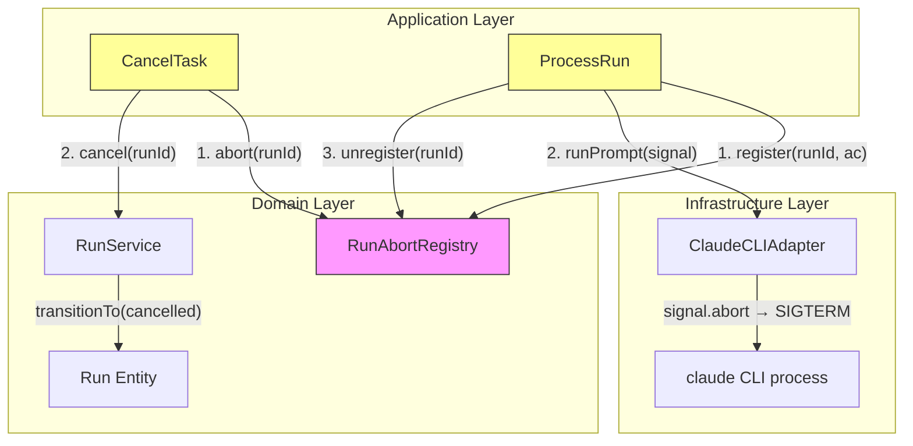
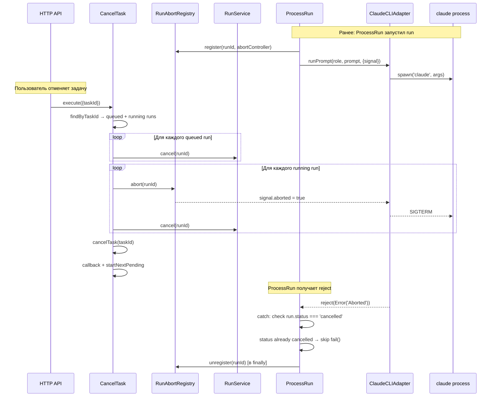

# Spec: Fix cancel задачи — остановка активных runs

## Проблема

`POST /tasks/:id/cancel` не останавливает running runs и не убивает CLI-процессы. `CancelTask.js` фильтрует только `queued` runs, игнорируя `running`. Процесс Claude CLI продолжает работу, потребляет ресурсы и может записать результат после отмены.

## Решение

1. **RunAbortRegistry** — in-memory реестр `Map<runId, AbortController>`
2. **ProcessRun** регистрирует AbortController перед вызовом CLI, передаёт `signal` в chatEngine
3. **CancelTask** для running runs: вызывает `abort()` через реестр + переводит run в `cancelled`
4. **Run entity** — разрешить переход `running → cancelled`

---

## Диаграмма компонентов (C4 Level 3)



## Sequence Diagram: Cancel с running run



---

## Изменения по слоям

### 1. Domain Layer

#### 1.1. `src/domain/entities/Run.js` — ИЗМЕНИТЬ

**Добавить `cancelled` в TRANSITIONS для `running`:**

```javascript
// Было:
[STATUSES.RUNNING]: [STATUSES.DONE, STATUSES.FAILED, STATUSES.TIMEOUT, STATUSES.INTERRUPTED],

// Стало:
[STATUSES.RUNNING]: [STATUSES.DONE, STATUSES.FAILED, STATUSES.TIMEOUT, STATUSES.INTERRUPTED, STATUSES.CANCELLED],
```

**Добавить метод `cancel()`:**

```javascript
cancel() {
  this.transitionTo(STATUSES.CANCELLED);
  this.finishedAt = new Date();
  this.durationMs = this.startedAt ? this.finishedAt - this.startedAt : null;
}
```

#### 1.2. НОВЫЙ: `src/domain/services/RunAbortRegistry.js`

In-memory реестр AbortController-ов. Не зависит от инфраструктуры — чистый domain сервис.

```javascript
export class RunAbortRegistry {
  #controllers = new Map();

  /** @param {string} runId  @param {AbortController} controller */
  register(runId, controller) {
    this.#controllers.set(runId, controller);
  }

  /** @param {string} runId */
  unregister(runId) {
    this.#controllers.delete(runId);
  }

  /**
   * Abort a running run. No-op if runId not registered.
   * @param {string} runId
   * @returns {boolean} true if aborted
   */
  abort(runId) {
    const controller = this.#controllers.get(runId);
    if (controller) {
      controller.abort();
      this.#controllers.delete(runId);
      return true;
    }
    return false;
  }

  /** @param {string} runId  @returns {boolean} */
  has(runId) {
    return this.#controllers.has(runId);
  }
}
```

#### 1.3. `src/domain/services/RunService.js` — ИЗМЕНИТЬ

Добавить метод `cancel()`:

```javascript
async cancel(runId) {
  const run = await this.#getRun(runId);
  run.cancel();
  await this.#runRepo.save(run);
  return run;
}
```

### 2. Application Layer

#### 2.1. `src/application/ProcessRun.js` — ИЗМЕНИТЬ

**Конструктор** — добавить `runAbortRegistry`:

```javascript
constructor({ ..., runAbortRegistry, ... }) {
  ...
  this.#runAbortRegistry = runAbortRegistry || null;
}
```

**Метод `execute()`** — обернуть CLI-вызов в AbortController:

```javascript
async execute() {
  const run = await this.#runRepo.takeNext();
  if (!run) return null;

  // Создать AbortController и зарегистрировать ДО вызова CLI
  const abortController = new AbortController();
  if (this.#runAbortRegistry) {
    this.#runAbortRegistry.register(run.id, abortController);
  }

  let result = null;
  let task = null;

  try {
    // ... existing git/session/memory logic ...

    result = await this.#chatEngine.runPrompt(run.roleName, enrichedPrompt, {
      sessionId: session.cliSessionId || null,
      timeoutMs: role.timeoutMs,
      runId: run.id,
      taskId: run.taskId,
      signal: abortController.signal,  // ← НОВОЕ
    });

    // ... existing completion logic ...
  } catch (error) {
    // Если run отменён через CancelTask — НЕ вызываем fail()
    if (error.message === 'Aborted') {
      const freshRun = await this.#runRepo.findById(run.id);
      if (freshRun && freshRun.status === 'cancelled') {
        return { run, result: null };
      }
    }

    // ... existing error handling (timeout/fail) ...
  } finally {
    // ВСЕГДА удаляем из реестра
    if (this.#runAbortRegistry) {
      this.#runAbortRegistry.unregister(run.id);
    }
  }

  return { run, result };
}
```

#### 2.2. `src/application/CancelTask.js` — ИЗМЕНИТЬ

**Конструктор** — добавить `runService`, `runAbortRegistry`:

```javascript
constructor({ taskService, runRepo, runService, projectRepo, callbackSender, startNextPendingTask, runAbortRegistry, logger }) {
  ...
  this.#runService = runService;
  this.#runAbortRegistry = runAbortRegistry || null;
}
```

**Метод `execute()`**:

```javascript
async execute({ taskId }) {
  const task = await this.#taskService.getTask(taskId);
  const runs = await this.#runRepo.findByTaskId(taskId);

  const queuedRuns = runs.filter(r => r.status === 'queued');
  const runningRuns = runs.filter(r => r.status === 'running');

  // 1. Cancel queued runs
  for (const run of queuedRuns) {
    run.transitionTo('cancelled');
    await this.#runRepo.save(run);
  }

  // 2. Abort + cancel running runs
  for (const run of runningRuns) {
    if (this.#runAbortRegistry) {
      this.#runAbortRegistry.abort(run.id);
    }
    await this.#runService.cancel(run.id);
  }

  // 3. Cancel the task
  await this.#taskService.cancelTask(taskId);

  // ... existing callback + startNextPending logic ...

  const totalCancelled = queuedRuns.length + runningRuns.length;
  return { taskId, shortId, status: 'cancelled', cancelledRuns: totalCancelled };
}
```

### 3. Infrastructure Layer (Composition Root)

#### 3.1. `src/index.js` — **КРИТИЧНЫЙ ФАЙЛ ОРКЕСТРАЦИИ**

**Обоснование:** Нужно создать singleton RunAbortRegistry и инжектить его в ProcessRun и CancelTask.

```javascript
// Импорт (добавить)
import { RunAbortRegistry } from './domain/services/RunAbortRegistry.js';

// После создания domain services (секция 6)
const runAbortRegistry = new RunAbortRegistry();

// Обновить создание ProcessRun (секция 7)
const processRun = new ProcessRun({
  runRepo, runService, taskRepo, chatEngine, sessionRepo,
  roleRegistry, callbackSender, gitOps,
  workDir: config.workDir, logger: console,
  runAbortRegistry,  // ← НОВОЕ
});

// Обновить создание CancelTask (секция 7)
const cancelTask = new CancelTask({
  taskService, runRepo, projectRepo, callbackSender,
  startNextPendingTask, logger: console,
  runService,         // ← НОВОЕ (ранее не передавался)
  runAbortRegistry,   // ← НОВОЕ
});
```

---

## Критичные файлы оркестрации

| Файл | Затрагивается? | Что именно | Обоснование |
|---|---|---|---|
| `src/index.js` | ✅ **ДА** | Создание RunAbortRegistry, DI в ProcessRun и CancelTask | Singleton реестр должен быть расшарен между use cases |
| `src/infrastructure/claude/claudeCLIAdapter.js` | ❌ Нет | Уже поддерживает AbortSignal | — |
| `src/infrastructure/scheduler/` | ❌ Нет | — | — |
| `restart.sh` | ❌ Нет | — | — |

---

## ADR: In-memory RunAbortRegistry vs. DB-based signaling

### Контекст
Нужен механизм для отмены running CLI-процессов по runId.

### Варианты
1. **In-memory Map<runId, AbortController>** — RunAbortRegistry
2. **DB-based** — флаг `cancel_requested` в таблице runs, polling в ProcessRun
3. **Хранение proc в ClaudeCLIAdapter** — Map<runId, ChildProcess>

### Решение
Вариант 1 — in-memory RunAbortRegistry.

### Обоснование
- Нейроцех — single-process приложение
- AbortSignal — стандартный Node.js механизм, уже поддержан в ClaudeCLIAdapter
- Нулевая задержка (vs. polling для DB)
- Простота (KISS)
- Вариант 3 нарушает DDD (infrastructure знает о runId)

### Последствия
- Не работает в multi-instance (не текущий сценарий)
- При crash — abort не произойдёт, но `#recover()` в ManagerScheduler пометит runs как interrupted
- Registry живёт в памяти — при restart теряется, что приемлемо

---

## Race Conditions и митигации

### 1. Cancel между takeNext() и chatEngine.runPrompt()

**Сценарий:** CancelTask вызван после `register()` но до подписки на signal в ClaudeCLIAdapter.

**Митигация:** `AbortController.abort()` ставит `signal.aborted = true` синхронно. ClaudeCLIAdapter проверяет `signal.aborted` ДО spawn — процесс не запустится.

### 2. Cancel одновременно с завершением run

**Сценарий:** Run естественно завершается (done) в момент когда CancelTask вызывает `cancel()`.

**Митигация:** `RunService.cancel()` перезагружает run из БД. Если статус уже `done` — `transitionTo('cancelled')` бросит `InvalidTransitionError`. CancelTask должен перехватить это:

```javascript
for (const run of runningRuns) {
  if (this.#runAbortRegistry) {
    this.#runAbortRegistry.abort(run.id);
  }
  try {
    await this.#runService.cancel(run.id);
  } catch (err) {
    // Run уже завершился — это OK
    this.#logger.warn('[CancelTask] Could not cancel run %s: %s', run.id, err.message);
  }
}
```

### 3. Двойная обработка ошибки в ProcessRun

**Сценарий:** CancelTask вызывает abort() и cancel(). ProcessRun получает reject('Aborted') и пытается fail().

**Митигация:** ProcessRun проверяет `freshRun.status === 'cancelled'` перед вызовом fail(). Если уже cancelled — просто выходит.

---

## Тесты

### Unit: `src/domain/services/RunAbortRegistry.test.js` (НОВЫЙ)

```
✓ register + abort — вызывает controller.abort(), возвращает true
✓ abort незарегистрированного runId — возвращает false, не падает
✓ unregister — после удаления abort() возвращает false
✓ повторный register перезаписывает предыдущий controller
✓ has() — true для зарегистрированных, false для остальных
```

### Unit: `src/domain/entities/Run.test.js` (ДОПОЛНИТЬ)

```
✓ running → cancelled — разрешён
✓ cancel() — устанавливает finishedAt и durationMs
✓ queued → cancelled — по-прежнему работает
```

### Unit: `src/application/CancelTask.test.js` (НОВЫЙ)

```
✓ отменяет queued runs (существующее поведение)
✓ отменяет running runs через abort + cancel
✓ отменяет queued + running одновременно, cancelledRuns = total
✓ running run без записи в реестре — graceful (abort false, run cancelled в БД)
✓ running run уже завершился (InvalidTransitionError) — перехватывается, не ломает cancel
✓ callback отправляется с type: 'failed'
✓ startNextPendingTask вызывается после отмены
✓ работает без runAbortRegistry (null) — только cancel в БД
```

### Unit: `src/application/ProcessRun.test.js` (ДОПОЛНИТЬ)

```
✓ регистрирует AbortController в реестре перед chatEngine.runPrompt
✓ передаёт signal в chatEngine.runPrompt
✓ удаляет из реестра в finally при успехе
✓ удаляет из реестра в finally при ошибке
✓ при Abort + run.status === 'cancelled' — не вызывает fail()
✓ при Abort + run.status !== 'cancelled' — вызывает fail()
✓ работает без runAbortRegistry (null)
```

---

## Acceptance Criteria

1. ✅ `POST /tasks/:id/cancel` отменяет и queued, и running runs
2. ✅ Running CLI-процесс получает SIGTERM при cancel
3. ✅ Running run переходит в статус `cancelled` в БД
4. ✅ `cancelledRuns` в ответе API включает running runs
5. ✅ ProcessRun не перезаписывает cancelled статус на failed
6. ✅ Race condition при одновременном завершении и cancel — не падает
7. ✅ Все существующие тесты проходят
8. ✅ `src/index.js` обновлён — RunAbortRegistry создан и инжектирован
