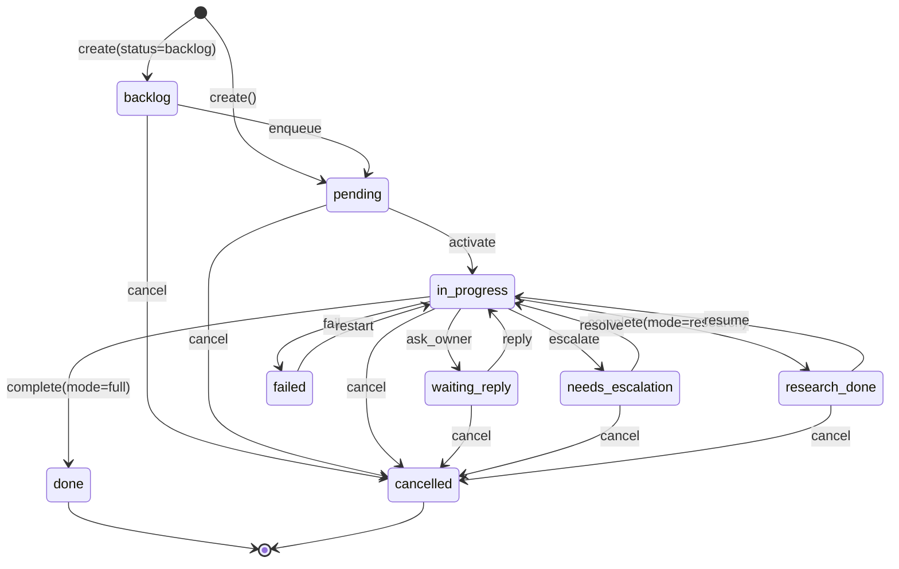
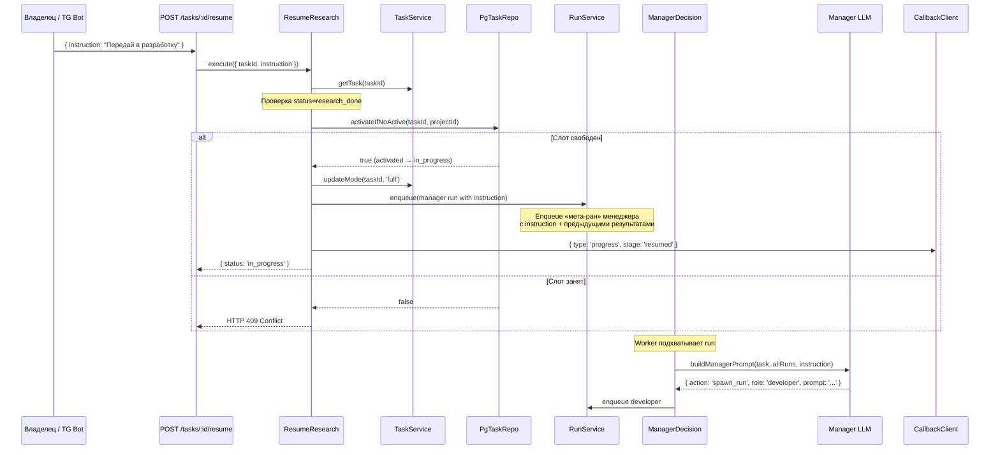

# Spec: RESEARCH_DONE статус и resume для research-задач

## Цель

Добавить статус `research_done` для research-задач и эндпоинт `POST /tasks/:id/resume` с `instruction`, чтобы владелец мог возобновить задачу и передать в разработку (или уточнить ресёрч).

## ADR: mode меняется на full при resume

**Контекст:** При resume research-задачи владелец может захотеть продолжить в разработку. Нужно определить, остаётся ли mode=research или переключается на full.

**Решение:** Resume **всегда** переводит `mode` из `research` в `full`. Обоснование:
- Семантика: «исследование закончено, задача возобновляется для полного цикла»
- Простота: `#handleResearchMode()` не сработает (mode≠research), менеджер работает штатно
- Менеджер сам решит, запустить developer или analyst, на основе instruction + истории runs
- Если владелец хочет ещё один «чистый ресёрч» — пусть создаст новую задачу с mode=research

## Диаграмма: обновлённая state machine



## Диаграмма: resume flow



## Изменения по слоям

### 1. Domain

#### `src/domain/entities/Task.js` — ИЗМЕНИТЬ

**Добавить статус и переходы:**

```javascript
const STATUSES = {
  BACKLOG: 'backlog',
  PENDING: 'pending',
  IN_PROGRESS: 'in_progress',
  WAITING_REPLY: 'waiting_reply',
  NEEDS_ESCALATION: 'needs_escalation',
  RESEARCH_DONE: 'research_done',   // ← НОВЫЙ
  DONE: 'done',
  FAILED: 'failed',
  CANCELLED: 'cancelled',
};

const TRANSITIONS = {
  [STATUSES.BACKLOG]:          [STATUSES.PENDING, STATUSES.CANCELLED],
  [STATUSES.PENDING]:          [STATUSES.IN_PROGRESS, STATUSES.CANCELLED],
  [STATUSES.IN_PROGRESS]:      [STATUSES.WAITING_REPLY, STATUSES.NEEDS_ESCALATION, STATUSES.RESEARCH_DONE, STATUSES.DONE, STATUSES.FAILED, STATUSES.CANCELLED],
  [STATUSES.WAITING_REPLY]:    [STATUSES.IN_PROGRESS, STATUSES.CANCELLED],
  [STATUSES.NEEDS_ESCALATION]: [STATUSES.IN_PROGRESS, STATUSES.CANCELLED],
  [STATUSES.RESEARCH_DONE]:    [STATUSES.IN_PROGRESS, STATUSES.CANCELLED],  // ← НОВЫЙ
  [STATUSES.DONE]:             [],
  [STATUSES.FAILED]:           [STATUSES.IN_PROGRESS],
  [STATUSES.CANCELLED]:        [],
};
```

#### `src/domain/services/TaskService.js` — ИЗМЕНИТЬ

Добавить два метода:

```javascript
async completeResearch(taskId) {
  const task = await this.getTask(taskId);
  task.transitionTo(Task.STATUSES.RESEARCH_DONE);
  await this.#taskRepo.save(task);
  return task;
}

async updateMode(taskId, mode) {
  const task = await this.getTask(taskId);
  task.mode = mode;
  await this.#taskRepo.save(task);
  return task;
}
```

### 2. Application

#### `src/application/ManagerDecision.js` — ИЗМЕНИТЬ

В `#handleResearchMode()`, заменить `completeTask` на `completeResearch` и callback type:

```javascript
// Было:
await this.#taskService.completeTask(task.id);
// ...type: 'done'...

// Стало:
await this.#taskService.completeResearch(task.id);
// ...

if (task.callbackUrl) {
  await this.#callbackSender.send(
    task.callbackUrl,
    {
      type: 'research_done',           // ← ИЗМЕНЁН тип
      taskId: task.id,
      shortId: task.shortId,
      mode: 'research',
      summary: 'Исследование завершено. Отправьте /resume для продолжения в разработку.',
      result,
      resultFormat,
      truncated,
    },
    task.callbackMeta,
  );
}

await this.#tryStartNext(task.projectId);  // Слот освобождается
```

Также обновить terminal check в начале `execute()`:

```javascript
// Было:
if (['done', 'failed', 'cancelled'].includes(task.status)) {

// Стало:
if (['done', 'failed', 'cancelled', 'research_done'].includes(task.status)) {
```

#### `src/application/ResumeResearch.js` — НОВЫЙ

```javascript
import { InvalidStateError } from '../domain/errors/InvalidStateError.js';

export class ResumeResearch {
  #taskService;
  #runService;
  #runRepo;
  #taskRepo;
  #projectRepo;
  #roleRegistry;
  #callbackSender;
  #logger;

  constructor({ taskService, runService, runRepo, taskRepo, projectRepo, roleRegistry, callbackSender, logger }) {
    this.#taskService = taskService;
    this.#runService = runService;
    this.#runRepo = runRepo;
    this.#taskRepo = taskRepo;
    this.#projectRepo = projectRepo;
    this.#roleRegistry = roleRegistry;
    this.#callbackSender = callbackSender;
    this.#logger = logger || console;
  }

  async execute({ taskId, instruction }) {
    const task = await this.#taskService.getTask(taskId);

    if (task.status !== 'research_done') {
      throw new InvalidStateError(
        `Cannot resume task in status '${task.status}', expected 'research_done'`
      );
    }

    if (!instruction || !instruction.trim()) {
      throw new ValidationError('instruction is required');
    }

    // Validate manager role exists
    this.#roleRegistry.get('manager');

    // Atomically activate — fails if another task is active
    const activated = await this.#taskRepo.activateIfNoActive(task.id, task.projectId);
    if (!activated) {
      throw new InvalidStateError(
        'Cannot resume: another task is active for this project. Wait for it to complete.'
      );
    }

    // Switch mode to full (research phase is over)
    await this.#taskService.updateMode(task.id, 'full');

    // Get all previous runs for context
    const allRuns = await this.#runRepo.findByTaskId(task.id);
    const completedRuns = allRuns
      .filter(r => r.status === 'done')
      .sort((a, b) => a.createdAt - b.createdAt);

    // Build prompt for manager with instruction + research context
    const runsReport = completedRuns
      .map(r => `[${r.roleName}] ${r.response ?? 'no output'}`)
      .join('\n---\n');

    const prompt = `Задача: ${task.title}
Описание: ${task.description ?? 'нет'}
Ветка: ${task.branchName ?? 'не назначена'}
Режим: full (возобновлена из research)

Результаты предыдущего исследования:
${runsReport}

Инструкция от владельца:
${instruction}

Прими решение о следующем шаге. Ответь строго в формате JSON.`;

    // Enqueue manager run
    await this.#runService.enqueue({
      taskId: task.id,
      stepId: null,
      roleName: 'manager',
      prompt,
      callbackUrl: task.callbackUrl,
      callbackMeta: task.callbackMeta,
    });

    const project = await this.#projectRepo.findById(task.projectId);
    const shortId = project?.prefix && task.seqNumber != null
      ? `${project.prefix}-${task.seqNumber}`
      : undefined;

    if (task.callbackUrl) {
      await this.#callbackSender.send(
        task.callbackUrl,
        {
          type: 'progress',
          taskId: task.id,
          shortId,
          stage: 'resumed',
          message: `Задача возобновлена: ${instruction.substring(0, 100)}`,
        },
        task.callbackMeta,
      );
    }

    return { taskId: task.id, shortId, status: 'in_progress' };
  }
}
```

**Важно:** ResumeResearch ставит в очередь ран с ролью `manager`. Worker подхватывает его через `ProcessRun`, менеджер получает промпт и принимает решение (`spawn_run developer` или `spawn_run analyst`).

**СТОП. Проблема.** Менеджер — не обычная роль. `ManagerDecision` вызывается из `worker.processOne()` ПОСЛЕ завершения рана. Менеджер не ставится в очередь как run — он вызывается как пост-обработка.

**Правильный подход:** Resume не ставит менеджера в очередь. Вместо этого resume формирует промпт и напрямую вызывает менеджера через `chatEngine.runPrompt('manager', prompt)`, парсит решение и выполняет его (как делает ManagerDecision).

**Ещё проще:** Resume вызывает существующий `ManagerDecision.execute()`, передав completedRunId последнего analyst run. Но проблема — задача в research_done, а ManagerDecision проверяет terminal статусы.

**ФИНАЛЬНЫЙ ПОДХОД:** Resume делает transition `research_done → in_progress`, меняет mode на full, и enqueue **analyst** (или developer) напрямую — аналогично тому как `RestartTask` работает. Менеджер подхватит управление ПОСЛЕ завершения этого рана через обычный `worker.processOne()`.

### Уточнённый ResumeResearch (финальный вариант)

```javascript
async execute({ taskId, instruction }) {
  const task = await this.#taskService.getTask(taskId);

  if (task.status !== 'research_done') {
    throw new InvalidStateError(
      `Cannot resume task in status '${task.status}', expected 'research_done'`
    );
  }

  if (!instruction || !instruction.trim()) {
    throw new ValidationError('instruction is required');
  }

  // Atomically activate — fails if another task is active
  const activated = await this.#taskRepo.activateIfNoActive(task.id, task.projectId);
  if (!activated) {
    throw new InvalidStateError(
      'Cannot resume: another task is active for this project'
    );
  }

  // Switch mode to full
  await this.#taskService.updateMode(task.id, 'full');

  // Get previous analyst's research for context
  const allRuns = await this.#runRepo.findByTaskId(task.id);
  const lastAnalystRun = [...allRuns]
    .filter(r => r.roleName === 'analyst' && r.status === 'done')
    .sort((a, b) => b.createdAt - a.createdAt)[0];

  const researchContext = lastAnalystRun?.response
    ? `\n\nРезультаты предыдущего исследования (аналитик):\n${lastAnalystRun.response.substring(0, 10000)}`
    : '';

  // Determine role: if instruction says "в разработку" → developer, else → analyst
  // But we don't parse instruction — let manager decide via the standard flow.
  // Enqueue developer with research context + instruction. Manager will get control after.
  const roleName = 'developer';
  this.#roleRegistry.get(roleName);

  const prompt = `Задача: ${task.title}
Описание: ${task.description ?? 'нет'}
${researchContext}

Инструкция от владельца для продолжения работы:
${instruction}

Реализуй задачу на основе результатов исследования и инструкции владельца.`;

  await this.#runService.enqueue({
    taskId: task.id,
    stepId: null,
    roleName,
    prompt,
    callbackUrl: task.callbackUrl,
    callbackMeta: task.callbackMeta,
  });

  const project = await this.#projectRepo.findById(task.projectId);
  const shortId = project?.prefix && task.seqNumber != null
    ? `${project.prefix}-${task.seqNumber}`
    : undefined;

  if (task.callbackUrl) {
    await this.#callbackSender.send(
      task.callbackUrl,
      {
        type: 'progress',
        taskId: task.id,
        shortId,
        stage: 'resumed',
        message: `Задача возобновлена, переход к разработке`,
      },
      task.callbackMeta,
    );
  }

  return { taskId: task.id, shortId, status: 'in_progress' };
}
```

**Решение:** Resume ВСЕГДА запускает `developer` с контекстом исследования + инструкцией. Если владелец хочет уточнить ресёрч — создаёт новую задачу.

Это самый простой подход:
- Не нужен вызов менеджера
- Developer получает полный контекст
- После developer → менеджер подхватит через обычный workflow (reviewers → tester → cto → done)

### 3. Infrastructure

#### `src/infrastructure/http/routes/taskRoutes.js` — ИЗМЕНИТЬ

Добавить schema и эндпоинт:

```javascript
const resumeSchema = {
  params: {
    type: 'object',
    required: ['id'],
    properties: {
      id: { type: 'string' },
    },
  },
  body: {
    type: 'object',
    required: ['instruction'],
    properties: {
      instruction: { type: 'string', minLength: 1, maxLength: 10000 },
    },
    additionalProperties: false,
  },
  response: {
    200: {
      type: 'object',
      properties: {
        taskId: { type: 'string' },
        shortId: { type: 'string' },
        status: { type: 'string' },
      },
    },
  },
};
```

Роут:

```javascript
fastify.post('/tasks/:id/resume', { schema: resumeSchema }, async (request, reply) => {
  const status = await useCases.getTaskStatus.execute({ taskId: request.params.id });
  assertProjectScope(request.apiKey, status.task.projectId);

  const result = await useCases.resumeResearch.execute({
    taskId: status.task.id,
    instruction: request.body.instruction,
  });
  return reply.send(result);
});
```

#### `src/infrastructure/persistence/migrations/20260323_007_research_done_status.js` — НОВЫЙ

```javascript
export async function up(knex) {
  await knex.raw(`
    ALTER TABLE tasks DROP CONSTRAINT IF EXISTS tasks_status_check;
    ALTER TABLE tasks ADD CONSTRAINT tasks_status_check
      CHECK (status IN ('backlog', 'pending', 'in_progress', 'waiting_reply',
                        'needs_escalation', 'research_done', 'done', 'failed', 'cancelled'));
  `);
}

export async function down(knex) {
  await knex.raw(`
    ALTER TABLE tasks DROP CONSTRAINT IF EXISTS tasks_status_check;
    ALTER TABLE tasks ADD CONSTRAINT tasks_status_check
      CHECK (status IN ('backlog', 'pending', 'in_progress', 'waiting_reply',
                        'needs_escalation', 'done', 'failed', 'cancelled'));
  `);
}
```

#### `src/index.js` — ИЗМЕНИТЬ (критичный файл оркестрации)

**Обоснование:** Нужно добавить DI для `ResumeResearch` use case и передать его в useCases.

```javascript
// Добавить import
import { ResumeResearch } from './application/ResumeResearch.js';

// Добавить создание use case (после строки с restartTask)
const resumeResearch = new ResumeResearch({
  taskService, runService, runRepo, taskRepo, projectRepo,
  roleRegistry, callbackSender, logger: console,
});

// Добавить в useCases объект
const useCases = {
  createTask, getTaskStatus, getRunDetail, cancelTask,
  replyToQuestion, restartTask, enqueueTask,
  resumeResearch,  // ← НОВЫЙ
};
```

### 4. Промпт менеджера

#### `roles/manager.md` — ИЗМЕНИТЬ

Обновить секцию «Режим research»:

```markdown
## Режим research

Если задача имеет `mode: research`, система автоматически завершает её после аналитика со статусом `research_done`.
Менеджер НЕ вызывается для research-задач при успешном завершении аналитика.
Менеджер вызывается только если аналитик упал (failed/timeout) — в этом случае прими решение retry или fail_task.

После resume (владелец возобновил задачу) — mode автоматически меняется на full. Дальше задача идёт по стандартному пайплайну: developer → reviewers → tester → cto → done.
```

## Критичные файлы оркестрации

| Файл | Затрагивается? | Что именно | Обоснование |
|---|---|---|---|
| `src/index.js` | ✅ **ДА** | import ResumeResearch + DI + useCases | Новый use case требует регистрации в composition root |
| `src/infrastructure/claude/claudeCLIAdapter.js` | ❌ Нет | — | — |
| `src/infrastructure/scheduler/` | ❌ Нет | — | — |
| `restart.sh` | ❌ Нет | — | — |

## Callback для бота

### При завершении исследования (research_done)

```json
{
  "type": "research_done",
  "taskId": "uuid",
  "shortId": "NF-20",
  "mode": "research",
  "summary": "Исследование завершено. Отправьте /resume для продолжения в разработку.",
  "result": "# Research\n...",
  "resultFormat": "file",
  "truncated": false,
  "callbackMeta": { "chatId": 123 }
}
```

Бот:
1. Отправить результат (текст или файл)
2. Показать кнопку «▶️ Продолжить в разработку» (или команду /resume)

### При resume

```json
{
  "type": "progress",
  "taskId": "uuid",
  "shortId": "NF-20",
  "stage": "resumed",
  "message": "Задача возобновлена, переход к разработке",
  "callbackMeta": { "chatId": 123 }
}
```

## Тесты

### `src/domain/entities/Task.test.js` — добавить:

```javascript
it('in_progress → research_done', () => {
  const task = Task.create(defaults);
  task.transitionTo('in_progress');
  task.transitionTo('research_done');
  expect(task.status).toBe('research_done');
});

it('research_done → in_progress (resume)', () => {
  const task = Task.create(defaults);
  task.transitionTo('in_progress');
  task.transitionTo('research_done');
  task.transitionTo('in_progress');
  expect(task.status).toBe('in_progress');
});

it('research_done → cancelled', () => {
  const task = Task.create(defaults);
  task.transitionTo('in_progress');
  task.transitionTo('research_done');
  task.transitionTo('cancelled');
  expect(task.status).toBe('cancelled');
});

it('rejects research_done → done', () => {
  const task = Task.create(defaults);
  task.transitionTo('in_progress');
  task.transitionTo('research_done');
  expect(() => task.transitionTo('done')).toThrow(InvalidTransitionError);
});
```

### `src/application/ResumeResearch.test.js` — НОВЫЙ

```javascript
it('resumes research_done task → enqueues developer with instruction', async () => {
  // task.status = 'research_done', activateIfNoActive returns true
  // Assert: mode updated to 'full', developer enqueued with instruction, callback sent
});

it('throws InvalidStateError when task is not research_done', async () => {
  // task.status = 'in_progress' → error
});

it('throws InvalidStateError when slot is occupied', async () => {
  // activateIfNoActive returns false → 409
});

it('includes previous analyst response in developer prompt', async () => {
  // Verify prompt contains research context
});

it('works without callbackUrl', async () => {
  // No callback sent
});
```

### `src/application/ManagerDecision.test.js` — изменить:

```javascript
it('research mode: completes with research_done status (not done)', async () => {
  // Verify taskService.completeResearch called instead of completeTask
  // Verify callback type: 'research_done'
});

it('skips research_done tasks in terminal check', async () => {
  // task.status = 'research_done' → skip
});
```

### `src/infrastructure/http/routes/taskRoutes.test.js` — добавить:

```javascript
it('POST /tasks/:id/resume returns 200 with instruction', async () => {
  // ...
});

it('POST /tasks/:id/resume rejects without instruction', async () => {
  // 400 Bad Request
});
```

## Acceptance Criteria

1. ✅ Research-задача при завершении аналитика переходит в `research_done` (не `done`)
2. ✅ `research_done` НЕ блокирует слот (следующая задача может стартовать)
3. ✅ `POST /tasks/:id/resume` с `{ instruction }` переводит `research_done → in_progress`
4. ✅ Resume меняет `mode` с `research` на `full`
5. ✅ Resume ставит в очередь developer с контекстом исследования + инструкцией
6. ✅ Resume возвращает HTTP 409 если слот занят
7. ✅ Callback `type: 'research_done'` (вместо `done`) при завершении ресёрча
8. ✅ Миграция обновляет CHECK constraint
9. ✅ `src/index.js` обновлён для DI нового use case
10. ✅ Все существующие тесты проходят
