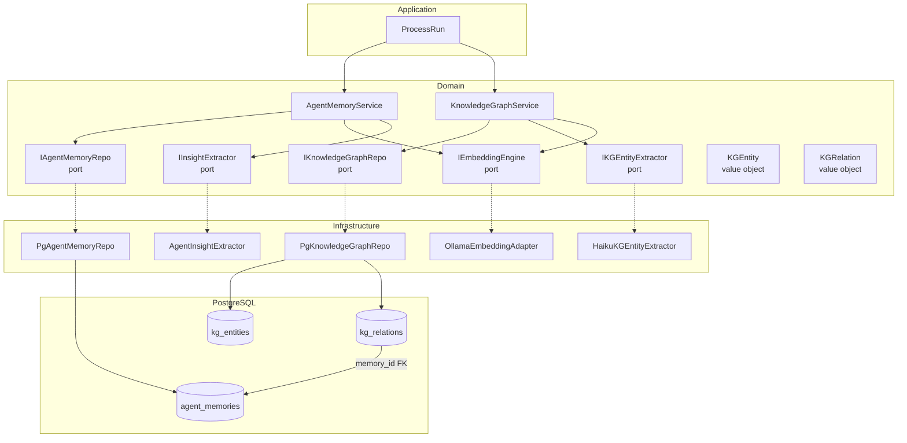
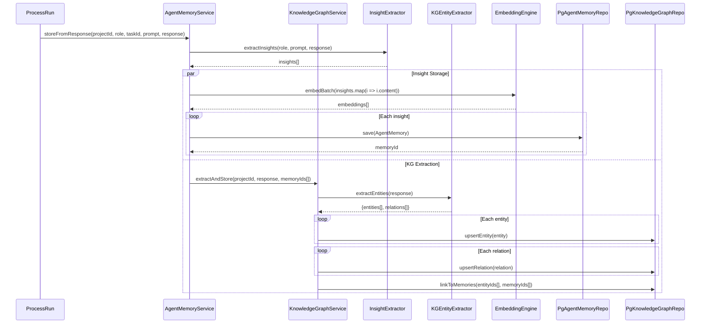
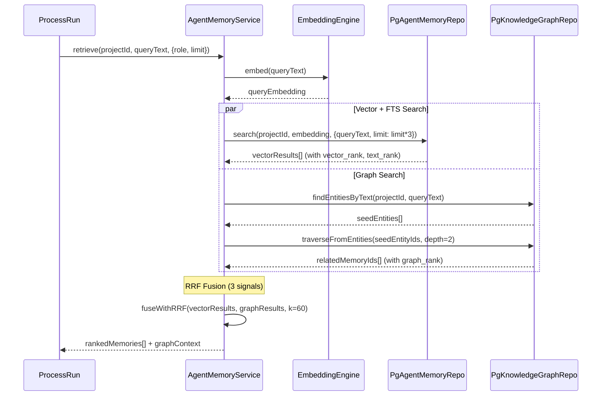

# BOT-18: Knowledge Graph поверх текущей памяти — Спецификация

## Цель

Добавить Knowledge Graph (граф знаний) поверх существующей системы agent_memories для улучшения retrieval через структурированные связи между сущностями. Граф дополняет (не заменяет) embedding + FTS поиск.

## ADR: Выбор хранилища

**Решение:** Простые таблицы `kg_entities` + `kg_relations` в PostgreSQL.

**Причины:**
- Нулевая инфраструктурная сложность (тот же PG, тот же Knex, тот же pool)
- Recursive CTEs покрывают нужные графовые запросы (<10ms на 10K nodes)
- Полная интеграция с agent_memories через JOIN
- Apache AGE отвергнут: C-extension overhead, нестабильный Node.js driver, сложность миграций
- Neo4j отвергнут: новый сервис, синхронизация двух БД, нарушение минимальной архитектуры

---

## Диаграмма 1: Архитектура (C4 Component)



---

## Диаграмма 2: Sequence — Storage Flow (после run completion)



---

## Диаграмма 3: Sequence — Retrieval Flow (hybrid search)



---

## Слой Domain

### Новые Value Objects

**Файл:** `src/domain/valueObjects/KGEntity.js`
```
KGEntity {
  id: UUID
  projectId: UUID
  entityType: 'module' | 'concept' | 'decision' | 'technology' | 'pattern' | 'problem' | 'person'
  name: string
  normalizedName: string  // lowercase, trimmed
  properties: object      // JSONB
  createdAt: Date
  updatedAt: Date
}

static create({projectId, entityType, name, properties}) → KGEntity
static fromRow(row) → KGEntity
```

**Файл:** `src/domain/valueObjects/KGRelation.js`
```
KGRelation {
  id: UUID
  projectId: UUID
  sourceEntityId: UUID
  targetEntityId: UUID
  relationType: 'USES' | 'DEPENDS_ON' | 'IMPLEMENTS' | 'DECIDED' | 'CAUSED_BY' | 'RESOLVED_BY' | 'RELATES_TO'
  confidence: number     // 0.0-1.0
  memoryId: UUID | null  // FK to agent_memories — откуда извлечена связь
  properties: object     // JSONB
  createdAt: Date
}

static create({projectId, sourceEntityId, targetEntityId, relationType, confidence, memoryId, properties}) → KGRelation
static fromRow(row) → KGRelation
```

### Новый Port

**Файл:** `src/domain/ports/IKnowledgeGraphRepo.js`
```
IKnowledgeGraphRepo {
  async upsertEntity(entity: KGEntity) → KGEntity
  async upsertRelation(relation: KGRelation) → KGRelation
  async findEntitiesByText(projectId, text) → KGEntity[]
  async findEntitiesByNormalizedName(projectId, names[]) → KGEntity[]
  async traverse(projectId, entityIds[], depth=2) → {entities: KGEntity[], relations: KGRelation[], memoryIds: UUID[]}
  async getEntityRelations(entityId) → KGRelation[]
  async getProjectGraph(projectId, {limit, entityTypes}) → {entities[], relations[]}
}
```

**Файл:** `src/domain/ports/IKGEntityExtractor.js`
```
IKGEntityExtractor {
  async extractEntities(text) → {entities: [{name, type, properties}], relations: [{source, target, type, confidence, properties}]}
}
```

### Новый Domain Service

**Файл:** `src/domain/services/KnowledgeGraphService.js`
```
KnowledgeGraphService {
  constructor({knowledgeGraphRepo, kgEntityExtractor})

  async extractAndStore(projectId, text, memoryIds[]) → {entitiesCount, relationsCount}
    // 1. Extract entities+relations via LLM
    // 2. Normalize entity names
    // 3. Upsert entities (dedup by normalized_name)
    // 4. Resolve source/target names → entity IDs
    // 5. Upsert relations with memoryId links
    // 6. Return counts

  async findRelatedMemories(projectId, queryText, limit) → {memoryIds: UUID[], graphContext: string}
    // 1. Extract entity names from query (keyword match, не LLM — для скорости)
    // 2. Find matching entities
    // 3. Traverse 1-2 hops
    // 4. Collect linked memoryIds
    // 5. Rank by distance from seed + confidence
    // 6. Format graph context string
}
```

### Изменения в существующем AgentMemoryService

**Файл:** `src/domain/services/AgentMemoryService.js`

Добавить:
- Constructor parameter: `knowledgeGraphService` (optional)
- В `storeFromResponse()`: после сохранения memories, вызвать `knowledgeGraphService.extractAndStore()`
- В `retrieve()`: параллельно с vector+FTS search, вызвать `knowledgeGraphService.findRelatedMemories()`
- Новый метод: `#fuseWithGraphRRF(vectorResults, graphMemoryIds, k=60, graphWeight=0.7)`
- В `formatForPrompt()`: добавить секцию `<knowledge_graph>` с graph context

---

## Слой Infrastructure

### Миграция

**Файл:** `src/infrastructure/persistence/migrations/YYYYMMDD_012_knowledge_graph.js`

```sql
-- kg_entities
CREATE TABLE kg_entities (
  id UUID PRIMARY KEY DEFAULT gen_random_uuid(),
  project_id UUID NOT NULL REFERENCES projects(id) ON DELETE CASCADE,
  entity_type VARCHAR(30) NOT NULL CHECK (entity_type IN (
    'module', 'concept', 'decision', 'technology', 'pattern', 'problem', 'person'
  )),
  name TEXT NOT NULL,
  normalized_name TEXT NOT NULL,
  properties JSONB DEFAULT '{}',
  created_at TIMESTAMPTZ DEFAULT NOW(),
  updated_at TIMESTAMPTZ DEFAULT NOW(),
  UNIQUE (project_id, entity_type, normalized_name)
);

CREATE INDEX idx_kg_entities_project ON kg_entities(project_id);
CREATE INDEX idx_kg_entities_name ON kg_entities USING gin(to_tsvector('simple', name));

-- kg_relations
CREATE TABLE kg_relations (
  id UUID PRIMARY KEY DEFAULT gen_random_uuid(),
  project_id UUID NOT NULL REFERENCES projects(id) ON DELETE CASCADE,
  source_entity_id UUID NOT NULL REFERENCES kg_entities(id) ON DELETE CASCADE,
  target_entity_id UUID NOT NULL REFERENCES kg_entities(id) ON DELETE CASCADE,
  relation_type VARCHAR(30) NOT NULL CHECK (relation_type IN (
    'USES', 'DEPENDS_ON', 'IMPLEMENTS', 'DECIDED', 'CAUSED_BY', 'RESOLVED_BY', 'RELATES_TO'
  )),
  confidence REAL DEFAULT 0.8 CHECK (confidence >= 0 AND confidence <= 1),
  memory_id UUID REFERENCES agent_memories(id) ON DELETE SET NULL,
  properties JSONB DEFAULT '{}',
  created_at TIMESTAMPTZ DEFAULT NOW(),
  UNIQUE (source_entity_id, target_entity_id, relation_type)
);

CREATE INDEX idx_kg_relations_source ON kg_relations(source_entity_id);
CREATE INDEX idx_kg_relations_target ON kg_relations(target_entity_id);
CREATE INDEX idx_kg_relations_memory ON kg_relations(memory_id);
CREATE INDEX idx_kg_relations_project ON kg_relations(project_id);
```

### PgKnowledgeGraphRepo

**Файл:** `src/infrastructure/persistence/PgKnowledgeGraphRepo.js`

Ключевые запросы:

**upsertEntity:** `INSERT ... ON CONFLICT (project_id, entity_type, normalized_name) DO UPDATE SET properties = EXCLUDED.properties || kg_entities.properties, updated_at = NOW()`

**traverse (recursive CTE):**
```sql
WITH RECURSIVE graph_walk AS (
  -- Base: seed entities
  SELECT e.id, e.name, e.entity_type, 0 AS depth,
         ARRAY[e.id] AS path
  FROM kg_entities e WHERE e.id = ANY($1)

  UNION ALL

  -- Recursive: follow relations
  SELECT e2.id, e2.name, e2.entity_type, gw.depth + 1,
         gw.path || e2.id
  FROM graph_walk gw
  JOIN kg_relations r ON r.source_entity_id = gw.id OR r.target_entity_id = gw.id
  JOIN kg_entities e2 ON e2.id = CASE
    WHEN r.source_entity_id = gw.id THEN r.target_entity_id
    ELSE r.source_entity_id
  END
  WHERE gw.depth < $2          -- max depth
    AND NOT (e2.id = ANY(gw.path))  -- prevent cycles
    AND r.confidence >= 0.5     -- confidence threshold
)
SELECT DISTINCT gw.*, r.memory_id, r.confidence,
       ROW_NUMBER() OVER (ORDER BY gw.depth ASC, r.confidence DESC) AS graph_rank
FROM graph_walk gw
LEFT JOIN kg_relations r ON (r.source_entity_id = gw.id OR r.target_entity_id = gw.id)
WHERE r.memory_id IS NOT NULL
LIMIT $3;
```

**findEntitiesByText:** Комбинация FTS (`to_tsvector('simple', name)`) и ILIKE для точного совпадения.

### HaikuKGEntityExtractor

**Файл:** `src/infrastructure/claude/haikuKGEntityExtractor.js`

- Использует Anthropic SDK (уже есть зависимость)
- Модель: `claude-haiku-4-5-20251001` (как AgentInsightExtractor)
- Max tokens: 1024
- Промпт: structured extraction → JSON response
- Валидация: проверка entity types, relation types, непустых имён
- Fallback: при ошибке парсинга → возвращает пустой результат (не блокирует pipeline)

---

## Изменения в существующих файлах

### `src/domain/services/AgentMemoryService.js`

**Изменения:**
1. Добавить `knowledgeGraphService` в constructor (optional, для backward compatibility)
2. `storeFromResponse()` — после сохранения insights, вызвать KG extraction:
   ```javascript
   if (this.#knowledgeGraphService) {
     await this.#knowledgeGraphService.extractAndStore(projectId, response, savedMemoryIds)
       .catch(err => logger.warn({ err }, 'KG extraction failed, continuing'))
   }
   ```
3. `retrieve()` — добавить параллельный graph search:
   ```javascript
   const [memories, graphResult] = await Promise.all([
     this.#memoryRepo.search(...),
     this.#knowledgeGraphService?.findRelatedMemories(projectId, queryText, limit) ?? {memoryIds: [], graphContext: ''}
   ])
   // Fuse results
   ```
4. Новый private метод `#fuseWithGraphRRF(vectorResults, graphMemoryIds, k, graphWeight)`

### `src/index.js` (Composition Root)

**Изменения:**
1. Import и создание `PgKnowledgeGraphRepo`
2. Import и создание `HaikuKGEntityExtractor`
3. Import и создание `KnowledgeGraphService`
4. Передать `knowledgeGraphService` в `AgentMemoryService`

> ⚠️ **Критичный файл оркестрации.** Изменения минимальны: 4 строки создания экземпляров + 1 параметр в конструкторе AgentMemoryService. Не затрагивает scheduler, worker, или ClaudeCLIAdapter.

---

## Формат обогащённого промпта

```xml
<project_memory>
  <memory section="architecture" importance="0.9" age="2d" source="developer">
    Database schema uses UUID primary keys with timestamptz
  </memory>
  ...
</project_memory>

<knowledge_graph>
  <entity name="TaskService" type="module">
    <relation type="DEPENDS_ON" target="PgTaskRepo" confidence="0.9"/>
    <relation type="IMPLEMENTS" target="DDD" confidence="0.8"/>
    <relation type="USES" target="PostgreSQL" confidence="0.9"/>
  </entity>
</knowledge_graph>
```

---

## RRF Fusion Formula (3 сигнала)

```
composite_score =
    w_v × (1 / (k + vector_rank))
  + w_t × (1 / (k + text_rank))
  + w_g × (1 / (k + graph_rank))

× recency_factor × importance × access_boost
```

Параметры:
- `k = 60` (smoothing constant, как сейчас)
- `w_v = 1.0`, `w_t = 1.0`, `w_g = 0.7` (начальные веса)
- `graph_rank` = позиция в результатах graph traversal (по depth ASC, confidence DESC)
- Для memories, найденных только через граф: `vector_rank = NULL`, `text_rank = NULL`
- Для memories без graph match: `graph_rank = NULL`

---

## Тест-план

### Unit тесты

| Файл | Что тестируем |
|------|---------------|
| `KGEntity.test.js` | create(), validation, normalization |
| `KGRelation.test.js` | create(), validation |
| `KnowledgeGraphService.test.js` | extractAndStore(), findRelatedMemories() с мок-репо |
| `HaikuKGEntityExtractor.test.js` | парсинг JSON ответа, обработка невалидного JSON |

### Integration тесты

| Файл | Что тестируем |
|------|---------------|
| `PgKnowledgeGraphRepo.test.js` | CRUD entities, CRUD relations, traverse CTE, upsert dedup |
| `AgentMemoryService.test.js` | retrieve() с graph fusion, storeFromResponse() с KG extraction |

### Ключевые сценарии

1. **Entity dedup:** Два runs создают entity "TaskService" → должна быть одна запись
2. **Traverse depth:** Seed → 1-hop → 2-hop, проверить что глубже не идёт
3. **Cycle prevention:** A→B→C→A не вызывает бесконечный обход
4. **RRF fusion:** Memory найдена и vector, и graph → score выше чем только vector
5. **Graceful degradation:** KG extraction fails → memories сохраняются без графа
6. **Empty graph:** Новый проект без KG → retrieve() работает как раньше (backward compatible)

---

## Что не входит в MVP

- Graph visualization / API endpoint для графа
- Entity resolution через embedding similarity (только normalized_name)
- Cross-project граф
- Graph-алгоритмы (PageRank, community detection)
- Пользовательская обратная связь по сущностям
- Миграция существующих memories в граф (только новые)

## Порядок реализации

1. Миграция (таблицы + индексы)
2. Value Objects (KGEntity, KGRelation)
3. Port (IKnowledgeGraphRepo, IKGEntityExtractor)
4. PgKnowledgeGraphRepo + тесты
5. HaikuKGEntityExtractor + тесты
6. KnowledgeGraphService + тесты
7. Интеграция в AgentMemoryService
8. DI wiring в index.js
9. Integration тесты
