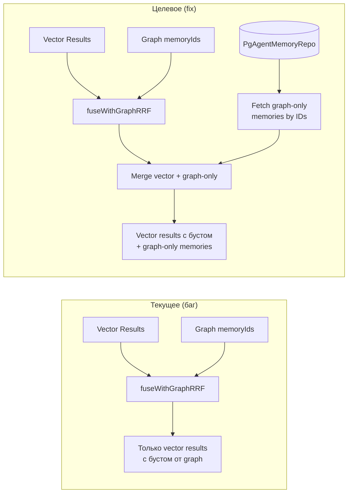
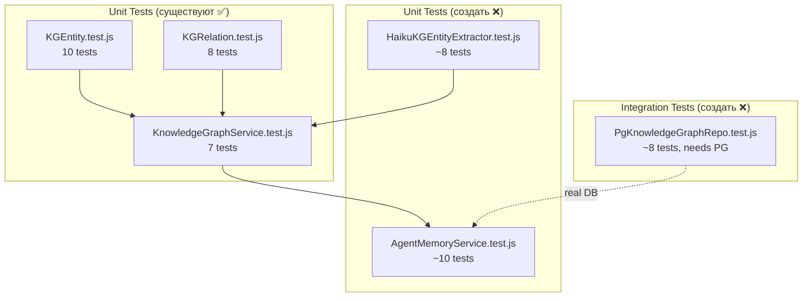

# BOT-19: Knowledge Graph — Доработка и тестирование

## Цель

Завершить реализацию Knowledge Graph: добавить недостающие тесты, исправить баг с graph-only memories в RRF fusion, провести валидацию миграции.

## ADR: Scope BOT-19

**Решение:** Не переписывать реализацию BOT-18. Доработать тесты и исправить один баг.

**Причины:**
- Реализация соответствует спецификации BOT-18 на 95%
- Единственное расхождение — graph-only memories не включаются в RRF
- Код уже прошёл implicit review (552 теста без регрессий)

---

## Диаграмма 1: RRF Fusion — Текущий vs. Целевой поток



## Диаграмма 2: Тестовое покрытие



---

## Изменение 1: Fix #fuseWithGraphRRF

**Файл:** `src/domain/services/AgentMemoryService.js`

**Проблема:** Метод `#fuseWithGraphRRF` только бустит vector results, но graph-only memories (найденные через граф, но не через vector) отбрасываются.

**Решение:** Добавить этап fetch + merge graph-only memories.

**Изменения:**

1. Добавить параметр `memoryRepo` в signature (private, уже доступен как `this.#memoryRepo`)
2. После обработки vector results — собрать оставшиеся graph-only IDs (`graphIdSet` после delete)
3. Если graph-only IDs есть — fetch их из `memoryRepo.findByIds(ids)`
4. Назначить им score на основе `graph_rank` only: `GRAPH_RRF_WEIGHT * 1/(RRF_K + rank)`
5. Merge в общий массив, re-sort, slice to limit

**Новая сигнатура:**
```javascript
async #fuseWithGraphRRF(vectorResults, graphMemoryIds, limit) → AgentMemory[]
```

Метод становится `async` (ранее был sync), т.к. нужен fetch из repo.

**Каскадные изменения:**
- `retrieve()`: `const fused = await this.#fuseWithGraphRRF(...)` (добавить await)

**Новый метод в IAgentMemoryRepo / PgAgentMemoryRepo:**
```javascript
async findByIds(ids: string[]) → AgentMemory[]
```
Простой `SELECT * FROM agent_memories WHERE id = ANY($1)`.

---

## Изменение 2: HaikuKGEntityExtractor.test.js

**Файл:** `src/infrastructure/claude/haikuKGEntityExtractor.test.js` (создать)

**Тесты:**

| # | Сценарий | Что проверяем |
|---|----------|---------------|
| 1 | Парсинг валидного JSON | entities + relations корректно извлекаются |
| 2 | JSON обёрнутый в markdown | `json...` корректно парсится |
| 3 | Невалидный JSON | Возврат `{entities: [], relations: []}` |
| 4 | Пустой текст (<50 символов) | Ранний return без LLM-вызова |
| 5 | Невалидные entity types | Fallback на `'concept'` |
| 6 | Self-referencing relations | Фильтруются (source === target) |
| 7 | Relations с unknown entities | Фильтруются |
| 8 | Превышение лимитов (>15 entities) | Обрезается до 15 |

**Подход:** Мок Anthropic SDK через `vi.mock('@anthropic-ai/sdk')`. Тестируем `#parseResponse` и `#validateEntities` через публичный API.

---

## Изменение 3: AgentMemoryService.test.js

**Файл:** `src/domain/services/AgentMemoryService.test.js` (создать)

**Тесты:**

| # | Сценарий | Что проверяем |
|---|----------|---------------|
| 1 | retrieve() без KG service | Работает как раньше (backward compatible) |
| 2 | retrieve() с KG — graph boosts vector result | Score выше для пересечения |
| 3 | retrieve() с KG — graph-only memories добавляются | Graph-only memories в результате |
| 4 | retrieve() с KG — graph failure graceful | Catch, fallback на vector only |
| 5 | storeFromResponse() с KG | extractAndStore вызывается с memoryIds |
| 6 | storeFromResponse() — KG failure не блокирует | .catch() — insights сохраняются |
| 7 | formatForPrompt() с graphContext | XML содержит `<knowledge_graph>` блок |
| 8 | #fuseWithGraphRRF — empty graph | Slice vector results |
| 9 | #fuseWithGraphRRF — graph-only fetch | Memories из графа добавлены |
| 10 | #fuseWithGraphRRF — respects limit | Не более limit результатов |

---

## Изменение 4: PgKnowledgeGraphRepo.test.js (integration)

**Файл:** `src/infrastructure/persistence/PgKnowledgeGraphRepo.test.js` (создать)

**Требует:** Реальная PostgreSQL (как другие integration тесты — `PgTaskRepo.test.js` и т.д.)

**Тесты:**

| # | Сценарий | Что проверяем |
|---|----------|---------------|
| 1 | upsertEntity — insert | Новая entity сохраняется |
| 2 | upsertEntity — dedup | Повторный insert → merge properties |
| 3 | upsertRelation — insert | Новая relation сохраняется |
| 4 | upsertRelation — dedup | Повторный insert → GREATEST confidence |
| 5 | findEntitiesByText — FTS match | Находит по полнотекстовому поиску |
| 6 | findEntitiesByText — ILIKE match | Находит по partial match |
| 7 | traverse — 1-hop | Возвращает непосредственных соседей |
| 8 | traverse — cycle prevention | A→B→C→A не зацикливается |

**Паттерн:** Как `PgRunRepo.test.js` — skip если нет DATABASE_URL.

---

## Изменение 5: PgAgentMemoryRepo — findByIds

**Файл:** `src/infrastructure/persistence/PgAgentMemoryRepo.js`

Добавить метод:
```javascript
async findByIds(ids) {
  if (!ids || ids.length === 0) return [];
  const { rows } = await this.pool.query(
    'SELECT * FROM agent_memories WHERE id = ANY($1)', [ids]
  );
  return rows.map(AgentMemory.fromRow);
}
```

**Port:** `src/domain/ports/IAgentMemoryRepo.js` — добавить `async findByIds(ids) → AgentMemory[]`

---

## Изменения в критичных файлах оркестрации

**`src/index.js`** — НЕ требует изменений (DI wiring уже на месте).

---

## Порядок реализации

1. Добавить `findByIds` в IAgentMemoryRepo + PgAgentMemoryRepo
2. Исправить `#fuseWithGraphRRF` в AgentMemoryService (async + graph-only fetch)
3. Создать `HaikuKGEntityExtractor.test.js`
4. Создать `AgentMemoryService.test.js`
5. Создать `PgKnowledgeGraphRepo.test.js`
6. Прогнать все тесты (`npx vitest run`)

## Тест-план

### Acceptance Criteria

1. ✅ Все 552+ существующих тестов проходят (нет регрессий)
2. ✅ `HaikuKGEntityExtractor.test.js` — 8+ тестов проходят
3. ✅ `AgentMemoryService.test.js` — 10+ тестов проходят
4. ✅ `PgKnowledgeGraphRepo.test.js` — 8+ тестов (skip без DB)
5. ✅ Graph-only memories включаются в RRF fusion результат
6. ✅ Backward compatibility: AgentMemoryService работает без knowledgeGraphService
