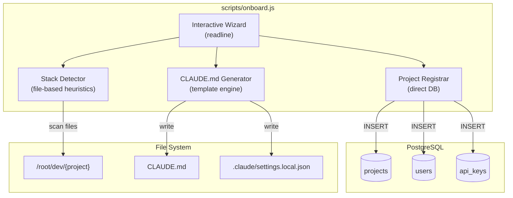
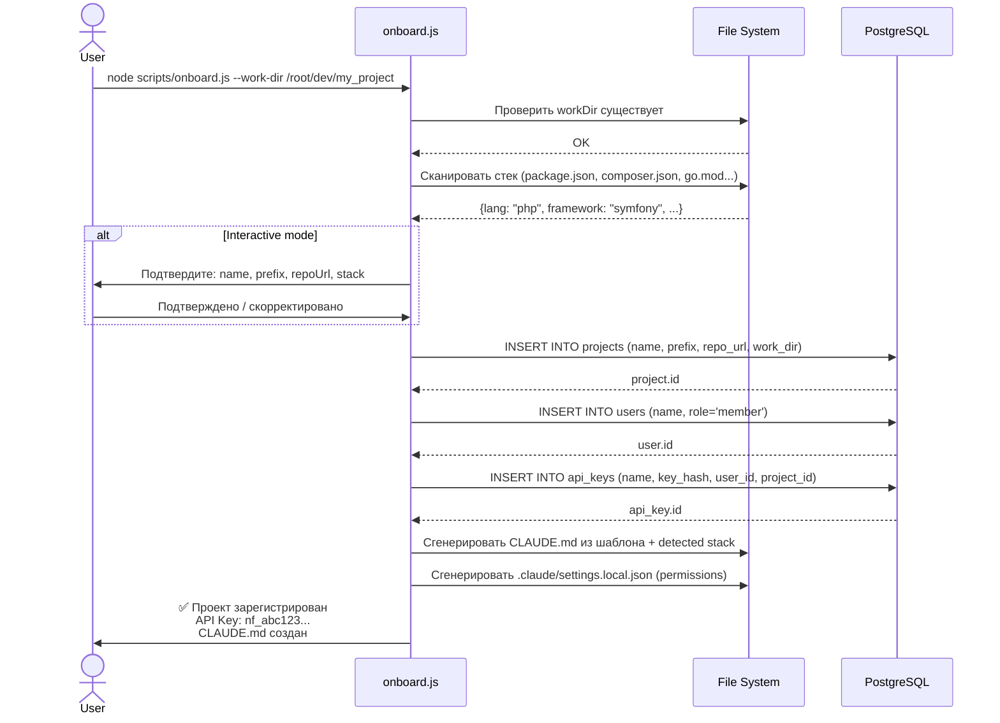

# NF-22: Процесс онбординга новых проектов — Спецификация

## Обзор

CLI-скрипт `scripts/onboard.js`, который автоматизирует полный цикл добавления проекта в Нейроцех: от регистрации в БД до генерации CLAUDE.md.

## ADR

### Почему CLI-скрипт, а не API endpoint

**Решение:** Standalone Node.js скрипт (`scripts/onboard.js`), запускаемый из командной строки.

**Альтернативы:**
- **API endpoint** `POST /projects/onboard` — отвергнут: онбординг включает файловую систему (создание CLAUDE.md, проверка workDir), что плохо ложится в HTTP-модель. Требует доступ к FS сервера.
- **Интерактивный wizard** — частично принят: скрипт запрашивает данные через stdin, но может работать и в non-interactive режиме с флагами.

**Обоснование:** CLI-скрипт имеет доступ и к API, и к файловой системе. Переиспользует domain-логику (Project.create) напрямую через БД, не дублируя HTTP-слой.

### Почему не per-project roles

**Решение:** Роли остаются глобальными (`roles/*.md`). Project-specific контекст передаётся через CLAUDE.md в workDir.

**Обоснование:** Текущая архитектура рассчитана на единый набор ролей. CLAUDE.md достаточно для project-specific контекста — агенты читают его автоматически.

## Архитектура

### Диаграмма компонентов (C4 Level 3)



### Sequence Diagram: онбординг



## Детальный дизайн

### 1. Stack Detector (`src/domain/services/StackDetector.js`)

**Слой:** Domain (чистая логика, без побочных эффектов кроме чтения FS)

```js
class StackDetector {
  /**
   * @param {string} workDir — абсолютный путь к проекту
   * @returns {Promise<DetectedStack>}
   */
  async detect(workDir) → DetectedStack
}
```

**Value Object: DetectedStack** (`src/domain/valueObjects/DetectedStack.js`)

```js
class DetectedStack {
  constructor({
    primaryLanguage,    // 'javascript' | 'php' | 'python' | 'go' | 'rust' | 'unknown'
    languages,          // ['javascript', 'typescript']
    frameworks,         // ['fastify', 'vue']
    packageManager,     // 'npm' | 'composer' | 'pip' | 'go' | null
    testFramework,      // 'vitest' | 'phpunit' | 'pytest' | null
    hasDocker,          // boolean
    structure,          // 'monorepo' | 'single'
    description,        // из README.md или package.json description
  })
}
```

**Эвристики обнаружения:**

| Файл | Язык | Фреймворк |
|------|------|-----------|
| `package.json` | javascript/typescript | express/fastify/vue/react/next (из dependencies) |
| `composer.json` | php | symfony/laravel (из require) |
| `go.mod` | go | gin/fiber/echo (из require) |
| `requirements.txt` / `pyproject.toml` | python | django/fastapi/flask (из deps) |
| `Cargo.toml` | rust | actix/axum (из dependencies) |
| `tsconfig.json` | typescript | — (доп. сигнал) |
| `docker-compose.yml` | — | hasDocker=true |
| `README.md` | — | description (первый абзац) |

### 2. CLAUDE.md Generator (`scripts/lib/claudeMdGenerator.js`)

**Шаблон CLAUDE.md:**

```markdown
# CLAUDE.md

## Проект: {{projectName}}

- **Стек:** {{stack.primaryLanguage}}, {{stack.frameworks.join(', ')}}
- **Структура:** {{stack.structure}}

## Структура проекта

{{generatedStructureTree}}

## Task Manager (Нейроцех)

Base URL: `http://localhost:3000`
Project slug: `{{slug}}`
Prefix: `{{prefix}}`

```bash
# Создать задачу
curl -X POST http://localhost:3000/tasks \
  -H "Authorization: Bearer $NF_TOKEN" \
  -H "Content-Type: application/json" \
  -d '{"projectId": "{{projectId}}", "title": "...", "description": "..."}'
```

## Запуск
{{runCommands}}
```

**Принцип:** Минимальный полезный CLAUDE.md. Пользователь дополняет его вручную после генерации. Скрипт не пытается быть идеальным — он создаёт фундамент.

### 3. Permissions Generator (`scripts/lib/permissionsGenerator.js`)

Генерирует `.claude/settings.local.json` на основе detected stack:

| Стек | Permissions |
|------|------------|
| Все | `Bash(git *)`, `Bash(ls:*)`, `Bash(grep:*)` |
| Node.js | `Bash(npm:*)`, `Bash(npx:*)`, `Bash(node:*)` |
| PHP | `Bash(php:*)`, `Bash(composer:*)`, `Bash(./vendor/bin/phpunit:*)` |
| Python | `Bash(python3:*)`, `Bash(pip:*)`, `Bash(pytest:*)` |
| Go | `Bash(go:*)` |
| Docker | `Bash(docker-compose:*)` |

### 4. Project Registrar (`scripts/lib/projectRegistrar.js`)

Работает напрямую с PostgreSQL (через существующий pg pool):

```js
class ProjectRegistrar {
  constructor({ pool }) // uses existing pg.js pool

  async register({ name, prefix, repoUrl, workDir }) → {
    project,   // Project entity
    user,      // User entity
    apiKey: {  // { id, name, token (raw!) }
      id, name, token
    }
  }
}
```

**Логика:**
1. Создать `Project` через `Project.create()` → `projectRepo.save()`
2. Создать `User` (name = `{slug}-agent`, role = `member`)
3. Создать `ApiKey` (привязан к user + project), вернуть raw token

### 5. CLI Entry Point (`scripts/onboard.js`)

```bash
# Interactive mode (default)
node scripts/onboard.js --work-dir /root/dev/flower_shop

# Non-interactive mode (CI/scripting)
node scripts/onboard.js \
  --work-dir /root/dev/flower_shop \
  --name flower-shop \
  --prefix FS \
  --repo-url https://github.com/user/flower_shop \
  --no-interactive

# Skip CLAUDE.md generation
node scripts/onboard.js --work-dir /root/dev/my_project --skip-claude-md

# Dry run (показать что будет сделано)
node scripts/onboard.js --work-dir /root/dev/my_project --dry-run
```

**Флаги:**

| Флаг | Описание | Default |
|------|----------|---------|
| `--work-dir` | Путь к проекту (обязательный) | — |
| `--name` | Slug проекта | Из имени директории |
| `--prefix` | Префикс задач | Из имени (первые буквы, uppercase) |
| `--repo-url` | Git remote URL | Из `git remote get-url origin` |
| `--no-interactive` | Без вопросов | false |
| `--skip-claude-md` | Не генерировать CLAUDE.md | false |
| `--skip-permissions` | Не генерировать settings.local.json | false |
| `--dry-run` | Показать план без выполнения | false |

### 6. Файловая структура изменений

```
scripts/
├── onboard.js                          # CLI entry point
└── lib/
    ├── claudeMdGenerator.js            # CLAUDE.md template + generation
    ├── permissionsGenerator.js         # .claude/settings.local.json generation
    └── projectRegistrar.js             # DB registration (project + user + api key)

src/domain/
├── services/
│   └── StackDetector.js                # Stack detection heuristics
└── valueObjects/
    └── DetectedStack.js                # Detected stack value object
```

## Изменения по слоям

### Domain Layer
| Что | Файл | Действие |
|-----|------|----------|
| StackDetector service | `src/domain/services/StackDetector.js` | CREATE |
| DetectedStack VO | `src/domain/valueObjects/DetectedStack.js` | CREATE |

### Infrastructure Layer
Нет изменений. Используем существующие PgProjectRepo, PgUserRepo, PgApiKeyRepo.

### Application Layer
Нет изменений. Скрипт работает напрямую с domain + infrastructure, минуя application use cases (это утилита, не бизнес-процесс).

### Scripts (новый слой)
| Что | Файл | Действие |
|-----|------|----------|
| CLI entry point | `scripts/onboard.js` | CREATE |
| CLAUDE.md generator | `scripts/lib/claudeMdGenerator.js` | CREATE |
| Permissions generator | `scripts/lib/permissionsGenerator.js` | CREATE |
| Project registrar | `scripts/lib/projectRegistrar.js` | CREATE |

### Критичные файлы оркестрации
Изменения НЕ требуются. Скрипт автономный, не модифицирует index.js, scheduler, claudeCLIAdapter.

## Переносимость для любого стека

Ключевое решение: **StackDetector** основан на file-based heuristics (наличие конфигурационных файлов), а не на запуске инструментов. Это означает:
- Не нужен установленный PHP для обнаружения Symfony-проекта
- Не нужен Go для обнаружения Go-проекта
- Достаточно файловой системы

**CLAUDE.md** генерируется из шаблона с переменными. Шаблон содержит общую структуру, а stack-specific секции подставляются по результатам детекции.

**Permissions** подбираются по стеку. Для неизвестного стека — минимальный набор (git, ls, grep).

## Тесты

### Unit Tests

1. **StackDetector.test.js**
   - Обнаружение Node.js проекта (package.json)
   - Обнаружение PHP проекта (composer.json)
   - Обнаружение Python проекта (requirements.txt, pyproject.toml)
   - Обнаружение Go проекта (go.mod)
   - Monorepo detection (несколько package.json)
   - Unknown stack (пустая директория)
   - README.md description extraction

2. **DetectedStack.test.js**
   - Создание из корректных данных
   - Default values для optional полей

3. **claudeMdGenerator.test.js**
   - Генерация для Node.js стека
   - Генерация для PHP стека
   - Генерация для unknown стека
   - Подстановка projectId, slug, prefix

4. **permissionsGenerator.test.js**
   - Permissions для Node.js
   - Permissions для PHP
   - Permissions для unknown
   - Merge с существующими permissions

5. **projectRegistrar.test.js**
   - Успешная регистрация (project + user + apiKey)
   - Duplicate name → ошибка
   - Duplicate prefix → ошибка

### Integration Tests

6. **onboard.integration.test.js** (с реальной БД)
   - Full flow: detect → register → generate files
   - Dry run: ничего не меняется
   - Идемпотентность: повторный запуск → понятная ошибка

## Открытые вопросы

1. **Нужен ли `npm run onboard` alias в package.json?** — Рекомендую: да.
2. **Нужна ли деонбординг/удаление проекта?** — Out of scope, но стоит учесть в будущем.
3. **Нужно ли обновлять PROJECT_MAP.md из скрипта?** — Нет, это задача аналитика после добавления новых модулей.
