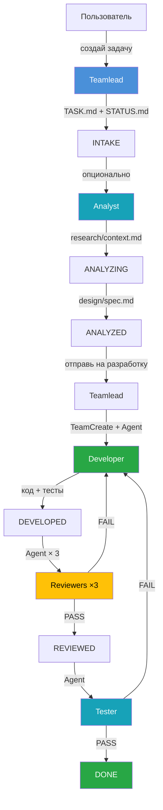
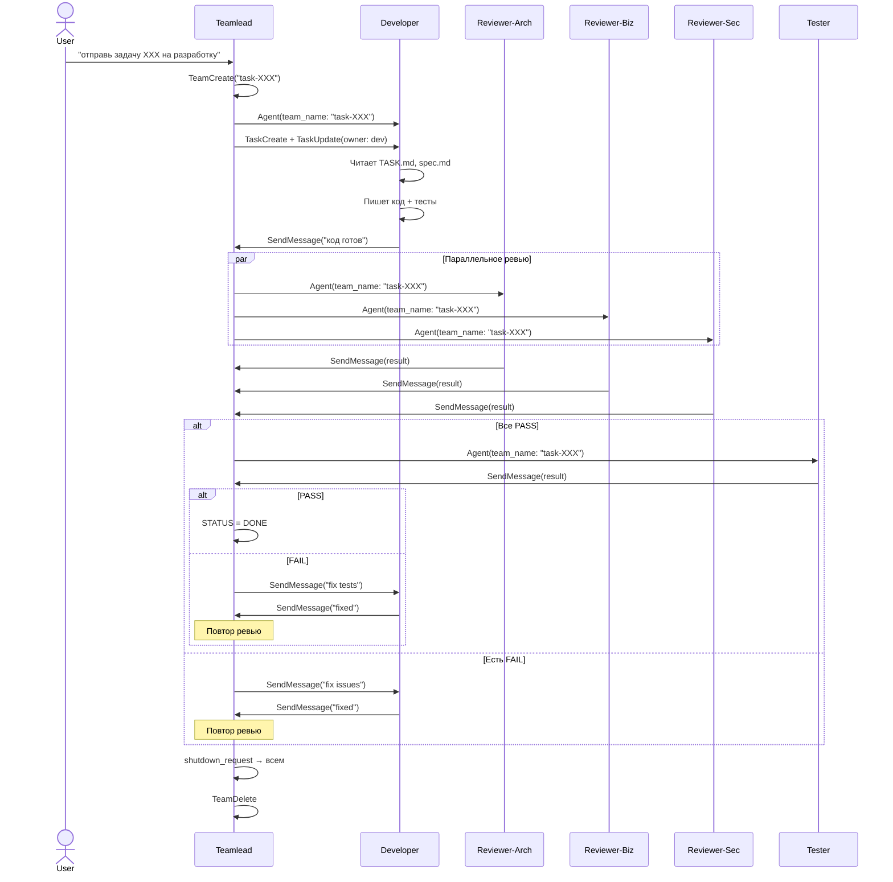
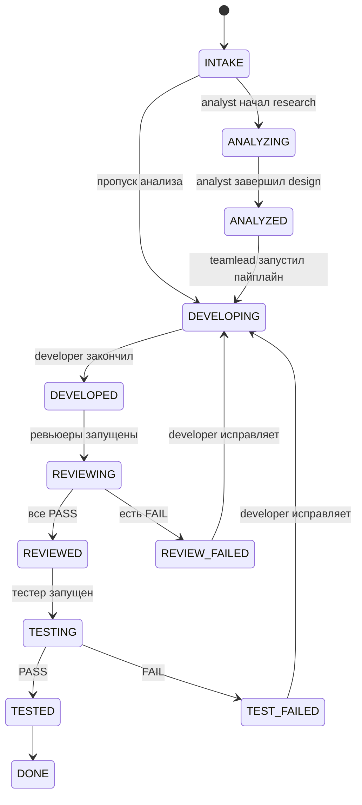

# Development Workflow

## Обзор процесса

Система агентов обеспечивает повторяемый процесс разработки: от создания задачи до готового кода.



## Шаги процесса

### Шаг 1: Создание задачи (ручной)
**Кто:** Пользователь → Teamlead
**Что:**
1. Teamlead классифицирует задачу (feature / bugfix / refactoring)
2. Создаёт структуру `docs/task/XXX_short_name/`
3. Заполняет `TASK.md` и `STATUS.md`
4. Статус: **INTAKE**
5. **СТОП** — ждёт пользователя

### Шаг 2: Анализ (ручной, опциональный)
**Кто:** Пользователь → Analyst
**Режим RESEARCH:**
1. Исследует кодовую базу (Glob, Grep, Read)
2. Исследует внешние API/библиотеки (WebSearch, WebFetch)
3. Результат: `research/context.md`
4. Статус: **ANALYZING**

**Режим DESIGN:**
1. Проектирует решение на основе research
2. Создаёт диаграммы (Mermaid): C4, Sequence, DFD
3. Результат: `design/spec.md`
4. Статус: **ANALYZED**

### Шаг 3: Разработка (автоматический пайплайн)
**Кто:** Пользователь → Teamlead → автопайплайн



## Статусы задачи



## Структура папки задачи

```
docs/task/XXX_short_name/
├── TASK.md              # Требования, acceptance criteria
├── STATUS.md            # Текущий статус и история
├── research/            # Результаты analyst (режим research)
│   └── context.md
├── design/              # Проектирование (режим design)
│   └── spec.md
├── adr/                 # Architecture Decision Records
├── review/              # Результаты ревью
│   ├── review-architecture.md
│   ├── review-business.md
│   ├── review-security.md
│   └── test-report.md
└── docs/                # Пользовательская документация
```
